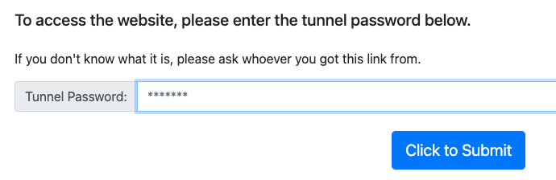

# LocalTunnel

_LocalTunnel 是一個免費且簡單易用的反向代理服務，可在樹莓派上將 HTTP 服務暴露到公網_

<br>

## 準備工作

1. 更新系統套件。

    ```bash
    sudo apt update
    sudo apt upgrade -y
    ```

<br>

2. 安裝 Node.js。

    ```bash
    curl -fsSL https://deb.nodesource.com/setup_18.x | sudo -E bash -
    sudo apt install -y nodejs
    ```

<br>

3. 確認安裝版本。

    ```bash
    node -v
    npm -v
    ```

<br>

## 安裝套件

1. 安裝 n。

    ```bash
    sudo npm install -g n
    ```

<br>

2. 安裝符合版本。

    ```bash
    sudo n stable
    ```

<br>

3. 或可以指定版本。

    ```bash
    sudo n 22.10.0
    ```

<br>

4. 安裝 LocalTunnel CLI。

    ```bash
    sudo npm install -g localtunnel
    ```

<br>

## 啟動本地 HTTP 服務

1. 使用 LocalTunnel 暴露服務，將本地 3000 埠映射到公網；執行後會顯示一個類似 `https://randomname.loca.lt` 的公開 URL，這就是你的公網訪問地址。

    ```bash
    lt --port 3000 --subdomain myraspi
    ```

<br>

2. 查詢密碼。

    ```bash
    curl https://loca.lt/mytunnelpassword
    ```

<br>

3. 輸入密碼，也就是 IP。

    

<br>

___

_END_