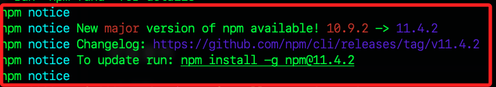

_越來越不穩定，課程中不要實作_

<br>

# LocalTunnel

_LocalTunnel 是一個免費且簡單易用的反向代理服務，可在樹莓派上將 HTTP 服務暴露到公網_

<br>

## 準備工作

1. 更新系統套件。

    ```bash
    sudo apt update
    sudo apt upgrade -y
    ```

<br>

2. 安裝 Node.js。

    ```bash
    curl -o- https://raw.githubusercontent.com/nvm-sh/nvm/v0.40.3/install.sh | bash
    . "$HOME/.nvm/nvm.sh"
    nvm install 22
    ```

<br>

3. 確認安裝版本。

    ```bash
    node -v
    npm -v
    ```

<br>

4. 安裝 LocalTunnel CLI。

    ```bash
    npm install -g localtunnel
    ```

<br>

5. 若出現更新提示，複製照做即可。

    ```bash
    npm install -g npm@11.4.2
    ```

    

<br>

## 啟動本地 HTTP 服務

1. 使用 LocalTunnel 暴露服務，將本地 3000 埠映射到公網；執行後會顯示一個類似 `https://randomname.loca.lt` 的公開 URL，這就是你的公網訪問地址。

    ```bash
    lt --port 3000 --subdomain myraspi
    ```

<br>

2. 另外開啟一個終端機，運行以下指令查詢密碼，也就是查詢外網 IP。

    ```bash
    curl https://loca.lt/mytunnelpassword
    ```

    

<br>

3. 開啟瀏覽器訪問公網網址，在提示框中輸入密碼，也就是 IP。

    

<br>

___

_END_