# 分區工具 GParted

_圖形化界面的分區管理工具 `GParted`_

<br>

1. 安裝任何工具前建議先更新樹莓派。

    ```bash
    sudo apt update && sudo apt full-upgrade -y
    ```

<br>

2. 緊接著安裝 `GParted`。

    ```bash
    sudo apt install gparted -y
    ```

<br>

3. 安裝完成可在選單中看到。

    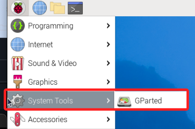

<br>

4. 安裝處理分區格式所需的附屬工具。

    ```bash
    sudo apt install dosfstools mtools -y
    ```

<br>

## 啟動工具

<br>

1. 這是一個圖形化界面工具，所以要進入樹莓派並從終端啟動。

    ```bash
    sudo gparted
    ```

<br>

## 使用

_透過 `GParted` 圖形介面可以進行磁碟分割、新增、刪除、格式化與掛載點設定；特別注意需小心操作以免誤刪資料；以下操作將使用另一個 USB 隨身碟，插入樹莓派後開始進行_

<br>

1. 插入 USB 裝置後，在終端機重啟 GParted。

    ```bash
    sudo gparted
    ```

<br>

2. 右上角點選裝置下拉選單，在本範例中的 `/dev/sda` 就是插入的隨身碟。

    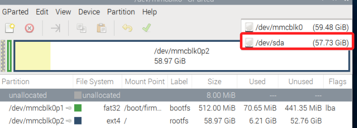

<br>

## 刪除舊分區

_若 USB 曾使用過，在此可實作刪除既有分區_

<br>

1. 在 GParted 主介面中，在要刪除的分區上點右鍵，選 `Unmount` 先進行卸載。

    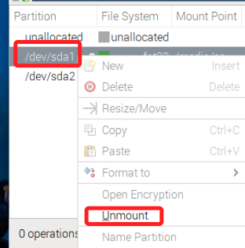

<br>

2. 再次點擊右鍵就可以 `Delete`。

    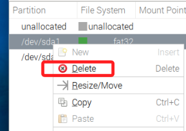

<br>

3. 重複直到變成 `unallocated` 全區域

    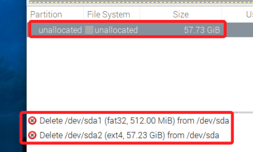

<br>

## 建立分區表

_Partition Table_

<br>

1. 點擊 `New`。

    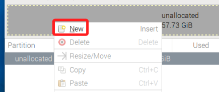

<br>

2. 設定大小之後點擊 `Add`。

    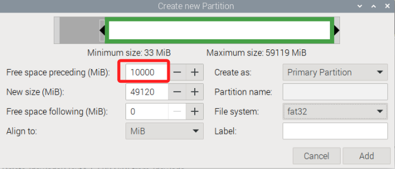

<br>

3. 關於新增分區的格式，若用於跨平台（`Windows、Mac、Linux`）檔案交換，則選擇 `fat32`；若僅用於 Linux 系統內部用途，選擇 Linux 原生格式 `ext4`。

    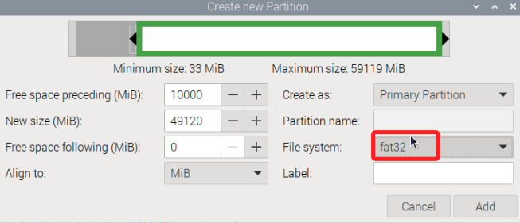


<br>

4. 點擊 `Add`。

    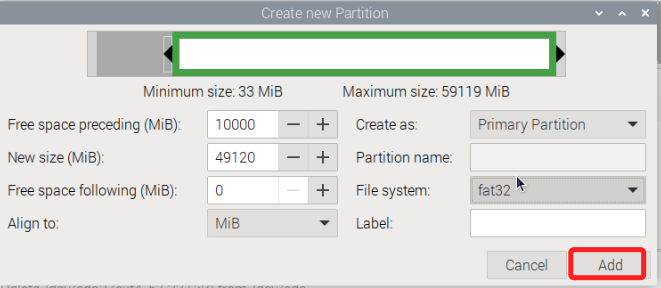

<br>

5. 接著點擊 ✅ `Apply All Operations`。

    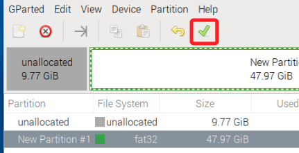

<br>

6. 點擊 `Apply`。

    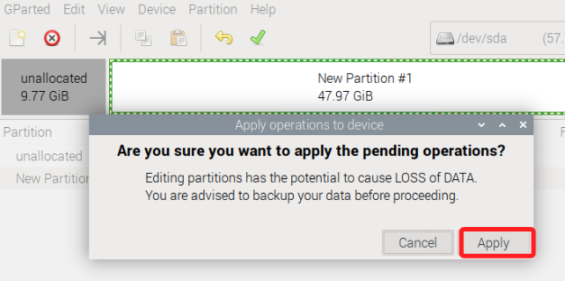

<br>

7. 完成後點擊 `Close`。

    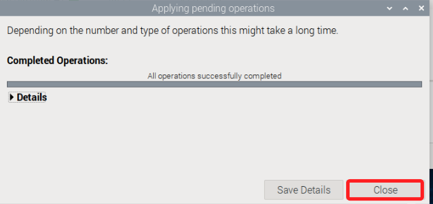

<br>

## 掛載並驗證

1. 在終端機查詢；顯示 USB 隨身碟裝置為 `/dev/sda1` 且尚未掛載到任何位置。

    ```bash
    lsblk
    ```

    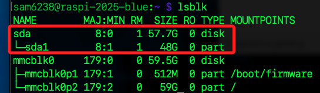

<br>

2. 建立掛載點。

    ```bash
    sudo mkdir -p /mnt/usb
    ```

<br>

3. 以 FAT32 格式掛載，`vfat` 是 FAT32 的對應類型。

    ```bash
    sudo mount -t vfat /dev/sda1 /mnt/usb
    ```

<br>

4. 驗證是否掛載成功。

    ```bash
    df -h | grep /mnt/usb
    ```

    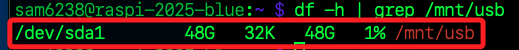

<br>

5. 進入。

    ```bash
    cd /mnt/usb
    ```

<br>

## 自動掛載

1. Linux 不會自動掛載大多數外接儲存裝置，若退出隨身碟，之前的掛載點 `/mnt/usb` 就會失效；再次插入後，系統只會偵測到裝置存在，但不會自動掛載到某個目錄；除每次運行指令重新掛載，也可設定自動掛載。

1. 先查出 USB 的 UUID。

    ```bash
    sudo blkid /dev/sdb1
    ```

    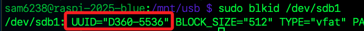

<br>

2. 編輯 `/etc/fstab`。 

    ```bash
    sudo nano /etc/fstab
    ```

<br>

3. 在末行新增以下內容，`defaults` 表示使用預設掛載參數，`user` 表示允許一般使用者手動掛載，如果允許希 `非 root` 使用者也能掛載或卸載，則加入 `user` 或 `users`；`0 0` 表示不進行 dump 及 fsck 檢查。

    ```bash
    UUID=D360-5536  /mnt/usb  vfat  defaults,users  0  0
    ```

<br>

4. 驗證是否生效；如果出現相關資訊，即表示已成功掛載，每次重新開機後系統會自動掛載該裝置，無需手動執行 mount。

    ```bash
    df -h | grep /mnt/usb
    ```

<br>

## 卸載 USB 裝置

1. 運行以下指令可卸載磁區。

    ```bash
    sudo umount /mnt/usb
    ```

<br>

___

_END_