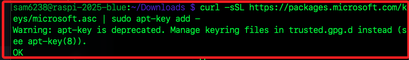
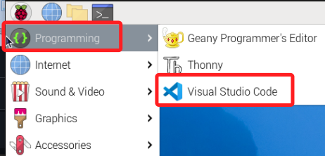

# 樹莓派安裝 VSCode

_主要用在使用桌面連線時，使用更易用的編輯軟體_

<br>

## 說明

1. 在樹莓派中安裝 VSCode 可便於在樹莓派中執行 `code` 指令，對於在樹莓派桌面編輯文件有一定的便利性。

<br>

2. 另外，若是使用虛擬機，那在虛擬機中的樹莓派安裝 VSCode 後，才能使用 VSCode 進行 SSH 連線到同樣為在虛擬機中的樹梅派，這是因為安裝 VSCode 之後才有 `code-server`。

<br>

## 安裝前準備

_檢查樹莓派顯示語系，若非英文，需修改幾個資料夾為英文_

<br>

1. 便於後續指令的順利運行，先切換到家目錄檢查資料夾是否顯示為英文；假如顯示是中文名稱，請先手動更名為英文。

    ```bash
    cd ~ && ls
    ```

    

<br>

2. 主要針對將其中兩個目錄 `下載`、`文件` 更名為 `Downloads` 及 `Documents` 即可。

    ```bash
    mv 下載 Downloads && mv 文件 Documents
    ```

    

<br>

## 開始安裝

_實機與虛擬機的安裝步驟相同_

<br>

1. 進入 `~/Downloads`。

    ```bash
    cd ~/Downloads
    ```

<br>

2. 運行指令進行下載。

    ```bash
    curl -sSL https://packages.microsoft.com/keys/microsoft.asc | sudo apt-key add -
    ```

<br>

3. 可能出現如下警告；簡單說就是提醒 `apt-key` 已經被淘汰，系統建議改用將金鑰檔案手動存放到 `/etc/apt/trusted.gpg.d/` 目錄下的方式來管理金鑰。

    

<br>

4. 改用以下指令。

    ```bash
    curl -sSL https://packages.microsoft.com/keys/microsoft.asc -o microsoft.asc
    ```

<br>

5. 將 VScode 添加到來源列表。

    ```bash
    echo "deb [arch=amd64,arm64,armhf] https://packages.microsoft.com/repos/vscode stable main" | sudo tee /etc/apt/sources.list.d/vscode.list
    ```

<br>

6. 更新與安裝。

    ```bash
    sudo apt update && sudo apt install code -y
    ```

<br>

## 進入樹莓派

1. 完成安裝後，可在選單中看到 `Visual Studio Code`。

    

<br>

___

_END_