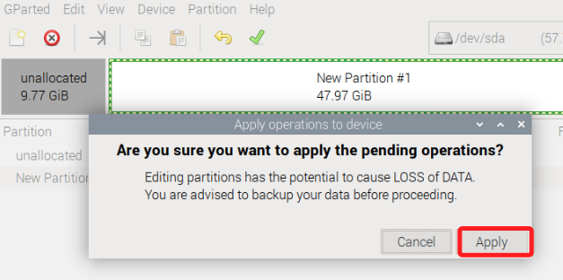

# Pi-Apps

_Pi-Apps 是一個為樹莓派設計的圖形化應用程式安裝器，讓使用者能夠輕鬆安裝常見的桌面應用_

<br>

## 說明

1. 安裝指令。

   ```bash
   wget -qO- https://raw.githubusercontent.com/Botspot/pi-apps/master/install | bash
   ```

<br>

2. 安裝完成會在桌面。

   

<br>

3. 或是在選單中開啟。

   

<br>

4. 很多應用可自行參考。

   

<br>

___

_END_