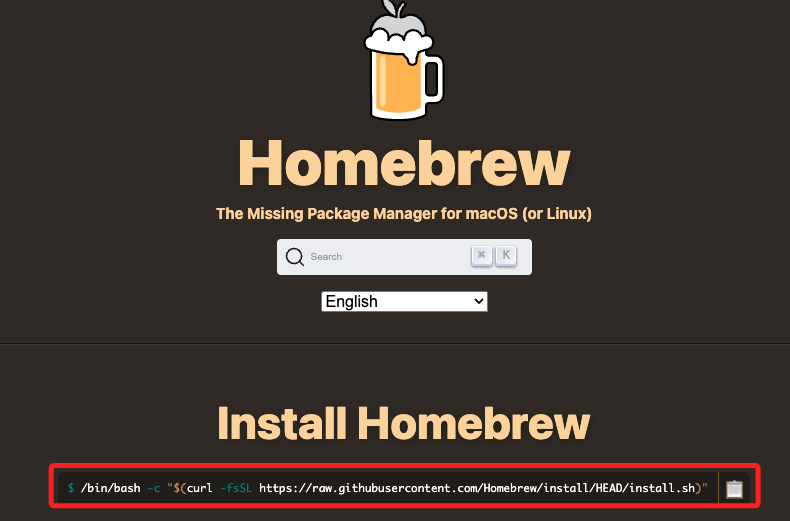
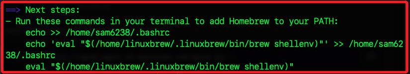
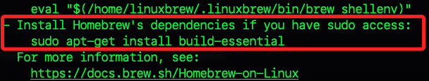
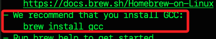

## 安裝 Homebrew

_將使用 brew 安裝 Ngrok_

<br>

1. 前往 [官網](https://brew.sh/) 複製安裝指令。

    

<br>

2. 在樹莓派執行。

    ```bash
    /bin/bash -c "$(curl -fsSL https://raw.githubusercontent.com/Homebrew/install/HEAD/install.sh)"
    ```

<br>

3. 依據提示把 Homebrew 加入環境變數。

    ```bash
    echo >> /home/sam6238/.bashrc
    echo 'eval "$(/home/linuxbrew/.linuxbrew/bin/brew shellenv)"' >> ~/.bashrc
    eval "$(/home/linuxbrew/.linuxbrew/bin/brew shellenv)"
    ```

    

<br>

4. 依據建議安裝基本依賴套件。

    ```bash
    sudo apt-get install build-essential
    ```

    

<br>

5. 依據建立安裝工具。

    ```bash
    brew install gcc
    ```

    

<br>