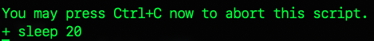
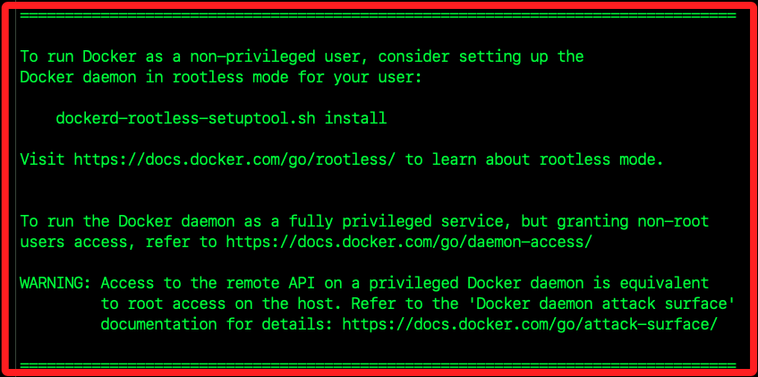
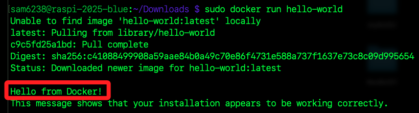
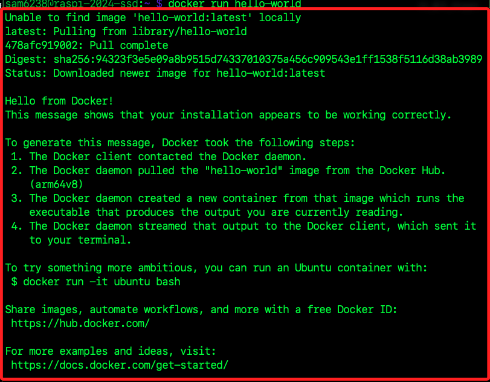

# 安裝 Docker

_在樹莓派上安裝_

<br>

## 說明

1. [Docker 官網](https://www.docker.com/)。

<br>

2. 官方 [Debian 安裝說明](https://docs.docker.com/engine/install/debian/) 及 [樹莓派 32 位元系統安裝說明](https://docs.docker.com/engine/install/raspberry-pi-os/)；若使用 64 位元樹莓派系統請參考 [Debian 安裝說明](https://docs.docker.com/engine/install/debian/)。

<br>

## 步驟

_進入樹莓派運行_

<br>

1. 第一步先更新系統。

   ```bash
   sudo apt update && sudo apt upgrade -y && sudo apt autoremove -y
   ```

<br>

2. 進入下載目錄。

   ```bash
   cd ~/Downloads
   ```

<br>

3. 下載 Docker 安裝腳本。

   ```bash
   curl -fsSL https://get.docker.com -o get-docker.sh
   ```

<br>

4. 運行安裝腳本；特別注意，若通知等待 20 秒是一種保護機制。

   ```bash
   sudo sh get-docker.sh
   ```

   

<br>

5. 完成。

   

<br>

6. 執行以下指令驗證是否能正常運行容器。

   ```bash
   sudo docker run hello-world
   ```

   

<br>

## 添加權限

_若未加入不影響使用，只是使用 `Docker` 指令時需添加 `sudo`_

<br>

1. 將當前用戶 `$USER` 加入 `Docker` 群組；如此可擁有群組權限。

   ```bash
   sudo usermod -aG docker $USER
   ```

<br>

2. 重新登入或重啟終端機套用變更，等效於刷新授權。

   ```bash
   exit
   ```

<br>

3. 另外，刷新授權也可以透過啟動 shell，這會要求輸入密碼；或嘗試關閉並重啟新的終端機。

   ```bash
   su - $USER
   ```

<br>

## curl 的參數

_用於從網路取得或發送數據的終端機指令，補充說明相關參數_

<br>

1. 參數 `-f` 或 `--fail` 表示當 HTTP 回應狀態碼為 `400` 或以上時，也就是網路請求回應失敗時，不輸出內容並回傳錯誤碼。

<br>

3. 參數 `-s`  或 `--silent` 表示靜默模式，不顯示進度訊息或錯誤消息。

<br>

4. 參數 `-S` 或 `--show-error`，與 `-s` 一起使用時表示顯示發生的錯誤，並隱藏正常操作的訊息。

<br>

5. 參數 `-L` 或 `--location` 表示如果指定的 URL 被重定向，則跟隨重定向的位置。

<br>

6. 參數 `-o` 與 `get-docker.sh` 表示將下載內容儲存為指定檔案 `get-docker.sh` 中，而不是直接輸出在終端機上。

<br>

## 關於警告

1. 警告若使用特權訪問 `Docker daemon` 上的遠程 API，等同在主機上的 root 訪問，也就是說若能夠訪問 Docker API，如同以最高權限在主機上做任何事情。

   

<br>

2. 若出現依賴庫的版本衝突，可依據官網提供的方式，運行以下指令刪除所有衝突的套件。

   ```bash
   for pkg in docker.io docker-doc docker-compose podman-docker containerd runc; do sudo apt-get remove $pkg; done
   ```

<br>

## 驗證安裝

1. 特別注意，安裝 Docker 後會自動建立成為 `系統服務`，這裡之所以進行手動啟動，是因為在初次安裝 Docker 後，以手動啟動服務可以用來驗證 Docker 是否正確安裝和配置，確保其能夠正常運行。

   ```bash
   sudo service docker start
   ```

<br>

2. 驗證 Docker 安裝；這個指令會從 Docker Hub 下載一個名為 hello-world 的測試鏡像。

   ```bash
   docker run hello-world
   ```

   _第一次執行會通知並下拉_
   
   

<br>

3. 查詢當前 Docker 版本。

   ```bash
   docker --version
   ```

   

<br>

## Docker 基本指令

1. `docker pull`：下載 Docker 鏡像，從Docker Hub或其他Docker registry下載指定的鏡像。

<br>

2. `docker run`：運行 Docker 容器，根據指定的鏡像啟動一個新的容器實例。

<br>

3. `docker ps`：列出運行中的容器，顯示運行中的所有Docker容器的列表。

<br>

4. `docker stop`：停止運行的容器，使用容器ID或名稱來停止容器。

<br>

5. `docker start`：啟動已停止的容器，使用容器ID或名稱來啟動停止的容器。

<br>

6. `docker rm`：刪除一個容器，使用容器ID或名稱來刪除一個停止的容器。

<br>

7. `docker images`：列出本地的 Docker 鏡像，顯示在本地機器上儲存的所有Docker鏡像的列表。

<br>

8. `docker rmi`：刪除 Docker 鏡像，使用鏡像ID或名稱來刪除指定的Docker鏡像。

<br>

## 卸載 Docker Engine

_若要更新 Docker Engine 也是運行這個卸載程序後重新安裝_

<br>

1. 卸載 Docker Engine、CLI、containerd 和 Docker Compose 套件。

   ```bash
   sudo apt-get purge docker-ce docker-ce-cli containerd.io docker-buildx-plugin docker-compose-plugin docker-ce-rootless-extras
   ```

<br>

2. 刪除所有鏡像、容器和卷。

   ```bash
   sudo rm -rf /var/lib/docker /var/lib/containerd
   ```

<br>

## 注意事項

1. 樹莓派使用的是 ARM 架構 的處理器，而大部分的 Docker 鏡像是為 x86 架構 的處理器設計的，所以在選擇 Docker 鏡像時，必須確保它支援 ARM 架構。

<br>

2. 官網另外提供了使用 apt 儲存庫安裝的說明，但指令較為複雜，參考即可。

   ```bash
   sudo apt-get update
   sudo apt-get install ca-certificates curl
   sudo install -m 0755 -d /etc/apt/keyrings
   sudo curl -fsSL https://download.docker.com/linux/debian/gpg -o /etc/apt/keyrings/docker.asc
   sudo chmod a+r /etc/apt/keyrings/docker.asc

   echo \
   "deb [arch=$(dpkg --print-architecture) signed-by=/etc/apt/keyrings/docker.asc] https://download.docker.com/linux/debian \
   $(. /etc/os-release && echo "$VERSION_CODENAME") stable" | \
   sudo tee /etc/apt/sources.list.d/docker.list > /dev/null
   sudo apt-get update
   ```

<br>

3. 若使用 apt 儲存庫安裝 Docker，則需要手動安裝 Docker 套件。

   ```bash
   sudo apt-get install docker-ce docker-ce-cli containerd.io docker-buildx-plugin docker-compose-plugin
   ```

<br>

___

_END：以上完成在樹莓派安裝 Docker_
