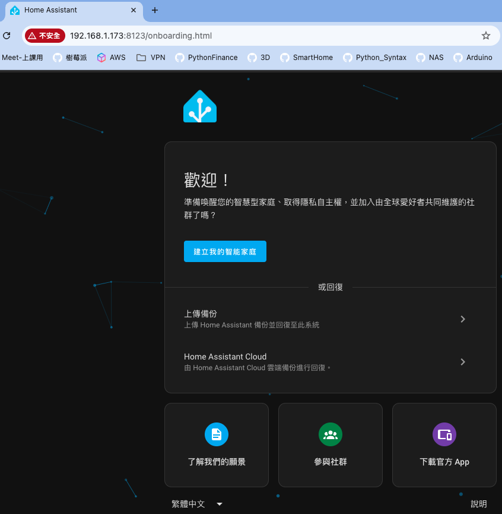
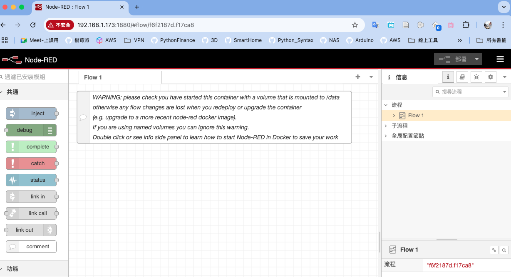
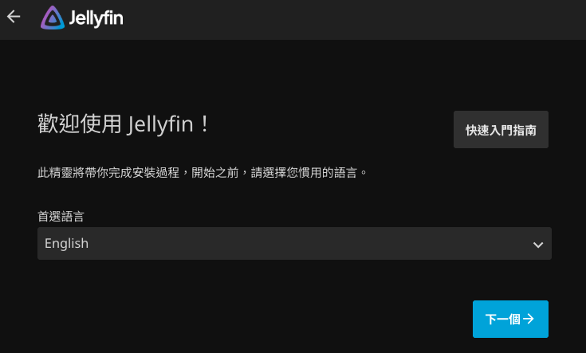

# 常用鏡像

_樹莓派上常用的 Docker 鏡像_

<br>

## 資料庫

1. MongoDB；NoSQL 資料庫。

   ```bash
   # 安裝
   docker pull mongo

   # 啟動
   docker run -d --name mongodb -p 27017:27017 mongo

   # 完成後連線測試
   docker exec -it mongodb mongosh

   # 查看目前所有資料庫
   show dbs

   # 退出
   exit
   ```

<br>

2. MariaDB：MySQL 的分支，完全相容。

   ```bash
   # 安裝
   docker pull mariadb

   # 啟動，設定密碼為 `my-secret-pw`
   docker run -d --name mariadb -e MYSQL_ROOT_PASSWORD=my-secret-pw -p 3306:3306 mariadb

   # 連線
   docker exec -it mariadb mariadb -uroot -p

   # 進入後，查看資料庫
   SHOW DATABASES;

   # 退出
   exit
   ```

<br>

3. PostgreSQL：是一個開源關聯性資料庫。

   ```bash
   # 安裝
   docker pull postgres

   # 啟動，設定密碼為 `my-secret-pw`
   docker run -d --name postgres -e POSTGRES_PASSWORD=my-secret-pw -p 5432:5432 postgres

   # 進入 PostgreSQL 容器
   docker exec -it postgres psql -U postgres

   # 列出資料庫，按下 `q` 退出分頁模式畫
   \l

   # 退出資料庫
   exit
   ```

<br>

4. Redis：高性能的 in-memory key-value 資料庫。

   ```bash
   # 安裝
   docker pull redis

   # 啟動
   docker run -d --name redis -p 6379:6379 redis

   # 進入
   docker exec -it redis redis-cli

   # 確認 Redis 是否正常回應，正常會回 PONG
   PING

   # 查資料庫內容
   KEYS *

   # 退出
   exit
   ```

<br>

## IoT

1. HomeAssistant。

   ```bash
   # 安裝
   docker pull homeassistant/home-assistant

   # 啟動
   docker run -d --name homeassistant \
      --privileged \
      --restart=unless-stopped \
      -e TZ=Asia/Taipei \
      -v /home/sam6238/homeassistant:/config \
      -v /etc/localtime:/etc/localtime:ro \
      --network=host \
      ghcr.io/home-assistant/home-assistant:stable

   # 在瀏覽器訪問
   http://<樹莓派-IP>:8123
   ```

   

<br>

2. RabbitMQ。

   ```bash
   # 安裝
   docker pull rabbitmq

   # 啟動
   docker run -d --name rabbitmq -p 5672:5672 -p 15672:15672 rabbitmq:management

   # 在瀏覽器訪問
   http://<樹莓派-IP>:15672
   ```

   

<br>

3. Mosquitto：一個 `MQTT` 代理，適用於 `IoT` 設備的消息傳遞；參數 `-h` 的值決定連線到哪個 `Broker`。

   ```bash
   # 安裝
   docker pull eclipse-mosquitto

   # 啟動
   docker run -d --name mosquitto -p 1883:1883 -p 9001:9001 eclipse-mosquitto

   # 先訂閱 Subscribe，當前 `<Broker-IP>` 就是本機 `localhost`
   docker exec -it mosquitto mosquitto_sub -h <Broker-IP> -t test/topic

   # 然後發佈 Publish
   docker exec -it mosquitto mosquitto_pub -h <Broker-IP> -t test/topic -m "Hello MQTT"
   ```

<br>

4. Node-RED：一個流覽器基礎的開發工具，用於物聯網裝置間的連接。

   ```bash
   # 安裝
   docker pull nodered/node-red

   # 啟動
   docker run -d --name nodered -p 1880:1880 nodered/node-red

   # 訪問
   http://<樹莓派-IP>:1880
   ```

   

<br>

## 多媒體

1. [Plex](https://hub.docker.com/r/linuxserver/plex)：個人多媒體伺服器，隨時隨地欣賞影片、音樂和照片。

   ```bash
   # 安裝
   docker pull lscr.io/linuxserver/plex:latest

   # 啟動
   docker run -d \
   --name=plex \
   --net=host \
   -e PUID=1000 \
   -e PGID=1000 \
   -e TZ=Etc/UTC \
   -e VERSION=docker \
   -v /path/to/library:/config \
   -v /path/to/tvseries:/tv \
   -v /path/to/movies:/movies \
   --restart unless-stopped \
   lscr.io/linuxserver/plex:latest

   # 訪問，必須添加路由 `/web`
   http://<樹莓派IP>:32400/web
   ```

   

<br>

2. Jellyfin：開源的媒體伺服器，是 Emby 的一個分支。

   ```bash
   # 安裝
   docker pull jellyfin/jellyfin

   # 啟動
   docker run -d --name jellyfin -p 8096:8096 jellyfin/jellyfin

   # 訪問
   http://<樹莓派IP>:8096
   ```

   

<br>

## 監控 & 網路

1. Pi-hole：網路層面的廣告和互聯網追踪屏蔽工具。

   ```bash
   # 安裝
   docker pull pihole/pihole

   # 啟動
   docker run -d --name pihole -p 53:53/tcp -p 53:53/udp -p 80:80 -p 443:443 -e TZ=Asia/Taipei -v /path/to/pihole:/etc/pihole -v /path/to/dnsmasq.d:/etc/dnsmasq.d --dns=1.1.1.1 pihole/pihole
   ```

<br>

2. Portainer：用於管理 Docker 容器的 UI 工具。

   ```bash
   # 安裝
   docker pull portainer/portainer-ce

   # 啟動
   docker run -d --name portainer -p 9000:9000 --restart=always -v /var/run/docker.sock:/var/run/docker.sock -v portainer_data:/data portainer/portainer-ce
   ```

<br>

## 開發 & CI/CD

1. GitLab Runner：用於執行 CI/CD 工作的 GitLab component。

   ```bash
   # 安裝
   docker pull gitlab/gitlab-runner

   # 啟動
   ```

<br>

2. Jenkins：開源的自動化伺服器，用於自動化各種開發任務。

   ```bash
   # 安裝
   docker pull jenkins/jenkins

   # 啟動
   docker run -d --name jenkins -p 8080:8080 -p 50000:50000 jenkins/jenkins
   ```

<br>

## 網頁伺服器 & CMS

1. WordPress：很受歡迎的內容管理系統。

   ```bash
   # 安裝
   docker pull wordpress

   # 啟動
   docker run -d --name wordpress -p 8080:80 -e WORDPRESS_DB_HOST=<資料庫主機>:3306 -e WORDPRESS_DB_USER=<資料庫使用者帳號> -e WORDPRESS_DB_PASSWORD=<資料庫密碼> -e WORDPRESS_DB_NAME=<資料庫名稱> wordpress
   ```

<br>

2. Nginx：與 `Apache` 一樣是最常被應用的網路伺服器，使用 Docker 容器化的 Nginx 或 Apache，可以極大地簡化網頁伺服器的部署和管理，提供更好的隔離性和擴展性，並且更加適合自動化運維的需求。

   ```bash
   # 安裝
   docker pull nginx

   # 啟動
   docker run -d --name nginx -p 8080:80 nginx
   ```

<br>

3. Apache：同上。

   ```bash
   # 安裝
   docker pull httpd

   # 啟動
   docker run -d --name httpd -p 8081:80 httpd
   ```

<br>

## 關於端口佔用

1. 以 Nginx 為例，使用其他端口的指令。

   ```bash
   docker run -d --name nginx -p 8082:80 nginx
   ```

<br>

2. 若要停止佔用端口。

   ```bash
   sudo lsof -i :
   sudo kill <佔用端口的進程 ID>
   ```

<br>

3. 強制刪除容器。

   ```bash
   docker rm -f <容器名稱>
   ```

<br>

4. 刪除所有容器。

   ```bash
   docker rm -f $(docker ps -aq)
   ```

<br>

## 補充

1. 啟動 Docker 進程。

   ```bash
   sudo service docker start
   ```

<br>

2. 列出所有容器的詳細資訊。

   ```bash
   docker ps
   ```

<br>

3. 列出所有容器的 ID。

   ```bash
   docker ps -aq
   ```

<br>

4. 停止所有運行中的容器。

   ```bash
   docker stop $(docker ps -aq)
   ```

<br>

___

_END：以上簡單列舉常用倉庫_