# 網頁伺服器

_在樹莓派上可架設多種的網頁伺服器，以下介紹幾種常見的套件或架構_

<br>

## 傳統 Web Server

_Apache、Nginx、Lighttpd 等；這部分會在後續單元詳細介紹與實作，這裡先簡單介紹_

<br>

1. Apache HTTP Server：這是最老牌的 Web Server，支援 PHP、CGI、MySQL（LAMP 架構）。

<br>

2. Nginx：這是高效能、輕量級的伺服器，常用於反向代理、API 網關、靜態網站。

<br>

3. Lighttpd：這是更輕量的 HTTP Server，適合資源有限的裝置，支援 CGI、PHP、FastCGI；套件安裝指令如下。

<br>

## Lighttpd

_實作_

<br>

1. 安裝 Lighttpd

    ```bash
    sudo apt update
    sudo apt install lighttpd -y
    ```

<br>

2. 查詢當前佔用 80 端口的服務。

    ```bash
    sudo lsof -i :80
    ```

<br>

3. 假如被其他服務如 `nginx` 佔用，需先將其停用。

    ```bash
    sudo systemctl stop nginx
    sudo systemctl disable nginx
    ```

<br>

4. 啟動 `lighttpd` 並設定開機自動啟動；啟動後可再次查詢端口是否確實由 `lighttpd` 所使用。

    ```bash
    sudo systemctl start lighttpd
    sudo systemctl enable lighttpd
    ```

<br>

5. 進入文本預設目錄 `/var/www/html`；特別注意，包含 Lighttpd、Apache、Nginx 等服務預設皆使用該目錄，如需同時運行，需自訂來源，這裡暫時略過該步驟。

    ```bash
    cd /var/www/html
    ```

<br>

4. 編輯簡單的 `index.html` 文件，這是預設的文本名稱。

    ```bash
    nano index.html
    ```

<br>

5. 貼上以下內容。

    ```html
    <!DOCTYPE html>
    <html lang="zh-Hant">
    <head>
        <meta charset="UTF-8">
        <title>歡迎來到我的網站</title>
        <style>
            body {
                font-family: "Helvetica Neue", sans-serif;
                background-color: #f0f8ff;
                text-align: center;
                padding-top: 50px;
            }
            h1 {
                color: #2c3e50;
            }
            p {
                color: #555;
            }
        </style>
    </head>
    <body>
        <h1>🎉 歡迎來到我的輕量級網站</h1>
        <p>這是由 Lighttpd 提供服務的簡易 HTML 頁面。</p>
    </body>
    </html>
    ```

6. 進行訪問，因為 HTTP 服務預設端口是 `80` 可省略；若是 `HTTPS` 則為 `443`。

    ```bash
    http://<樹莓派-IP>/
    ```

    

<br>

## Python 內建輕量伺服器

_Python 內建的 Python HTTP Server 可用於快速建站_

<br>        

1. 使用前面相同的文本，進入系統預設路徑中，使用 `sudo` 權限編輯 `index.html`。

    ```bash
    cd /var/www/html
    sudo nano index.html
    ```

<br>

2. 簡易編輯 Body 以利觀察。

    ```html
    <body>
        <h1>🎉 歡迎來到 Python 驅動的輕量級網站</h1>
    </body>
    ```

<br>

3. 透過以下指令可在 _當前路徑中_ 快速啟動網站伺服器，若當前路徑中沒有 `index.html`，則會建立一個 `靜態檔案伺服器`，顯示執行該指令所在目錄的檔案清單，若目錄內有 `index.html` 就會自動顯示該超文本頁面；參數 `8000` 就是指定的端口，可自訂。

    ```bash
    python -m http.server 8000
    ```

    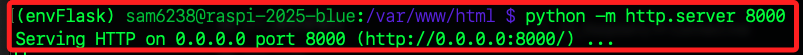

<br>

4. 在區網中其他電腦訪問樹莓派網址，端口指定為 `8000`。

    ```bash
    http://<樹莓派-IP>:8000
    ```

    

<br>

## Flask 網頁伺服器

_同樣是使用 Python 進行部署；特別注意，樹莓派系統預設啟用了 PEP 668 安全機制，禁止使用 pip 安裝破壞系統環境套件，所以部署 Flask 時需要建立虛擬環境，以下示範將暫時略過虛擬環境建立的說明。_

<br>

1. 啟動指定的虛擬環境，這裡是 `envFlask`；關於建立虛擬環境的細節說明詳見下一個小節。

    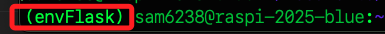

<br>

2. `Flask` 是輕量網頁框架，先透過以下指令安裝套件。

    ```bash
    pip install flask
    ```

<br>

3. 在指定路徑如 `~/Documents` 建立 Flask 專案資料夾 `flask-app`；緊接著進入專案目錄並編輯主腳本 `app.py`。

    ```bash
    cd ~/Documents
    mkdir flask-app
    cd flask-app
    nano app.py
    ```

<br>

4. 在主腳本 `app.py` 中貼上以下內容；其中端口 `5000` 是 `Flask` 預設端口，若有衝突可自訂。

    ```python
    from flask import Flask
    app = Flask(__name__)

    @app.route('/')
    def home():
        return '這是樹莓派上簡易的 Flask 站台'

    if __name__ == '__main__':
        app.run(host='0.0.0.0', port=5000)
    ```

<br>

5. 啟動伺服器，複製其中的網址進行訪問。

    ```bash
    python app.py
    ```

    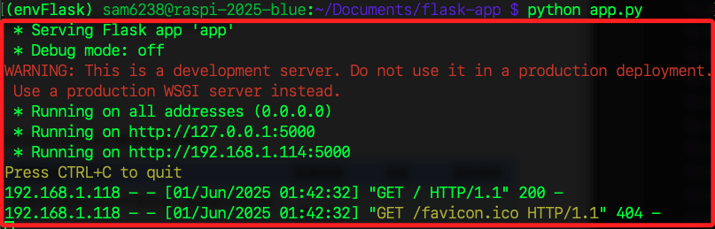

<br>

6. 在區網中訪問。

    ```bash
    <樹莓派-IP>:5000/
    ```

    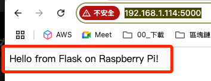

<br>

## FastAPI

_FastAPI 是一個用 Python 編寫的資料接口框架，主要用於快速建立 API 尤其是 RESTful API，或用於自動生成 API 文件等，且支援非同步處理，適合處理大量請求；以下同樣在虛擬環境中完成_

<br>

1. 安裝 FastAPI 與 Uvicorn。

    ```bash
    pip install fastapi uvicorn requests
    ```

<br>

2. 建立並進入專案目錄 `fastapi-app`，接著編輯專案主程式 `main.py`。

    ```bash
    cd ~/Documents
    mkdir fastapi-app
    cd fastapi-app
    nano main.py
    ```

<br>

3. 貼上以下內容用以建立 API，這就是 FastAPI 後端。

    ```python
    from fastapi import FastAPI
    from fastapi.responses import JSONResponse

    app = FastAPI()

    @app.get("/")
    def read_root():
        return {"message": "這是自定義首頁"}

    @app.get("/greet")
    def greet(name: str = "訪客"):
        return JSONResponse(content={"message": f"你好，{name}！"})
    ```

<br>

4. 建立前端網頁 `index.html`。

    ```bash
    nano index.html
    ```

<br>

5. 貼上以下文本；其中 `192.168.1.114` 是樹莓派 IP，務必記得更改為實際的樹莓派 IP。

    ```html
    <!DOCTYPE html>
    <html>
    <head>
    <meta charset="utf-8">
    <title>API 測試</title>
    </head>
    <body>
    <h1>輸入名字取得問候語：</h1>
    <input type="text" id="name" placeholder="請輸入名字">
    <button onclick="callAPI()">送出</button>
    <p id="result"></p>

    <script>
        function callAPI() {
        const name = document.getElementById('name').value;
        fetch(`http://192.168.1.114:8000/greet?name=${name}`)
            .then(response => response.json())
            .then(data => {
            document.getElementById('result').innerText = data.message;
            });
        }
    </script>
    </body>
    </html>
    ```

<br>

6. 建立腳本 `call_api.py`。

    ```bash
    nano call_api.py
    ```

<br>

7. 編輯內容如下；同樣地，其中 `http://192.168.1.114/` 為樹莓派 IP，需依據實際狀況修正。

    ```python
    import requests

    url = "http://192.168.1.114:8000/greet"
    params = {"name": "Sam"}

    response = requests.get(url, params=params)
    print(response.json())
    ```

<br>

8. 啟動伺服器，指定端口為 `8000`；該視窗需保持運行狀態。

    ```bash
    uvicorn main:app --reload --host 0.0.0.0 --port 8000
    ```

<br>

9. 在腳本所在目錄中另外開啟一個終端機，並運行 Python 腳本。

    ```bash
    python call_api.py
    ```

<br>

10. 存取 FastAPI 定義的根目錄（/）路由，對象為 API 使用者。

    ```bash
    <樹莓派-IP>:8000
    ```

<br>

11. 訪問網址可查看自動產生的 Swagger UI API 文件，該文件將提供互動式 API 測試介面給開發者使用，可直接對 API 發送請求並查看回應。

    ```bash
    http://<樹莓派-IP>:8000/docs
    ```

<br>

12. 查看自動產生的 ReDoc API 文件，這是提供開發者閱讀的 API 文件，設計風格與 Swagger 不同但資訊一致。

    ```bash
    http://<樹莓派-IP>:8000/redoc
    ```

<br>

## Node.js 伺服器

_基於 Node.js 的網頁框架能簡化伺服器端應用程式的開發流程，通常提供路由、中介軟體（middleware）、模板引擎整合、錯誤處理等功能，可加速建構 RESTful API、動態網站或即時應用。常見框架如下_

<br>

1. Express.js：最流行的 `Node.js` 網頁框架，結構簡潔、適合開發 `RESTful API` 與一般 Web 應用。

<br>

2. Next.js：基於 `React` 的 `Fullstack` 應用框架，支援 `SSR（Server-Side Rendering）`、`SSG（Static Site Generation）`，可部署於 `Node.js` 環境。

<br>

3. Nuxt.js：基於 `Vue` 的通用應用框架，類似 `Next.js`，支援 `SSR` 與靜態產出，需搭配 `Node.js` 或其他後端伺服器。

<br>

4. Koa.js：由原 `Express` 團隊打造，使用 ES6 `async/await` 為核心，設計更精簡且中立，需自行整合中介軟體。

<br>

5. NestJS：以 `TypeScript` 為基礎的進階架構風格框架，採用 `OOP（物件導向）` 與 `DI（依賴注入）` 模式，適用於大型可維護系統，類似 `Angular` 架構。

<br>

6. Hapi.js：模組化高、安全性設計完善，適合需要細緻控制與大型企業應用的場景。

<br>

7. Sails.js：`MVC` 架構風格，類似 `Ruby on Rails`，支援資料導向開發，適合即時應用如聊天室、遊戲伺服器等。

<br>

## 實作 Express.js

_使用 Express.js 建立最簡單網頁伺服器_

<br>

1. 安裝套件需使用 NPM，若尚未安裝則需先運行以下指令。

    ```bash
    sudo apt update && sudo apt install nodejs npm -y
    ```

<br>

2. 在 `~/Documents` 建立專案資料夾 `express-app`。

    ```bash
    cd ~/Documents
    mkdir express-app
    cd express-app
    ```

<br>

3. 在專案資料夾中進行專案初始化。

    ```bash
    npm init -y
    ```

    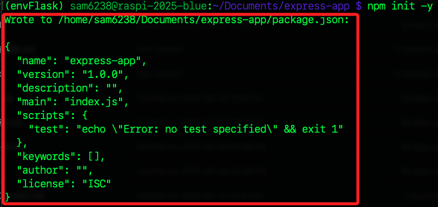

<br>

4. 使用 npm 安裝 Express。

    ```bash
    npm install express
    ```

<br>

5. 建立主程式 `index.js`。

    ```bash
    nano index.js
    ```

<br>

6. 貼上以下內容。

    ```js
    const express = require('express');
    const app = express();
    const port = 3000;

    app.get('/', (req, res) => {
    res.send('Hello, Express!');
    });

    app.listen(port, () => {
        console.log(`伺服器運行中：http://localhost:${port}`);
    });
    ```

<br>

7. 啟動伺服器。

    ```bash
    node index.js
    ```

    

<br>

8. 打開瀏覽器輸入網址進行訪問，指定端口為 `3000`。

    ```bash
    http://<樹莓派-IP>:3000
    ```

<br>

9. 可看到畫面顯示。

    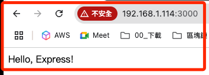

<br>

## 實作 Node.js

1. 安裝 Node.js，使用 NodeSource 安裝較新版本；以下指令會下載並執行 NodeSource 官方提供的安裝腳本，並自動設定套件來源。

    ```bash
    curl -fsSL https://deb.nodesource.com/setup_18.x | sudo -E bash -
    sudo apt install -y nodejs
    ```

<br>

2. 確認安裝成功。

    ```bash
    node -v
    npm -v
    ```

<br>

3. 建立資料夾並初始化專案；可加入參數 `--yes` 省略回答接下來的問題，或是全部按 `ENTER` 使用預設選項。

    ```bash
    cd ~/Documents
    npx create-next-app@latest my-next-app
    cd my-next-app
    ```

    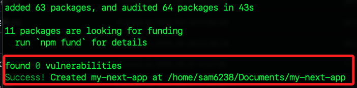

<br>

4. 啟動伺服器。

    ```bash
    npm run dev
    ```

    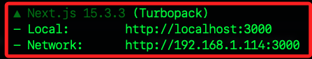

<br>

5. 可依據指示在區網中進行訪問。

    ```bash
    http://<樹莓派IP>:3000
    ```

<br>

6. 可看到 Next.js 初始網頁。

    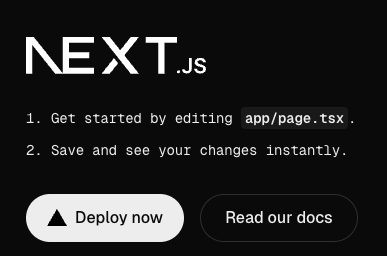

<br>

7. 可編輯 `app/page.tsx` 修改預設的首頁頁面；更改原本的內容如下。

    ```js
    export default function Home() {
    return (
        <main style={{ textAlign: 'center', marginTop: '50px' }}>
        <h1>歡迎來到我的網站！</h1>
        <p>這是使用 Next.js App Router 建立的首頁。</p>
        </main>
    );
    }
    ```

    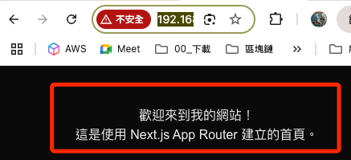

<br>

8. 若要新增 API 路由，可新增檔案到 `pages/api/` 資料夾；特別注意， 因為 `Next.js` 專案使用的是 `App Router` 架構，所以 API 路由應寫在 `app/api/` 目錄下並遵循特定格式。

    ```bash
    mkdir -p app/api/hello
    nano app/api/hello/route.ts
    ```

<br>

9. 貼上以下內容。

    ```js
    import { NextResponse } from 'next/server';

    export async function GET() {
    return NextResponse.json({ message: 'Hello from App Router API!' });
    }
    ```

<br>

10. 重啟服務後訪問，會得到一個標準的 JSON 回應。

    ```bash
    http://<樹莓派-IP>:3000/api/hello
    ```

    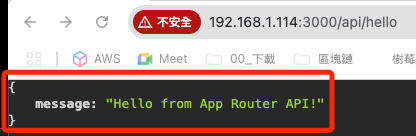

<br>

11. 若要編譯正式版，則將 `dev` 改為 `build`，並且運行 `npm start` 啟動正式環境伺服器。

    ```bash
    npm run build
    npm start
    ```

<br>

## PHP 網頁伺服器

_PHP + Apache/Nginx 是傳統 PHP 架構網站，可與 MariaDB 搭建完整 LAMP/LEMP 環境。_

<br>

1. 樹莓派系統預設並無安裝 PHP。

    ```bash
    sudo apt update
    sudo apt install php -y
    ```

<br>

2. 檢查版本。

    ```bash
    php -v
    ```

<br>

3. 建立 PHP 專案資料夾與檔案。

    ```bash
    cd ~/Documents
    mkdir ~/php-server
    cd ~/php-server
    nano index.php
    ```

<br>

4. 貼上以下內容並儲存。

    ```php
    <?php
    echo "你好，這是來自 PHP 的訊息！";
    ?>
    ```

<br>

5. 啟動 PHP 內建伺服器，此命令會在 `localhost:8000` 啟動伺服器，預設使用目前資料夾作為網站根目錄。

    ```bash
    php -S 0.0.0.0:8000
    ```

<br>

6. 訪問。

    ```bash
    http://<樹莓派-IP>:8000
    ```

    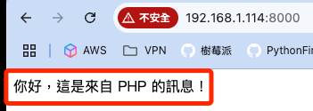

<br>

7. 進一步建立完整的 PHP 網站，先安裝以下套件建立 `Apache + PHP + MariaDB` 的 `LAMP` 環境。

    ```bash
    sudo apt install apache2 php libapache2-mod-php mariadb-server php-mysql -y
    ```

<br>

8. 切換到Apache 預設網站目錄。

    ```bash
    cd /var/www/
    ```

<br>

9. 備份原本的 HTML 檔案並建立新的文本。

    ```bash
    sudo mv /var/www/html/index.html /var/www/html/index.html.bak
    sudo nano /var/www/html/index.php
    ```

<br>

10. 貼上。

    ```php
    <?php
    echo "🎉 LAMP 架構成功運作！這是 Apache + PHP 的首頁訊息。";
    ?>
    ```

<br>

11. 通常安裝完就已啟動，若要手動啟動則運行以下指令。

    ```bash
    sudo systemctl status apache2
    ```

<br>

12. 直接在瀏覽器訪問樹莓派網址即可。

    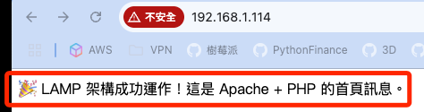

<br>

13. 執行以下指令啟動 MariaDB 設定。

    ```bash
    sudo mysql
    ```

<br>

14. 在 MariaDB 提示符下輸入以下 SQL 指令，這會建立名為 `testdb` 的資料庫，使用者帳號為 `testuser`，密碼為 `testpass`，權限只開放給本機連線。

    ```sql
    CREATE DATABASE testdb;
    CREATE USER 'testuser'@'localhost' IDENTIFIED BY 'testpass';
    GRANT ALL PRIVILEGES ON testdb.* TO 'testuser'@'localhost';
    FLUSH PRIVILEGES;
    ```

<br>

15. 執行以下 SQL 寫入資料庫。

    ```sql
    USE testdb;

    CREATE TABLE users (
    id INT AUTO_INCREMENT PRIMARY KEY,
    name VARCHAR(50) NOT NULL
    );

    INSERT INTO users (name) VALUES ('Alice'), ('Bob'), ('Charlie');

    EXIT;
    ```

<br>

16. 建立 PHP 測試頁面。

    ```bash
    sudo nano /var/www/html/dbtest.php
    ```

<br>

17. 貼上以下內容。

    ```php
    <?php
    $conn = new mysqli("localhost", "testuser", "testpass", "testdb");
    if ($conn->connect_error) {
        die("❌ 資料庫連線失敗：" . $conn->connect_error);
    }

    if ($_SERVER["REQUEST_METHOD"] == "POST") {
        $name = $_POST["name"];
        $stmt = $conn->prepare("INSERT INTO users (name) VALUES (?)");
        $stmt->bind_param("s", $name);
        $stmt->execute();
        $stmt->close();
        echo "✅ 資料已新增：" . htmlspecialchars($name) . "<br><br>";
    }
    ?>

    <form method="POST">
        輸入姓名：<input type="text" name="name" required>
        <input type="submit" value="送出">
    </form>

    <hr>
    <h3>👥 目前資料庫中的使用者：</h3>

    <?php
    $result = $conn->query("SELECT id, name FROM users ORDER BY id DESC");
    if ($result->num_rows > 0) {
        echo "<ul>";
        while($row = $result->fetch_assoc()) {
            echo "<li>🆔 " . $row["id"] . "：👤 " . htmlspecialchars($row["name"]) . "</li>";
        }
        echo "</ul>";
    } else {
        echo "（目前沒有資料）";
    }
    $conn->close();
    ?>
    ```

<br>

18. 重啟服務。

    ```bash
    sudo systemctl restart apache2
    ```

<br>

19. 再次訪問。

    ```bash
    http://192.168.1.114/dbtest.php
    ```

<br>

20. 可嘗試寫入新的資料後刷新網頁。

    ```sql
    USE testdb;
    INSERT INTO users (name) VALUES ('David');
    ```

<br>

21. 查詢。

    ```sql
    USE testdb;
    SELECT * FROM users;
    ```

<br>

## Java 網頁伺服器

_在 Raspberry Pi 上啟動 Spring Boot 伺服器_

<br>

1. 安裝 Java 與 Maven。

    ```bash
    sudo apt update
    sudo apt install default-jdk maven -y
    sudo apt autoremove -y
    ```

<br>

2. 建立專案目錄。

    ```bash
    cd ~/Documents
    mkdir spring-hello
    cd spring-hello
    ```

<br>

3. 在當前路徑中建立目錄結構。

    ```bash
    mkdir -p src/main/java/com/example
    mkdir -p src/main/resources
    ```

    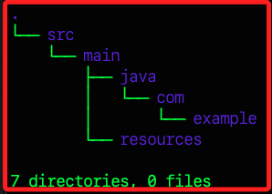

<br>

4. 建立主程式 App.java。

    ```bash
    nano src/main/java/com/example/App.java
    ```

<br>

5. 貼上。

    ```java
    package com.example;

    import org.springframework.boot.SpringApplication;
    import org.springframework.boot.autoconfigure.SpringBootApplication;
    import org.springframework.web.bind.annotation.*;

    @SpringBootApplication
    @RestController
    public class App {

        public static void main(String[] args) {
            SpringApplication.run(App.class, args);
        }

        @GetMapping("/")
        public String hello() {
            return "🎉 你好，這是 Spring Boot 網頁伺服器！";
        }
    }
    ```

<br>

6. 建立 `pom.xml`。

    ```bash
    nano pom.xml
    ```

<br>

7. 填入以下內容。

    ```xml
    <project xmlns="http://maven.apache.org/POM/4.0.0"
            xmlns:xsi="http://www.w3.org/2001/XMLSchema-instance"
            xsi:schemaLocation="http://maven.apache.org/POM/4.0.0 
                                http://maven.apache.org/xsd/maven-4.0.0.xsd">

        <modelVersion>4.0.0</modelVersion>
        <groupId>com.example</groupId>
        <artifactId>spring-hello</artifactId>
        <version>1.0</version>
        <packaging>jar</packaging>

        <parent>
            <groupId>org.springframework.boot</groupId>
            <artifactId>spring-boot-starter-parent</artifactId>
            <version>3.2.5</version>
            <relativePath/>
        </parent>

        <dependencies>
            <!-- Spring Boot Web -->
            <dependency>
                <groupId>org.springframework.boot</groupId>
                <artifactId>spring-boot-starter-web</artifactId>
            </dependency>
        </dependencies>

        <build>
            <plugins>
                <plugin>
                    <groupId>org.springframework.boot</groupId>
                    <artifactId>spring-boot-maven-plugin</artifactId>
                </plugin>
            </plugins>
        </build>
    </project>
    ```

<br>

8. 建構專案，跳過測試。

    ```bash
    mvn package -DskipTests
    ```

<br>

9. 若順利完成，會生成文件。

    ```bash
    target/spring-hello-1.0.jar
    ```

<br>

10. 啟動 Spring Boot 網頁伺服器。

    ```bash
    java -jar target/spring-hello-1.0.jar
    ```

<br>

11. 瀏覽器開啟以下網址。

    ```bash
    http://<樹莓派 IP>:8080/
    ```

    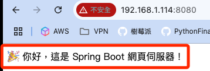

<br>

12. 可擴充簡易的 /api/hello API，編輯 App.java。

    ```bash
    nano src/main/java/com/example/App.java
    ```

<br>

13. 在 `public class App` 導入新的套件。

    ```js
    import java.util.HashMap;
    import java.util.Map;
    ```

<br>

14. 繼續編輯，加入新的路由方法，特別注意縮排。

    ```js
    @GetMapping("/api/hello")
    public Map<String, String> apiHello() {
        Map<String, String> response = new HashMap<>();
        response.put("message", "你好，這是 /api/hello 回應！");
        return response;
    }
    ```

<br>

15. 編輯 `pom.xml`。

    ```bash
    nano pom.xml
    ```

<br>

16. 在 `<dependencies>` 中加上這一段。

    ```js
    <dependency>
        <groupId>org.springframework.boot</groupId>
        <artifactId>spring-boot-starter-thymeleaf</artifactId>
    </dependency>
    ```

<br>

17. 建立 HTML 模板。

    ```bash
    mkdir -p src/main/resources/templates
    nano src/main/resources/templates/welcome.html
    ```

<br>

18. 貼上。

    ```html
    <!DOCTYPE html>
    <html>
    <head><title>歡迎頁</title></head>
    <body>
        <h1>🎉 歡迎來到 Thymeleaf 頁面！</h1>
        <p th:text="'使用者：' + ${name}"></p>
    </body>
    </html>
    ```

<br>

19. 修改 App.java。

    ```bash
    nano src/main/java/com/example/App.java
    ```

<br>

20. 導入。

    ```js
    import org.springframework.ui.Model;
    ```

<br>

21. 在 `public class App` 區塊加入模板頁面，這會對應 `templates/welcome.html`。

    ```js
    @GetMapping("/welcome")
    public String welcomePage(Model model) {
        model.addAttribute("name", "Sam 使用者");
        return "welcome";
    }
    ```

<br>

22. 再次啟動並訪問。

    ```bash
    mvn package -DskipTests
    java -jar target/spring-hello-1.0.jar
    ```

<br>

23. 訪問 JSON API。

    ```bash
    http://<樹莓派-IP>:8080/api/hello
    ```

<br>

24. 訪問 HTML 模板。

    ```bash
    http://<樹莓派-IP>:8080/welcome
    ```

<br>

## 容器化方式

_針對以前面步驟建立的 `spring-hello` Spring Boot 專案進行容器化_

<br>

1. 在樹莓派上安裝 Docker。

    ```bash
    sudo apt update
    sudo apt install docker.io -y
    sudo systemctl enable docker
    sudo systemctl start docker
    ```

<br>

2. 在 `spring-hello` 專案根目錄下建立 `Dockerfile`。

    ```bash
    cd ~/spring-hello
    nano Dockerfile
    ```

<br>

3. 填入以下內容，使用 `eclipse-temurin:17-jdk-jammy` 為 ARM 架構適用的 Java 基礎鏡像。

    ```bash
    FROM eclipse-temurin:17-jdk-jammy

    WORKDIR /app

    COPY target/spring-hello-1.0.jar app.jar

    EXPOSE 8080

    ENTRYPOINT ["java", "-jar", "app.jar"]
    ```

<br>

4. 建立 Docker 鏡像檔；`docker` 指令都必須使用 `sudo` 權限執行。

    ```bash
    sudo docker build -t spring-hello .
    ```

<br>

5. 執行容器。

    ```bash
    sudo docker run -d -p 8080:8080 --name spring-container spring-hello
    ```

<br>

6. 瀏覽器訪問樹莓派 IP。

    ```
    http://<樹莓派-IP>:8080/
    ```

<br>

7. 查看當前運行的容器。

    ```bash
    sudo docker ps
    ```

<br>

8. 停止與刪除容器。

    ```bash
    sudo docker stop spring-container
    sudo docker rm spring-container
    ```

<br>

## Hugo

_除了前述的 Node.js 及 Python 以外，以下介紹 Go 語言製作的靜態網頁_

<br>

1. 下載 hugo 適用於 ARM64 架構的版本；特別注意，版本號如 `v0.147.7` 可能會更新，可前往 [官網](https://github.com/gohugoio/hugo/releases) 確認最新版本；下載完成進行解壓縮。

    ```bash
    cd ~/Downloads
    wget https://github.com/gohugoio/hugo/releases/download/v0.147.0/hugo_extended_0.147.0_Linux-ARM64.tar.gz
    ```

<br>

2. 解壓縮到指定目錄。

    ```bash
    mkdir -p ~/Downloads/hugo147
    tar -xvzf hugo_extended_0.147.0_Linux-ARM64.tar.gz -C ~/Downloads/hugo147
    ```

<br>

3. 移動到系統路徑。

    ```bash
    sudo mv ~/Downloads/hugo147/hugo /usr/local/bin/
    ```

<br>

4. 確認版本。

    ```bash
    hugo version
    ```

<br>

5. 建立 Hugo 網站專案。

    ```bash
    cd ~/Documents
    hugo new site mysite
    cd mysite
    ```

<br>

6. 加入主題，以 Ananke 為例。

    ```bash
    git init
    git submodule add https://github.com/theNewDynamic/gohugo-theme-ananke.git themes/ananke
    ```

<br>

7. 編輯設定檔 `config.toml`。

    ```bash
    nano config.toml
    ```

<br>

8. 貼上以下內容。

    ```bash
    baseURL = "http://localhost/"
    languageCode = "zh-tw"
    title = "我的 Hugo 網站"
    theme = "ananke"
    ```

<br>

9. 建立一篇文章。

    ```bash
    hugo new posts/hello.md
    ```

<br>

10. 接著編輯 `content/posts/hello.md`。

    ```bash
    nano content/posts/hello.md
    ```

<br>

11. 修改為以下內容；如果 draft = true，Hugo 預設不會產出該文章。

    ```bash
    +++
    title = "Hello"
    date = 2025-06-01T22:27:34+08:00
    draft = false
    +++

    這是我的第一篇 Hugo 網誌內容。
    ```

<br>

12. 建構網站，這會產生在 `public/` 資料夾中；如果你想要包含還在草稿狀態的文章，可加上參數 `-D`。

    ```bash
    hugo
    ```

    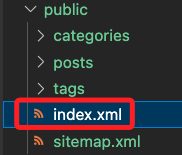

<br>

13. Hugo 會優先使用 hugo.toml，導致主題未載入、頁面無法渲染，所以移除。

    ```bash
    rm hugo.toml
    ```

<br>

14. 本機預覽。

    ```bash
    hugo server -D --bind 0.0.0.0
    ```

<br>

15. 訪問。

    ```bash
    http://<樹莓派-IP>:1313/
    ```

    

<br>

16. 安裝。

    ```bash
    sudo apt update
    sudo apt install nginx -y
    ```

<br>

17. apache2 佔用了 80 埠，先將其停止。

    ```bash
    sudo systemctl stop apache2
    sudo systemctl disable apache2
    ```

<br>

18. 啟動服務。

    ```bash
    sudo systemctl start nginx
    sudo systemctl enable nginx
    ```

<br>

19. 部署到 Nginx 網頁伺服器。

    ```bash
    sudo cp -r public/* /var/www/html/
    ```

<br>

20. 在瀏覽器訪問，會看到前面相同的靜態網頁內容。

    ```bash
    http://<樹莓派-IP>/
    ```

<br>

___

_END_


