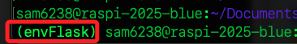

# 快速建立虛擬環境

<br>

## 步驟

1. 切換到 `~/Documents`，建立並進入統一管理虛擬環境的資料夾 `PythonVenvs`。

    ```bash
    cd ~/Documents
    mkdir PythonVenvs && cd PythonVenvs
    ```

<br>

2. 建立虛擬環境 `envFlask`。

    ```bash
    python -m venv envFlask
    ```

<br>

3. 進入環境目錄。

    ```bash
    cd envFlask/bin
    ```

<br>

4. 查詢當前絕對路徑；複製結果待用。

    ```bash
    pwd
    ```

<br>

5. 編輯環境參數。

    ```bash
    nano ~/.bashrc
    ```

<br>

6. 在最下方添加。

    ```bash
    source /home/sam6238/Documents/PythonVenvs/envFlask/bin/activate
    ```

<br>

7. 立即套用；在提示字元前綴會顯示虛擬環境名稱。

    ```bash
    source ~/.bashrc
    ```

    

<br>

8. 若要跳脫虛擬環境。

    ```bash
    deactivate
    ```

<br>

___

_END_