# Apache 伺服器站台實作

_以下將分幾個階段依序完成站台建立_

<br>

## 步驟與說明

1. 安裝與檢查；

2. 設定文件說明；

3. 授權編輯設定文件；

4. 多人共用一台主機樹莓派設備；

5. 修改設定文件；

6. 是否使用預設的設定文件；

7. 授權訪問文件；

8. 建立網站文本進行測試；

9. 錯誤排除；

<br>

## 安裝與檢查

1. 更新套件索引＆升級套件。

   ```bash
   sudo apt update && sudo apt upgrade -y
   ```

<br>

2. 安裝 `apache2`。

   ```bash
   sudo apt install apache2 -y
   ```

   

<br>

3. 透過指令查詢 `apache2` 安裝狀態：使用 `dpkg -l` 命令列出與 `apache2` 相關的套件列表。

   ```bash
   dpkg -l | grep apache2
   ```

   

<br>

4. 查詢 `apache2` 安裝的版本。

   ```bash
   apache2 -v
   ```

   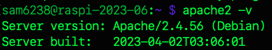

<br>

5. 查詢 `apache2` 服務是否啟動。

   ```bash
   sudo systemctl status apache2
   ```

   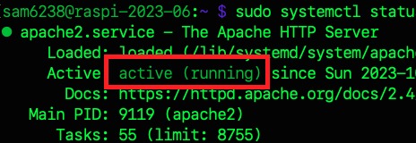

<br>

6. _若未啟動_，立即啟動服務。

   ```bash
   sudo systemctl start apache2
   ```

<br>

7. 設定為開機啟動。

   ```bash
   sudo systemctl enable apache2
   ```

   

<br>

## 端口佔用

_若預設端口 `80` 被佔用會導致啟動失敗_

<br>

1. 啟動失敗時會顯示 `failed`。

   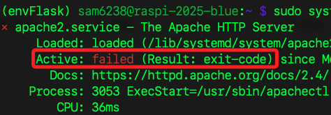

<br>

2. 查詢端口使用狀況。

   ```bash
   sudo lsof -i :80
   ```

<br>

3. 如需要查看詳細錯誤日誌。

   ```bash
   sudo journalctl -xeu apache2.service
   ```

<br>

4. 停用佔用端口的服務如 `lighttpd`，同時啟用 `Apache`。

   ```bash
   sudo systemctl stop lighttpd
   sudo systemctl disable lighttpd
   sudo systemctl start apache2
   ```

<br>

## 設定文件說明

_`Apache` 的配置分為 `全域` 與 `個別` 配置文件。_

<br>

1. 使用 `cat` 指令查看全域配置文件。

   ```bash
   cat /etc/apache2/apache2.conf
   ```

<br>

2. 查看個別配置文件路徑；這是用於定義 `單個網站` 或 `應用程式` 的設定，可以在此配置每個網站的文件根目錄、特定的伺服器名稱、伺服器別名、錯誤頁面等。

   ```bash
   cat /etc/apache2/sites-available/000-default.conf
   ```

<br>

## 授權編輯設定文件

_使用終端機編輯器查看這類文件很吃力，可設定授權後使用 VSCode 進行查看與編輯。_

<br>

1. 使用指令 `chown` 以管理員身份變更文件的擁有者達到 `授權` 目的，`$USER` 表示目前登入的使用者。

   _全域文件_

   ```bash
   sudo chown $USER /etc/apache2/apache2.conf
   ```

   _個別文件_

   ```bash
   sudo chown $USER /etc/apache2/sites-available/000-default.conf
   ```

<br>

2. 因為使用 VSCode 編輯文件時，無法執行類似於 `sudo nano` 這樣的授權行為，所以必須修改檔案權限或是擁有者來達到賦予權限的效果；另外，在只有單人的開發情境下，使用授權或是變更擁有者的效果並無差異。

<br>

## 多人共用一台樹莓派

_這裡僅是 `共用設備` 而不是指 `共同開發` 的情境；`多人共用一台樹莓派` 時，因為 `/etc` 文件屬於 `全域` 的設定檔案，所以將文件 `擁有者` 改為特定人實屬不便，此時可直接使用終端機以 `sudo nano` 進行編輯；另外，可透過建立權限群組，如 `apacheadmin`，然後透過將使用者加入群組來配置權限，以下示範的是建立群組的方式_

<br>

1. 查詢群組是否存在；若群組存在，會顯示相關資訊；若沒有，則不輸出任何內容。

   ```bash
   getent group apacheadmin
   ```

<br>

2. 建立群組如 `apacheadmin`。

   ```bash
   sudo groupadd apacheadmin
   ```

<br>

3. 將文件加入群組；`chgrp` 就是 `change group` 的意思。

   ```bash
   sudo chgrp apacheadmin /etc/apache2/apache2.conf /etc/apache2/sites-available/000-default.conf
   ```

<br>

4. 設定檔案或目錄權限；指令 `chmod` 就是 `change mode`，這會變更權限，`660` 意思就是賦予擁有者與群組 `讀寫（r+w）` 權限。

   ```bash
   sudo chmod 660 /etc/apache2/apache2.conf /etc/apache2/sites-available/000-default.conf
   ```

<br>

5. 將指定使用者加入指定群組；當 `adduser` 僅有一個參數時，代表 `新增使用者`，若接上第二個參數，代表將使用者加入指定群組。

   ```bash
   sudo adduser $USER apacheadmin
   ```

<br>

6. 有時會使用較為寬鬆的權限設定方式，也就是將檔案設為 `666` 或 `777`，也就是開放所有使用者對該檔案具有讀寫甚至執行的權限；雖然在實務上不建議這樣做，因為可能帶來安全風險，但在非正式或測試環境中，這種方式可用於快速排除權限問題。

   ```bash
   sudo chmod 666 /etc/apache2/apache2.conf /etc/apache2/sites-available/000-default.conf
   ```

<br>

## 修改設定文件

1. 首先，在設定文件中將會指定 `超文本所在路徑`，所以先建立這個指定目錄；以下指令會將目錄建立在 `/home/sam6238/Documents` 。

   ```bash
   mkdir /home/sam6238/Documents/my_web
   ```

<br>

2. 修改 `全域` 配置，特別注意 `縮排` 要手動調整跟其他文本一樣，到這裡同學應該發現檔案內容很多，使用 `nano` 編輯不太友善，這也就是為何前面要授權讓我們可以在此使用 VSCode 編輯的原因，假如已經設定好權限，可以使用 VSCode 編輯。

   ```bash
   sudo nano /etc/apache2/apache2.conf
   ```

<br>

3. 滑動到程式碼中以下區塊進行添加內容 `# 添加這個`，其餘部分可以不用變動。

   ```html
   <Directory />
      Options FollowSymLinks
      AllowOverride None
      Require all granted
   </Directory>
   <Directory /usr/share>
      AllowOverride None
      Require all granted
   </Directory>
   <Directory /var/www/>
      Options Indexes FollowSymLinks
      AllowOverride None
      Require all granted
   </Directory>
   # 添加這個
   <Directory <超文本所在目錄>>
      Options Indexes FollowSymLinks
      AllowOverride None
      Require all granted
   </Directory>    
   ```

<br>

4. 超文本所在目錄就是前面自己建立的目錄，比如說 `/home/sam6238/Documents/my_web`；特別注意箭頭括號的格式。

   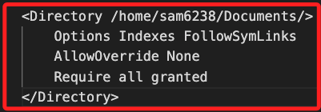

<br>

5. 修改 `個別` 網站配置。

   ```bash
   sudo nano /etc/apache2/sites-available/000-default.conf
   ```

<br>

6. 添加內容 `# 添加這個`，並且些修改 `超文本所在目錄`，其餘部分不用變動；可把預設註解的內容都刪除，這樣會看得比較清楚。

   ```html
   <VirtualHost *:80>
      ServerAdmin webmaster@localhost
      DocumentRoot <超文本所在目錄>

      # 添加這段
      <Directory <超文本所在目錄>>
         Options Indexes FollowSymLinks
         AllowOverride All
         Require all granted
      </Directory>

      ErrorLog ${APACHE_LOG_DIR}/error.log
      CustomLog ${APACHE_LOG_DIR}/access.log combined
   </VirtualHost>
   ```

<br>

## 指定要使用的設定文件

_因為將使用預設值，所以這裡僅作說明無需實作_

<br>

1. 若要禁用預設的設定檔 `000-default.conf`；`a2dissite` 是 `Apache 2 Disable Site` 的縮寫。

   ```bash
   sudo a2dissite 000-default.conf
   ```

   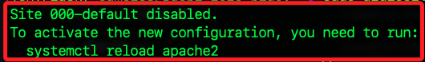

<br>

2. 啟用指定的設定檔。

   ```bash
   sudo a2ensite <自訂設定檔案>
   ```

<br>

3. 使用預設檔案。

   ```bash
   sudo a2ensite 000-default.conf
   ```

<br>

## 授權訪問文件

1. 讓 `Apache` 用戶有權限訪問服務相關目錄。

   ```bash
   sudo chmod -R 755 <Apache 超文本所在目錄>
   ```

   _如_

   ```bash
   sudo chmod -R 755 /home/sam6238/Documents/my_web
   ```

<br>

2. 確保 Apache 用戶（通常是 www-data）是相關目錄和文件的擁有者

   ```bash
   sudo chown -R www-data:www-data <Apache 超文本所在目錄>
   ```

   如

   ```bash
   sudo chown -R www-data:www-data  /home/sam6238/Documents/my_web
   ```

<br>

3. 因為 `DocumentRoot` 設置為 `<Apache 超文本所在目錄>`，那麼 `Apache` 需要對所在目錄的上層資料夾也具有執行權限方可進行訪問。

   ```bash
   sudo chmod +x /home
   sudo chmod +x /home/<使用者名稱>
   ```

   _如_

   ```bash
   sudo chmod +x /home
   sudo chmod +x /home/sam6238
   ```

<br>

4. 後續會添加超文本，所以可先授權自己擁有添加文件的權限，沒授權的話將無法新增 `index.html`。

   ```bash
   sudo chown -R <使用者名稱>:<使用者同名群組名稱> <Apache 超文本所在目錄>
   ```

   _如_

   ```bash
   sudo chown -R sam6238:sam6238 /home/sam6238/Documents/my_web
   ```

   _或_

   ```bash
   sudo chown -R $USER:$USER /home/sam6238/Documents/my_web
   ```

<br>

## 建立網站文本進行測試

1. 進入超文本目錄，建立一個 `index.html` 檔案。

   ```bash
   sudo touch index.html
   ```

   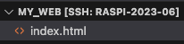

<br>

2. 開啟 `index.html` 使用 VSCode 透過快速鍵 `!` 建立文本。

   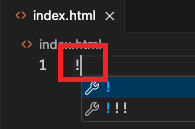

<br>

3. 任意修改。

   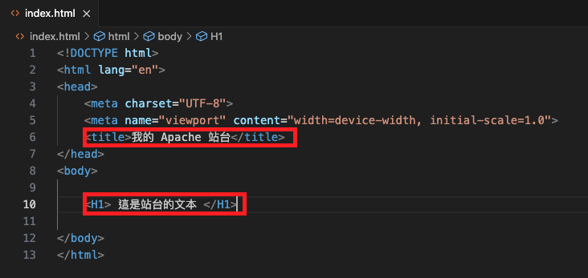

<br>

4. 完成要重新啟動。

   ```bash
   sudo systemctl reload apache2
   ```

<br>

5. 在樹莓派上瀏覽 `http://localhost` 或在區網內訪問樹莓派網址。

   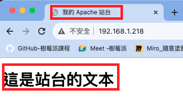

<br>

## 錯誤排除

1. 假使看到的是這個內容，表示文本路徑設置錯誤，所以訪問到預設內容。

   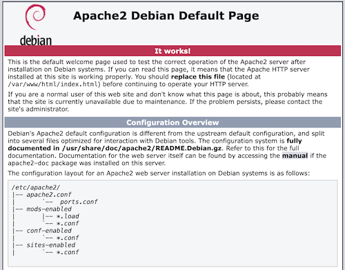

<br>

2. 在進行任何更改之前，先確保 Apache 配置文件沒有 `語法錯誤`。

   ```bash
   sudo apache2ctl configtest
   ```

   _正確的話會看到 `Syntax OK`_

   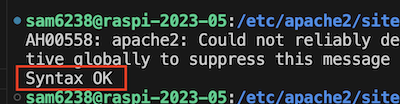

   _錯誤的話會看到 `Action 'configtest' failed`_

   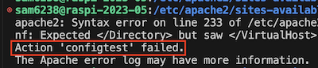

<br>

3. 查看日誌可以看到詳細的錯誤與問題。

   ```bash
   sudo tail -f /var/log/apache2/error.log
   ```

<br>

4. 確認站台是否啟動 `active`。

   ```bash
   sudo systemctl status apache2
   ```

   _沒有啟動會顯示 `failed`_
   
   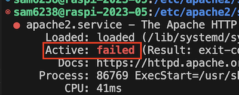

<br>

___

_END：以上建立自己的 Apache 站台_
