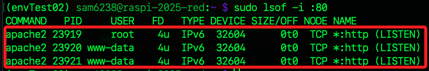
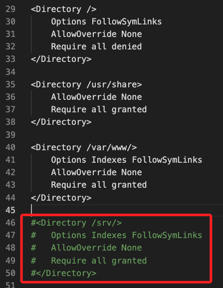
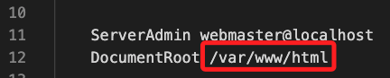
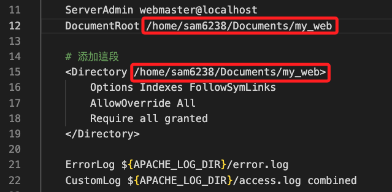
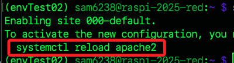

# Apache 伺服器站台實作

_以下將分幾個階段依序完成站台建立_

<br>

## 步驟與說明

1. 安裝與檢查；

2. 設定文件說明；

3. 授權編輯設定文件；

4. 多人共用一台主機樹莓派設備；

5. 修改設定文件；

6. 是否使用預設的設定文件；

7. 授權訪問文件；

8. 建立網站文本進行測試；

9. 錯誤排除；

<br>

## 安裝與檢查

1. 更新套件索引並升級套件。

   ```bash
   sudo apt update && sudo apt upgrade -y
   ```

<br>

2. 安裝套件 `apache2`。

   ```bash
   sudo apt install apache2 -y
   ```

   

<br>

3. 使用 `dpkg -l` 命令查詢是否已安裝 `apache2` 及相關套件。

   ```bash
   dpkg -l | grep apache2
   ```

   

<br>

4. 查詢 `apache2` 安裝的版本。

   ```bash
   apache2 -v
   ```

   

<br>

5. 查詢 `apache2` 服務是否啟動。

   ```bash
   sudo systemctl status apache2
   ```

   

<br>

6. _若未啟動_，立即啟動服務。

   ```bash
   sudo systemctl start apache2
   ```

<br>

7. 查看是否為開機自動啟動。

   ```bash
   sudo systemctl enable apache2
   ```

<br>

8. 設定為開機啟動。

   ```bash
   sudo systemctl enable apache2
   ```

   

<br>

## 端口佔用

_若預設端口 `80` 被佔用會導致啟動失敗_

<br>

1. 啟動失敗時會顯示 `failed`。

   

<br>

2. 查詢端口使用狀況；`Apache` 是多進程架構，預設會 fork 多個 worker，以便同時處理多個請求，所以會看到多個進程。

   ```bash
   sudo lsof -i :80
   ```

   

<br>

3. 如需要查看詳細錯誤日誌。

   ```bash
   sudo journalctl -xeu apache2.service
   ```

<br>

4. 假設端口被其他服務如 `lighttpd` 佔用，需將其停用、再啟用 `apache2`；記得要 `disable` 取消開機啟動，不然重啟後可能會衝突。

   ```bash
   sudo systemctl stop lighttpd
   sudo systemctl disable lighttpd
   sudo systemctl start apache2
   ```

<br>

## 設定文件說明

_`Apache` 的配置分為 `全域` 與 `個別` 配置文件；服務啟動時會運行預設設定，假如使用預設首頁 `/var/www/html` 可不修改相關設定，若要部署自訂的站台或建立多站台網域則需要修改；另外，若有特殊安全性與性能需求時也需經過修正設定來達成。_

<br>

1. 查看全域配置文件。

   ```bash
   cat /etc/apache2/apache2.conf
   ```

<br>

2. 查看個別配置文件；所謂 `個別配置` 就是用於定義特定 `網站` 或 `應用程式` 的設定，可針對指定對象配置網站文件的根目錄、特定的伺服器名稱、伺服器別名、錯誤頁面等。

   ```bash
   cat /etc/apache2/sites-available/000-default.conf
   ```

<br>

## 授權編輯設定文件

_使用終端機編輯器查看這類文件很吃力，建議使用 VSCode 進行查看，若要使用 VSCode 編輯則需進行授權。_

<br>

1. 以管理員身份使用指令 `chown` 變更文件的擁有者，如此便可達到 `授權` 目的，`$USER` 表示目前登入的使用者。

   _全域文件_

   ```bash
   sudo chown $USER /etc/apache2/apache2.conf
   ```

   _個別文件_

   ```bash
   sudo chown $USER /etc/apache2/sites-available/000-default.conf
   ```

<br>

2. 使用 VSCode 編輯文件時，不像使用終端機編輯器可執行 `sudo nano` 的授權行為，所以必須修改檔案權限或擁有者來達到賦予權限的效果；另外，在只有單人的開發情境下，使用授權或是變更擁有者的效果並無差異。

<br>

## 多人共用一台樹莓派

_這裡僅是 `共用設備` 而不是指 `共同開發` 的情境；`多人共用一台樹莓派` 時，因為 `/etc` 文件屬於 `全域` 的設定檔案，所以將文件 `擁有者` 改為特定人實屬不便，此時可直接使用終端機以 `sudo nano` 進行編輯；另外，可透過建立權限群組，如 `apacheadmin`，然後透過將使用者加入群組來配置權限，以下示範的是建立群組的方式_

<br>

1. 查詢群組是否存在；若群組存在，會顯示相關資訊；若沒有，則不輸出任何內容。

   ```bash
   getent group apacheadmin
   ```

<br>

2. 建立群組如 `apacheadmin`。

   ```bash
   sudo groupadd apacheadmin
   ```

<br>

3. 將文件加入群組；`chgrp` 就是 `change group` 的意思。

   ```bash
   sudo chgrp apacheadmin /etc/apache2/apache2.conf /etc/apache2/sites-available/000-default.conf
   ```

<br>

4. 設定檔案或目錄權限；指令 `chmod` 就是 `change mode`，這會變更權限，`660` 意思就是賦予擁有者與群組 `讀寫（r+w）` 權限。

   ```bash
   sudo chmod 660 /etc/apache2/apache2.conf /etc/apache2/sites-available/000-default.conf
   ```

<br>

5. 將指定使用者加入指定群組；當 `adduser` 僅有一個參數時，代表 `新增使用者`，若接上第二個參數，代表將使用者加入指定群組。

   ```bash
   sudo adduser $USER apacheadmin
   ```

<br>

6. 有時會使用較為寬鬆的權限設定方式，也就是將檔案設為 `666` 或 `777`，也就是開放所有使用者對該檔案具有讀寫甚至執行的權限；雖然在實務上不建議這樣做，因為可能帶來安全風險，但在非正式或測試環境中，這種方式可用於快速排除權限問題。

   ```bash
   sudo chmod 666 /etc/apache2/apache2.conf /etc/apache2/sites-available/000-default.conf
   ```

<br>

## 修改 `全局` 配置

1. 首先，在後續步驟進行設定，會在文件中指定 `超文本所在路徑`，所以先建立這個指定的資料夾；以下示範將目錄建立在 `~/Documents`。

   ```bash
   mkdir ~/Documents/my_web
   ```

<br>

2. 修改 `全域` 配置，特別注意 `縮排` 要手動調整跟其他文本一樣，到這裡同學應該發現檔案內容很多，使用 `nano` 編輯不太友善，這也就是為何前面要授權讓我們可以在此使用 VSCode 編輯的原因，假如已經設定好權限，可以使用 VSCode 編輯。

   ```bash
   sudo nano /etc/apache2/apache2.conf
   ```

<br>

3. 滑動以下區塊，將框選的部分取消註解。

   

<br>

4. 將其中的 `/srv/` 替換為自己的 `<超文本所在目錄>`。

   ```html
   <Directory <超文本所在目錄>>
      Options Indexes FollowSymLinks
      AllowOverride None
      Require all granted
   </Directory>    
   ```

<br>

5. 超文本所在目錄就是前面建立的資料夾路徑，格式如下 `/home/sam6238/Documents/my_web`；務必將路徑展開，不要使用 `~` 符號。

   

<br>

## 修改 `個別` 配置

1. 使用 `nano` 或是 `VSCode` 開啟設定文件。

   ```bash
   sudo nano /etc/apache2/sites-available/000-default.conf
   ```

<br>

2. 先修改以下代碼，將 `/var/www/html` 替換為 `<超文本所在目錄>`。

   

3. 添加以下內容，並替換 `<超文本所在目錄>`。

   ```html
   <Directory <超文本所在目錄>>
      Options Indexes FollowSymLinks
      AllowOverride All
      Require all granted
   </Directory>
   ```

<br>

4. 完整的修改如下。

   

<br>

5. 可複製以下文本進行修改。

   ```html
   <VirtualHost *:80>

      ServerAdmin webmaster@localhost
      DocumentRoot <超文本所在目錄>

      <Directory <超文本所在目錄>>
         Options Indexes FollowSymLinks
         AllowOverride All
         Require all granted
      </Directory>

      ErrorLog ${APACHE_LOG_DIR}/error.log
      CustomLog ${APACHE_LOG_DIR}/access.log combined

   </VirtualHost>
   ```

<br>

## 指定所要使用的設定文件

_前一個步驟是編輯設定文件，接著可指定要使用哪一個設定文件，這也代表系統中可以存在一個以上的設定文件作為選擇與切換對象；由於在這示範使用預設值，所以僅作說明無需實作_

<br>

1. 預設的設定檔為 `000-default.conf`，可使用指令 `a2dissite` 進行禁用；`a2dissite` 是 `Apache 2 Disable Site` 的縮寫。

   ```bash
   sudo a2dissite 000-default.conf
   ```

   

<br>

2. 啟用指定的設定檔。

   ```bash
   sudo a2ensite <自訂設定檔案>
   ```

<br>

3. 若要使用預設檔案，也就是指定為預設文件 `000-default.conf`。

   ```bash
   sudo a2ensite 000-default.conf
   ```

<br>

4. 完成後依指示重啟服務。

   ```bash
   systemctl reload apache2
   ```

   

<br>

## 授權訪問文件

_網頁要能夠正確顯示，必須訪問者有權限讀取相關目錄_

<br>

1. 授權 `Apache` 用戶有權限訪問服務相關目錄。

   ```bash
   sudo chmod -R 755 <Apache 超文本所在目錄>
   ```

   _如_

   ```bash
   sudo chmod -R 755 ~/Documents/my_web
   ```

<br>

2. 確保 `Apache` 用戶是相關目錄和文件的擁有者，而 `www-data` 就是 `Ubuntu/Debian` 系統中 `Apache` 的預設執行用戶；透過以下設定便可確保 `Apache` 有權限讀寫指定的目錄。

   ```bash
   sudo chown -R www-data:www-data <Apache 超文本所在目錄>
   ```

   _如_

   ```bash
   sudo chown -R www-data:www-data  ~/Documents/my_web
   ```

<br>

3. 因為 `DocumentRoot` 設置為 `<Apache 超文本所在目錄>`，那麼 `Apache` 需要對所在目錄的上層資料夾也具有執行權限方可進行訪問。

   ```bash
   sudo chmod +x /home
   sudo chmod +x /home/<使用者名稱>
   ```

   _如_

   ```bash
   sudo chmod +x /home
   sudo chmod +x /home/sam6238
   ```

<br>

4. 後續會添加超文本，所以在這先授權自己擁有添加文件的權限；若無權限，後續將無法新增 `index.html`。

   ```bash
   sudo chown -R <使用者名稱>:<使用者同名群組名稱> <Apache 超文本所在目錄>
   ```

   _如_

   ```bash
   sudo chown -R sam6238:sam6238 ~/Documents/my_web
   ```

<br>

5. 以上指令可進一步使用 `$USER` 來表達當前使用者 `sam6238`；在編程時，無論腳本或指令都應儘量避免硬編碼。

   ```bash
   sudo chown -R $USER:$USER ~/Documents/my_web
   ```

<br>

## 建立網站文本

1. 進入指定的文本目錄 `/home/sam6238/Documents/my_web`，接著新增 `index.html` 檔案。

   ```bash
   cd ~/Documents/my_web
   touch index.html
   ```

   

<br>

2. 在 VSCode 中開啟 `index.html`，並使用快速鍵 `!` 建立文本。

   

<br>

3. 可任意修改 `<title>` 或在 `<body>` 中添加一個 `<H1>`。

   

<br>

4. 完成要重新啟動 `apache2`。

   ```bash
   sudo systemctl reload apache2
   ```

<br>

5. 在樹莓派上瀏覽 `http://localhost` 或在區網內訪問樹莓派網址 `http://<樹莓派-IP>`。

   

<br>

6. 可稍做優化。

   ```html
   <!DOCTYPE html>
   <html lang="zh-Hant">
   <head>
   <meta charset="UTF-8" />
   <meta name="viewport" content="width=device-width, initial-scale=1" />
   <title>Welcome to Raspberry Pi Web</title>
   <link href="https://cdn.jsdelivr.net/npm/bootstrap@5.3.3/dist/css/bootstrap.min.css" rel="stylesheet" />
   <style>
      body {
         background: linear-gradient(to right, #74ebd5, #ACB6E5);
         min-height: 100vh;
         display: flex;
         align-items: center;
         justify-content: center;
         color: #333;
      }
      .card {
         border-radius: 1rem;
         box-shadow: 0 0 20px rgba(0,0,0,0.2);
      }
      .btn-primary {
         background-color: #4a90e2;
         border-color: #4a90e2;
      }
   </style>
   </head>
   <body>
   <div class="container text-center">
      <div class="card p-5">
         <h1 class="mb-3">🌐 歡迎使用 Raspberry Pi 網頁伺服器</h1>
         <p class="lead">已成功啟動 Apache2！這是一個使用 Bootstrap 打造的簡潔頁面。</p>
         <hr />
         <p>若看到這個畫面，代表 Apache 正常運作。</p>
         <a href="https://www.raspberrypi.com" target="_blank" class="btn btn-primary mt-3">前往 Raspberry Pi 官網</a>
      </div>
   </div>
   </body>
   </html>
   ```

<br>

## 錯誤排除

1. 假使看到的是 Apache2 預設的首頁，表示文本路徑設置錯誤，所以會訪問到預設內容。

   

<br>

2. 可使用指令查詢 `Apache` 配置文件是否有 `語法錯誤`；正確會回傳 `Syntax OK`。

   ```bash
   sudo apache2ctl configtest
   ```

   

<br>

3. 承上，若有語法錯誤會傳回 `Action 'configtest' failed`。

   

<br>

4. 可透過查看日誌找出詳細的錯誤與問題。

   ```bash
   sudo tail -f /var/log/apache2/error.log
   ```

<br>

5. 查看站台狀態，正確啟動會顯示 `active`。

   ```bash
   sudo systemctl status apache2
   ```

<br>

6. 承上，若沒有啟動會顯示 `failed`。

   

<br>

___

_END：以上完成 Apache 站台的建立_
