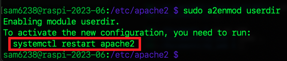

# 使用者目錄

_在多人共用的樹莓派環境下建置個別用戶的 Apache 站台；`Apache` 有一個 `userdir` 模組，允許使用者在自己的 `家目錄` 中提供網站內容，每個使用者可以有獨立的 `Apache` 主機和超文本目錄，通過使用 Apache 的 `使用者主目錄` 功能來實現多人共用的環境。_

<br>

## 操作說明

1. 啟用模組 `userdir`。

   ```bash
   sudo a2enmod userdir
   ```

<br>

2. 提示所有修改皆須重啟站台。

   

<br>

3. 無需立即重啟，可等待全部修改完成後再重啟。

   ```bash
   sudo systemctl restart apache2
   ```

<br>

4. 重啟時可能會出現紅色警告提示輸入密碼，輸入後完成開啟。

   

<br>

## 文件說明

_無需特別修改這個檔案的內容_

<br>

1. 查看或編輯 `userdir` 模組設定文件。

   ```bash
   sudo nano /etc/apache2/mods-available/userdir.conf
   ```

<br>

2. 原始內容如下。

   

<br>

3. 文件中預設每個使用者可以在自己的 `家目錄` 中建立一個名為 `public_html` 的目錄，並在該目錄中放置網站內容，若要修改預設的目錄名稱則更改 `public_html` 即可。

   ```bash
   UserDir public_html
   ```

<br>

4. 若是要禁用某個使用者，可以添加在 `UserDir disabled` 之後，如 `UserDir disabled <特定使用者名稱>`；特別注意，預設不允許 root 使用者提供個人網站目錄，因為正常情況下，root 不會作為一般網站使用者建立 public_html，這是給一般帳號使用的功能。

   ```bash
   UserDir disabled <特定使用者名稱>
   ```

<br>

5. 若啟用了 `userdir` 模組，接著建立資料夾 `public_html` 目錄來存放超文本；這裡使用預設的目錄不做更改。

   ```bash
   mkdir ~/public_html
   ```

<br>

6. 保存更改並重啟 Apache。

   ```bash
   sudo systemctl restart apache2
   ```

<br>

## 建立站台

_完成以上步驟後，每個使用者都可以在自己的家目錄中建立一個 `public_html` 目錄，並在其中放置 HTML 文件或其他網站資料_

<br>

1. 建立文本。

   ```bash
   touch ~/public_html/index.html
   ```

   

<br>

2. 訪問個別使用者網站；透過以下 URL 訪問，以 `username` 為例。

   ```bash
   http://樹莓派網址/~username/
   ```

   

<br>

3. 波浪號 `~` 在 Linux 系統中是 `家目錄` 的縮寫，當使用網址 `http://樹莓派網址/~username/` ，其中 `~username` 部分是 Apache 的 `mod_userdir` 模組的特別用法，透過這個設定，每個使用者便可提供家目錄下的 `public_html` 目錄中存放網頁，然後通過上述網址來訪問它。

<br>

## 安全性問題

_使用 `userdir` 模組讓每個使用者可以提供自己的網頁內容進行訪問，但可能因此帶來安全問題，實務上需確保每位使用者皆了解安全性問題，並根據需要調整 Apache 配置以提供適當的權限與保護。_

<br>

___

_END_
