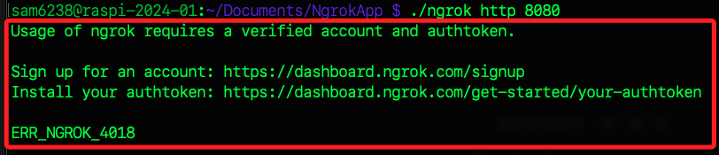

# 錯誤排除紀錄

<br>

## 尚未驗證

1. 假如啟動時出現以下訊息代表尚未驗證獲授權。 

    

<br>

2. 假如是訪問看到如下錯誤，也是因為尚無授權資訊。

    

<br>

3. 當系統中已存在設定檔案，在版本更新時可能出現設定檔錯誤警告；可運行以下指令自動轉換設定檔。

    ```bash
    ngrok config upgrade
    ```

<br>

___

_持續記錄中_