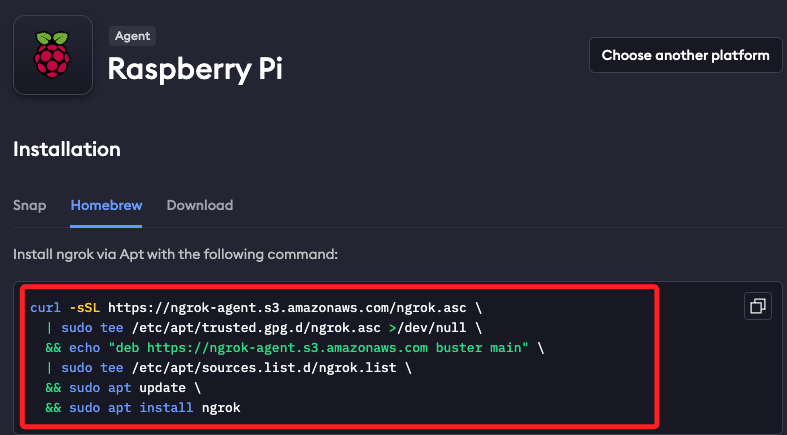
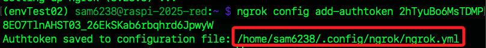
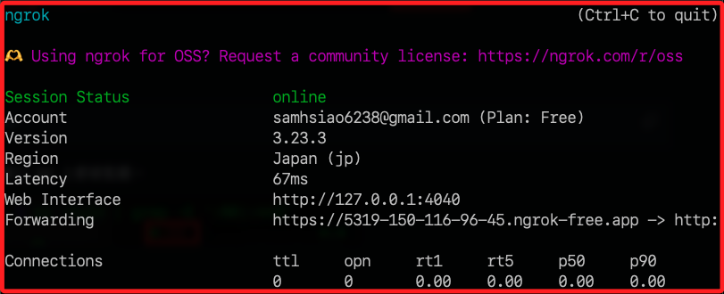
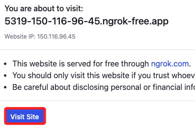
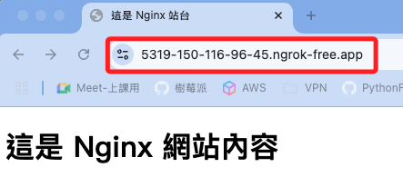

# Ngrok 

_[Ngrok 官網](https://ngrok.com/)；Ngrok 本身並不是一種 `伺服器服務`，而是一種 `通道服務`，執行後可取得 Ngrok 公開服務器的通道，讓外部使用者可以透過這個通道訪問本地網站，也就是讓樹莓派上的伺服器可被外網訪問_

<br>

## 安裝 Homebrew

_參考 `D01-05_開發套件與工具-02_安裝 Homebrew`；因為後續的腳本需要使用到 `brew` 工具_

<br>

## 安裝 Ngrok

1. 前往 [官網](https://dashboard.ngrok.com/get-started/setup/raspberrypi) 並切換到下載頁面。

    

<br>

2. 選擇樹莓派系統。

    

<br>

3. 切換到 `Homebrew` 選項。

    

<br>

4. 複製指令運行。

    ```bash
    curl -sSL https://ngrok-agent.s3.amazonaws.com/ngrok.asc \
        | sudo tee /etc/apt/trusted.gpg.d/ngrok.asc >/dev/null \
        && echo "deb https://ngrok-agent.s3.amazonaws.com buster main" \
        | sudo tee /etc/apt/sources.list.d/ngrok.list \
        && sudo apt update \
        && sudo apt install ngrok
    ```

<br>

## 設定權杖

_假如當前設備還沒寫入權杖，需先完成該步驟_

<br>

1. 複製權杖存入變數 `YOUR_AUTHTOKEN`。

    ```bash
    YOUR_AUTHTOKEN=<複製下來的-Authtoken>
    ```

<br>

2. 運行指令將權杖加到本地。

    ```bash
    ngrok config add-authtoken $YOUR_AUTHTOKEN
    ```

<br>

3. 完成時會提示儲存位置。

    ```bash
    ~/.config/ngrok/ngrok.yml
    ```

    

<br>

## 啟動服務

1. 啟動 Ngrok 並指定端口為 8080。

    ```bash
    ngrok http 8080
    ```

    

<br>

2. 複製 `Forwarding` 網址並開啟瀏覽器訪問。

    

<br>

3. 點擊 `Visit Site`。

    

<br>

4. 就會看到當前在 `8080` 端口運行的伺服器，目前是 `Ngnix` 伺服器。

    

<br>

___

_END_