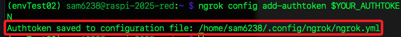

# 註冊

<br>

## 步驟說明

1. 前往 [Ngrok 官網](https://ngrok.com/) 點擊 `Sign up`，已有帳戶可點擊 `Login in`。

    

<br>

2. 建議使用 Google 帳號快速註冊。

    

<br>

## 手動設定

1. 切換到 `Your Authtoken` 頁籤，複製 `Authtoken` 或保留瀏覽頁面備用。

    

<br>

2. 開啟終端機，將 `Authtoken` 存入變數。

```bash
YOUR_AUTHTOKEN=<複製下來的-Authtoken>
```


4. 在終端機執行以下指令進行授權，完成時會輸出儲存路徑。

    ```bash
    ngrok config add-authtoken $YOUR_AUTHTOKEN
    ```

    

<br>

5. 啟動服務並指定使用端口 `80`。

    ```bash
    ngrok http 80
    ```

<br>

6. 複製公網網址可進行訪問服務器。

    

<br>

7. 若正常運行會顯示如下，點擊 `Visit Site` 。

    

<br>

8. 就會看到目前正在端口上運行的服務器；同時終端機會顯示 `200 OK`。

    

<br>

___

_END_