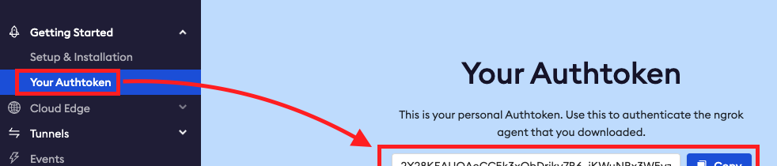
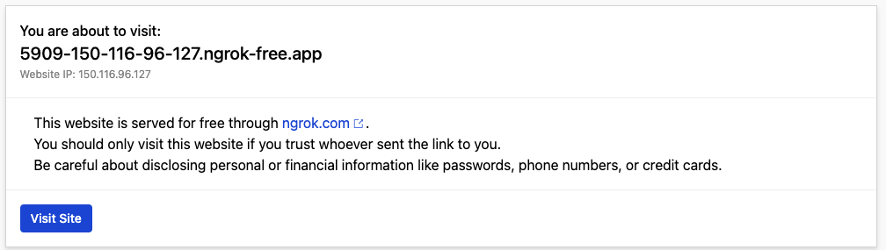

# 註冊

<br>

## 步驟說明

1. 前往 [Ngrok 官網](https://ngrok.com/) 點擊 `Sign up`，已有帳戶可點擊 `Login in`。

    

<br>

2. 建議使用 Google 帳號快速註冊。

    

<br>

3. 複製 `Authtoken` 或保留瀏覽頁面備用。

    

<br>

4. 在終端機執行以下指令進行授權，完成時會輸出儲存路徑。

    ```bash
    ngrok authtoken <複製下來的-Authtoken>
    ```

    

<br>

5. 假如是依照官網指示安裝的版本，可以適用以下新版指令，在沒有其他參數時，兩者效果一致，這裡不做贅述。

    ```bash
    ngrok config add-authtoken <複製下來的-Authtoken>
    ```

    

<br>

6. 再次啟動服務；以下指令是使用端口 `80`，若使用其他端口則自行修正參數。

    ```bash
    ./ngrok http 80
    ```

<br>

7. 假如版本過低會出現以下警告。

    

<br>

8. 可複製公網網址進行訪問。

    

<br>

9. 若正常運行會顯示如下，點擊 `Visit Site` 。

    

<br>

10. 就會看到目前樹莓派的 Nginx 服務器了；同時終端機會顯示 `200 OK`。

    

<br>

## 將 Ngrok 移動到系統 PATH 中

_可先關閉 Ngrok_

<br>

1. 切換到當前所在的路徑中。

    ```bash
    ls ~/Documents/NgrokApp/ngrok
    ```

<br>

2. 確保具有可執行權限。

    ```bash
    sudo chmod +x ~/Documents/NgrokApp/ngrok
    ```

<br>

3. 將 `ngrok` 執行檔移動到 `/usr/local/bin`，使其成為系統全域指令。

    ```bash
    sudo mv ~/Documents/NgrokApp/ngrok /usr/local/bin/ngrok
    ```

<br>

4. 同時也可進一步檢查 `/usr/local/bin` 是否已經在 PATH 環境變數中。

    ```bash
    echo $PATH
    ```

    

<br>

5. 如果 `/usr/local/bin` 不在 PATH 中，請添加到配置文件 `.bashrc`。

    ```bash
    echo 'export PATH=$PATH:/usr/local/bin' >> ~/.bashrc
    source ~/.bashrc
    ```

<br>

6. 完成後，切換到任意目錄中並運行以下指令，確認設置是否完成；特別注意，設定完成後執行的就是全域指令，也就是系統路徑中的 `ngrok`，所以不使用 `./`；另外，在尚未建立全域變數時，即便位在腳本所在路徑中也必須加上 `./`，因為 `Linux/macOS` 系統預設不會將 `當前目錄` 加入 `$PATH`。

    ```bash
    cd ~ && ngrok --version
    ```

<br>

7. 嘗試透過以下指令添加憑證。

    ```bash
    ngrok config add-authtoken <輸入自己的憑證>
    ```

<br>

8. 啟動服務。

    ```bash
    ngrok http 80
    ```

<br>

___

_END_