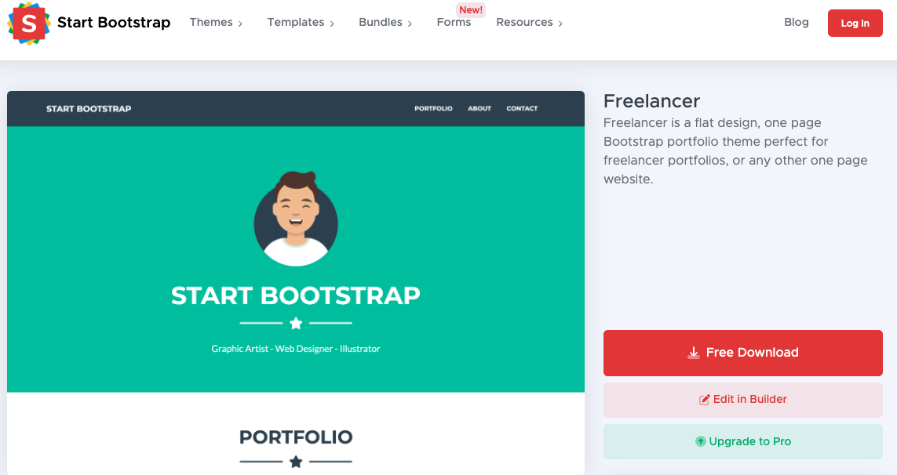
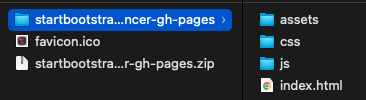
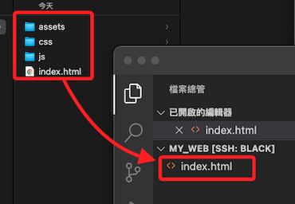
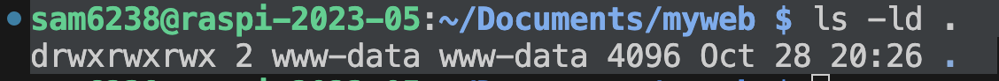
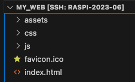
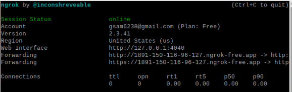
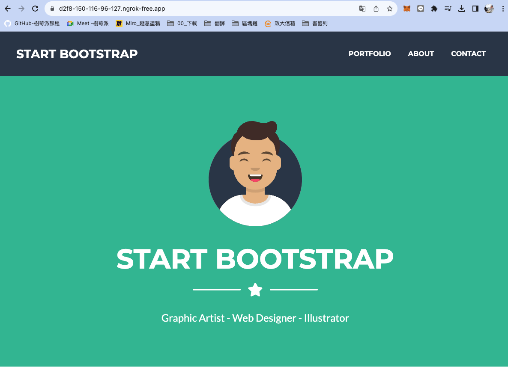

# 部署網站

<br>

## 步驟

1. 下載任意一個 `Bootstrap` [範例](https://startbootstrap.com/theme/freelancer)。

   

<br>

2. 下載完成，在電腦中雙擊會自動解壓縮。

   

<br>

3. 開啟 VSCode，進入文本所在路徑如 `/home/sam6238/Documents/my_web/`；直接把解壓縮的資料夾內容拖曳進入 `myweb`，覆蓋原本 Apache 的檔案；特別注意，不是拖曳資料夾，而是資料夾的內容。

   

<br>

4. 假如遇到權限問題，可能是在前面步驟未完成權限設置，導致限制了權限如，可透過指令查詢目錄本身的詳細資訊，參數 `-l` 會顯示詳細資訊、`-d` 表示只顯示目錄本身的資訊，而不是列出裡面的檔案。

   ```bash
   ls -ld
   ```

   

<br>

5. 可把自己加入 `www-data` 群組，讓自己可以存取修改 `Apache` 伺服器使用的目錄與檔案，而不必將檔案權限完全開放。

   ```bash
   sudo usermod -aG www-data $USER
   ```

<br>

6. 補充說明，由於專案資料夾中並無 `.ico` 文件，後續瀏覽器在載入網站時，伺服器若無此檔案，後台日誌會出現錯誤訊息，但這並不影響網站運作；若要避免這個錯誤可加入任意 `.ico` 檔案，或新增一個 `空的` 檔案 `favicon.ico`。

   

<br>

7. 運行 `Ngrok` 並指定端口 `80`。

   

<br>

8. 訪問站台，就可以看到這個自訂的網頁了。

   

<br>

___

_END_
