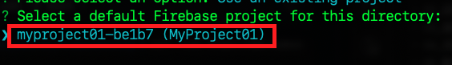
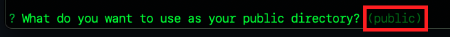
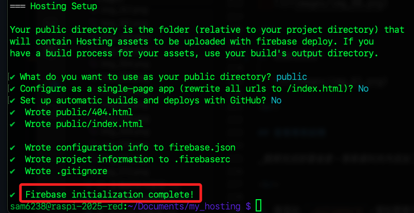
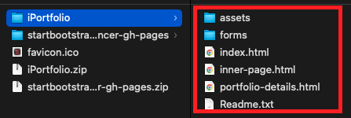
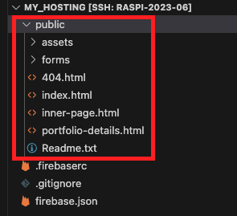
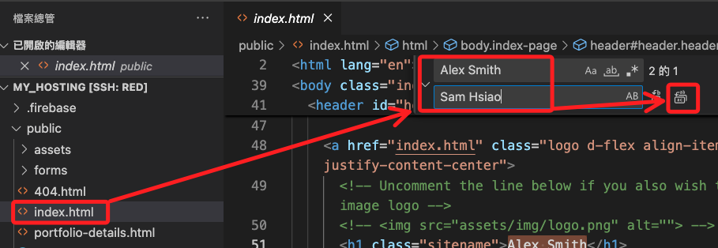

# Firebase Hosting

_Google Cloud 的服務：更新【2025/07/02】_

<br>

## 說明

_接下來示範將樹莓派上的 `Apache` 站台直接初始化後，部署到 `Firebase Hosting`_

<br>

## 套件安裝

_須先安裝相關套件_

<br>

1. 安裝 `Node.js`，若使用 NVM 可參考 `D01-05` 章節的說明。

   ```bash
   sudo apt update
   sudo apt install nodejs npm -y
   ```

<br>

2. 安裝 `firebase-tools`。

   ```bash
   sudo npm install -g firebase-tools
   ```

<br>

## 版本相容

_若有提示更新，可改用 nvm 進行管理；以下僅指引操作，詳細說明請參考 `D01-05` 章節_

<br>

1. 遇到版本相容問題。

   

<br>

2. 先安裝 nvm；指令及當前版本可在 [官網](https://github.com/nvm-sh/nvm) 中進行查詢。

   ```bash
   curl -o- https://raw.githubusercontent.com/nvm-sh/nvm/v0.40.3/install.sh | bash
   source ~/.bashrc
   ```

<br>

3. 安裝指定版本。

   ```bash
   nvm install 22
   nvm use 22
   nvm alias default 22
   ```

<br>

4. 查看版本。

   ```bash
   node -v
   npm -v
   ```

<br>

5. 重新安裝 Firebase CLI。

   ```bash
   npm install -g firebase-tools
   ```

<br>

6. 查看安裝版本。

   ```bash
   firebase --version
   ```

<br>

## 登入帳號

_必須進入樹莓派桌面並啟動終端機運行_

<br>

1. 登入 `Firebase`。

   ```bash
   firebase login
   ```

<br>

2. 若提示啟用 AI 功能，可自行決定，這不影響登入。

   

<br>

3. 輸入 `y` 允許登入。

   

<br>

4. 會詢問是否允許收集使用統計與錯誤資訊，用來改進產品；任意作答。

   

<br>

5. _特別注意_，若要在樹莓派上進行部署，以下的連結 _必須進入樹莓派桌面，並使用樹莓派啟瀏覽器_ 進行驗證；複製以下網址貼在樹莓派瀏覽器上進行訪問。

   

<br>

6. 驗證完成後，瀏覽器會顯示如下畫面。

   

<br>

7. 然後終端機也會顯示成功 `Success` 。

   

<br>

## 初始化

_這裡切記要選對資料夾_

<br>

1. 可使用前面步驟所建立的 `Apache` 站台資料夾 `myweb`，或是建立新的專案資料夾；這裏示範建立新的專案。

   ```bash
   cd ~/Documents
   mkdir my_hosting && cd my_hosting
   ```

<br>

2. 進行初始化；切記初始化的位置必須是專案資料夾的 `根目錄內`，且專案內部可再建立專案。

   ```bash
   firebase init
   ```

   

<br>

3. 使用 `方向鍵` 移動，然後用 `空白鍵` 選擇 `Hosting: Configure files for Firebase Hosting and (optionally) set up GitHub Action deploys` ，確認好按下 `ENTER` 。

   

<br>

4. 再次提醒，必須按下 `空白鍵` 進行選擇，前方 Box 會變成實心；接著按下 `ENTER`。

   

<br>

5. 選擇現有專案或建立專案，這裡示範選擇現有專案。

   

<br>

6. 選定後按 `ENTER`。

   

<br>

7. 選擇存放站台文件的資料夾，若是新建站台可使用預設的 `public`，按下 `ENTER` 就是預設。

   

<br>

8. 若使用 `Apache` 站台，則輸入一點 `.` 代表當前目錄；特別注意，若是把 `public` 刪除後按下 `ENTER` 代表的不是根目錄，而是預設的 `public` 。_

   

<br>

9. 不要 `N` 覆寫 rewrite。

   

<br>

10. 不要 `N` 進行自動化佈署。

   

<br>

11. 初始化完成。

   

<br>

## 查看專案結構

_觀察完成部署後會，專案資料夾內添加了哪些設定文件_

<br>

1. 會添加 `.gitignore`，假如要進行原始檔控制，可加入排除項目。

   ```bash
   ls -al
   ```

   

<br>

2. `firebase.json` 是主要的設定文件。
   
   ```json
   {
      "hosting": {
         "public": ".",
         "ignore": [
            "firebase.json",
            "**/.*",
            "**/node_modules/**"
         ]
      }
   }
   ```

<br>

3. `.firebaserc` 則是紀錄專案的名稱。

   ```json
   {
      "projects": {
         "default": "myproject01-be1b7"
      }
   }
   ```

<br>

4. 隱藏的資料夾 `.firebase` 存放相關快取。

   

<br>

5. 另外還建立了 `404.html` 文本。

<br>

## 建立站台內容

_示範新建站台_

<br>

1. [下載](https://bootstrapmade.com/iportfolio-bootstrap-portfolio-websites-template/download/) 免費模板，這次換一個模板試試。

   

<br>

2. 解壓縮後包含以下結構。

   

<br>

3. 同樣使用 VSCode 開啟 Firebase Hosting 專案後，將壓縮後的內容拖曳到專案資料夾內的 `public` 資料夾內。

   

<br>

4. 再次強調，下載的模板要放在 `public` 資料夾之下；完成後如下。

   

<br>

5. 在 VSCode 中可使用 `Live Serve` 插件進行網站的預覽。

   

<br>

6. 安裝後在 `index.html` 檔案按下右鍵即可預覽 `Open with Live Server`。

   

<br>

7. 這個插件預設使用的端口是 `5500` ，留意一下避免端口衝突。

   

<br>

## 網站部署

_進入樹莓派_

<br>

1. 在專案的根目錄 `/my_hosting` 運行部署指令。

   ```bash
   firebase deploy
   ```

<br>

2. 完成時會顯示一個網站的超連結；複製進行訪問。

   

<br>

3. 可修改文本中的 `Alex Smith` 為自己的名字進行觀察。

   

<br>

4. 重新部署後刷新網頁；假如網頁內容未更新，可能是瀏覽器載入舊的快取所致，Win 系統可使用 `Ctrl + F5`、Mac 系統可使用 `Command + Shift + R` 清除快取。

   

<br>

## 將 Ngnix 指向這個站台

_以上若是覆蓋 `Apache` 文本，那 `Firebase Hosting` 可與 `Apache` 結合；若有建立 `Ngnix` 站台，可繼續以下操作結合 Ngnix_

<br>

1. 再度開啟設定檔案，進一步設定網頁所在位置案。

   ```bash
   sudo nano /etc/nginx/sites-available/default
   ```

<br>

2. 修改路徑，若是原本的 `Apache` 站台則無 `public` 。

   

<br>

3. 重新啟動。

   ```bash
   sudo systemctl reload nginx
   ```  

<br>

4. 不要忘記重啟 `Ngrok`。

   

<br>

5. 端口是 `8080`。

   

<br>

6. 現在所訪問的站台不是 Firebase Hosting 上的內容，而是樹莓派上 Nginx。

   

<br>

_完成三個站台的結合，都指向同一個內容_

<br>

___

_END_