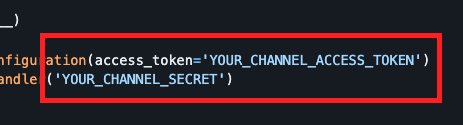
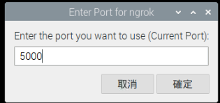

# 在樹莓派部署 Line 聊天機器人

_部署聊天機器人的所有方式中最簡單的一種，沒有之一_

<br>

## 安裝

_請先啟動虛擬環境 `envLinebot`_

<br>

1. 可參考官方 [API SDKs](https://developers.line.biz/en/docs/messaging-api/line-bot-sdk/)，或直接參考官網 [Python](https://github.com/line/line-bot-sdk-python) 文件。

<br>

2. 在樹莓派上安裝 SDK 及必要套件。

    ```bash
    pip install line-bot-sdk flask
    ```


3. 更新版本。

    ```bash
    pip install --upgrade line-bot-sdk
    ```

<br>

## 建立 LineBot

_這裡不重複步驟指引，僅說明 Webhook 設置，其他請參考前週課程講義_

<br>

1. 進入 Line 開發者 [網址](https://developers.line.biz/zh-hant/) 。

<br>

2. 可先記下 `Token`、 `Secret` 以及 `user ID` 備用。

<br>

3. 使用 [官網腳本](https://github.com/line/line-bot-sdk-python#synopsis)

<br>

4. 用自己的 `Token`、 `Secret` 更改範例中的。

    

<br>

## 使用 `dotenv` 隔離敏感檔案

_加強安全性，這個範例將安裝 `dotenv` 套件來隔離私密資訊。_

<br>

1. 在樹莓派安裝套件。

    ```bash
    pip install python-dotenv
    ```

2. 在專案內根目錄自建立一格隱藏檔案 `.env` 並編輯內容。

    ```bash
    _CHANNEL_ACCESS_TOKEN_=<貼上 TKOKEN>
    _CHANNEL_SECRET_=<貼上 SECRET>
    ```

3. 在主腳本 `app.py` 導入 `dotenv`。

    ```python
    import os
    from dotenv import load_dotenv
    load_dotenv()
    ```

4. 使用 `os` 來取得 `Token` 及 `Secret`；特別注意，分開寫是希望讓程式碼易讀性提高。

    ```python
    # 讀取
    CHANNEL_ACCESS_TOKEN = os.getenv("_CHANNEL_ACCESS_TOKEN_")
    CHANNEL_SECRET = os.getenv("_CHANNEL_SECRET_")

    # 其他代碼，略...

    # 使用
    configuration = Configuration(
        access_token=CHANNEL_ACCESS_TOKEN
    )
    handler = WebhookHandler(
        CHANNEL_SECRET
    )
    ```

<br>

## 啟動 Flask 應用

1. 先在 `5000` 端口啟動 Ngrok，這是 Flask 預設的端口。

    

<br>

2. 將 `https` 的 URL 貼到 LineBot 的 Webhook 中。

    

<br>

3. 使用 `https` 並加上 `/callback`；特別注意所使用的路由名稱是否正確，有些腳本會使用 `webhook` 。

    

<br>

4. 以上機器人便部署完成。

    

<br>

## 運行

1. 在專案跟目錄中運行腳本。

    ```bash
    python app.py
    ```

    

<br>

2. 在 Line Developers 主控台中點擊 `Verify` 確認 `Webhook` 正確運行。

    

<br>

3. 接下來就可以開啟機器人對話。

    

<br>

4. 可簡易編輯腳本確認互動；切記修改腳本後必須重新運行。

    ```python
    # 修改後的 handle_message 函式
    @handler.add(MessageEvent, message=TextMessageContent)
    def handle_message(event):
        user_msg = event.message.text.strip()

        if user_msg == "你是誰":
            reply_text = "我是你的 LINE 機器人小助手 🤖"
        else:
            # 原本的 echo 回覆
            reply_text = user_msg

        with ApiClient(configuration) as api_client:
            line_bot_api = MessagingApi(api_client)
            line_bot_api.reply_message_with_http_info(
                ReplyMessageRequest(
                    reply_token=event.reply_token,
                    messages=[TextMessage(text=reply_text)]
                )
            )
    ```

    

<br>

___

_END_