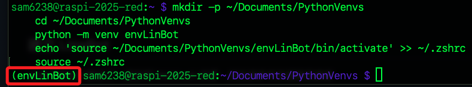
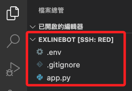
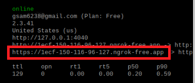
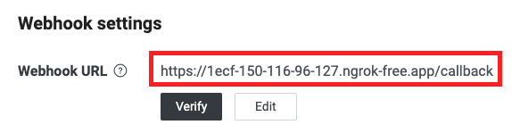
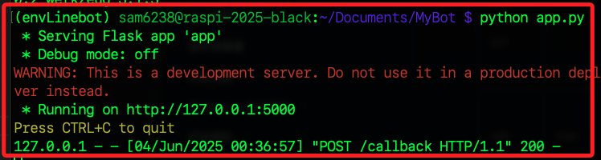
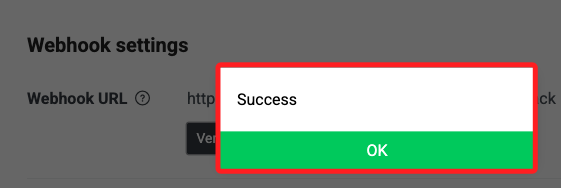
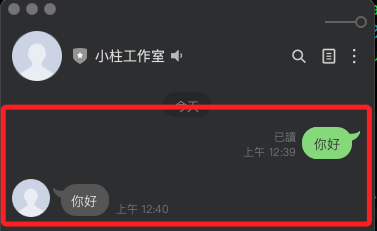
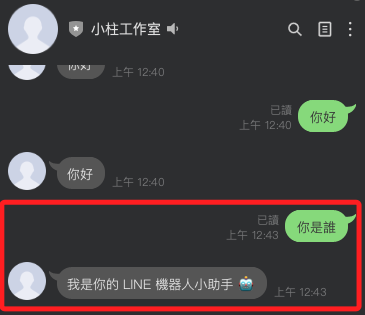
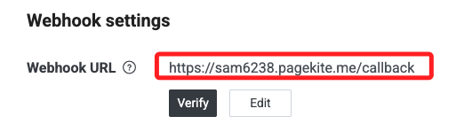
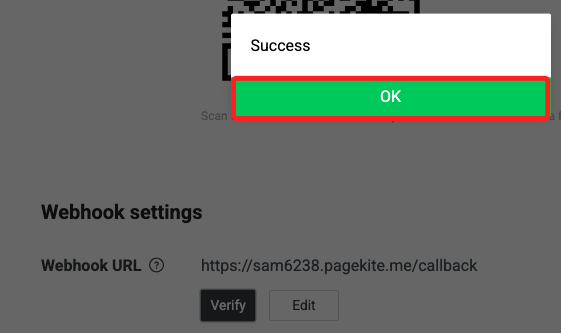

# 在樹莓派部署 Line 聊天機器人

_部署聊天機器人的所有方式中最簡單的一種_

<br>

## 建立虛擬環境

1. 一鍵建立虛擬環境，命名為 `envLineBot`。

    ```bash
    mkdir -p ~/Documents/PythonVenvs
    cd ~/Documents/PythonVenvs
    python -m venv envLineBot
    echo 'source ~/Documents/PythonVenvs/envLineBot/bin/activate' >> ~/.zshrc
    source ~/.zshrc
    ```

    

<br>

## 安裝套件

_可參考官方 [API SDKs](https://developers.line.biz/en/docs/messaging-api/line-bot-sdk/)，或直接參考官網 [Python](https://github.com/line/line-bot-sdk-python) 文件。_

<br>

1. 確認啟動虛擬環境後，安裝 SDK 及必要套件。

    ```bash
    pip install line-bot-sdk flask python-dotenv
    ```

<br>

2. 若已安裝過，可進行版本更新。

    ```bash
    pip install --upgrade line-bot-sdk
    ```

<br>

## 建立 LineBot

_這裡不重複步驟指引，僅說明 Webhook 設置，其他請參考前週課程講義_

<br>

1. 進入 Line 開發者 [網址](https://developers.line.biz/zh-hant/) 。

<br>

2. 可先記下 `Token`、 `Secret` 以及 `user ID` 備用。

<br>

3. 使用 [官網腳本](https://github.com/line/line-bot-sdk-python#synopsis)；在後續步驟中貼在主腳本 `app.py` 中。

    ```python
    from flask import Flask, request, abort

    from linebot.v3 import (
        WebhookHandler
    )
    from linebot.v3.exceptions import (
        InvalidSignatureError
    )
    from linebot.v3.messaging import (
        Configuration,
        ApiClient,
        MessagingApi,
        ReplyMessageRequest,
        TextMessage
    )
    from linebot.v3.webhooks import (
        MessageEvent,
        TextMessageContent
    )

    app = Flask(__name__)

    configuration = Configuration(access_token='YOUR_CHANNEL_ACCESS_TOKEN')
    handler = WebhookHandler('YOUR_CHANNEL_SECRET')


    @app.route("/callback", methods=['POST'])
    def callback():
        # get X-Line-Signature header value
        signature = request.headers['X-Line-Signature']

        # get request body as text
        body = request.get_data(as_text=True)
        app.logger.info("Request body: " + body)

        # handle webhook body
        try:
            handler.handle(body, signature)
        except InvalidSignatureError:
            app.logger.info("Invalid signature. Please check your channel access token/channel secret.")
            abort(400)

        return 'OK'


    @handler.add(MessageEvent, message=TextMessageContent)
    def handle_message(event):
        with ApiClient(configuration) as api_client:
            line_bot_api = MessagingApi(api_client)
            line_bot_api.reply_message_with_http_info(
                ReplyMessageRequest(
                    reply_token=event.reply_token,
                    messages=[TextMessage(text=event.message.text)]
                )
            )

    if __name__ == "__main__":
        app.run()
    ```

<br>

## 建立專案

1. 建立專案資料夾。

    ```bash
    mkdir -p ~/Documents/exLineBot
    cd ~/Documents/exLineBot
    touch .env .gitignore app.py
    ```

<br>

2. 使用 VSCode 開啟專案。

    

<br>

## 隔離敏感檔案

_加強安全性，這個範例將安裝 `dotenv` 套件來隔離私密資訊。_

<br>

1. 編輯 `.gitignore` 文件。

    ```bash
    .env
    ```

<br>

2. 編輯 `.env`。

    ```bash
    _CHANNEL_ACCESS_TOKEN_=<貼上 TKOKEN>
    _CHANNEL_SECRET_=<貼上 SECRET>
    ```

<br>

3. 在主腳本 `app.py` 導入 `dotenv` 並讀取數據。

    ```python
    import os
    from dotenv import load_dotenv
    load_dotenv()

    # 讀取
    CHANNEL_ACCESS_TOKEN = os.getenv("_CHANNEL_ACCESS_TOKEN_")
    CHANNEL_SECRET = os.getenv("_CHANNEL_SECRET_")
    ```

<br>

4. 修改範例腳本中的導入方式；其餘代碼暫時不用變更。

    ```python
    # 其他代碼，略...

    # 使用
    configuration = Configuration(
        access_token=CHANNEL_ACCESS_TOKEN
    )
    handler = WebhookHandler(
        CHANNEL_SECRET
    )
    ```

<br>

## 啟動 Flask 應用

_若尚未安裝 Ngrok，可參考 `D01-04-06-2`_

<br>

1. 先在 `Flask` 預設端口 `5000` 啟動 `Ngrok`。

    ```bash
    ngrok http 5000
    ```

<br>

2. 複製 `https` 的 URL。

    

<br>

3. 貼上網址，並且記得尾綴要加上路由 `/callback`；特別注意路由名稱是否正確，有些腳本會使用 `webhook`。

    

<br>

## 啟動服務

_進入專案根目錄_

<br>

1. 運行腳本。

    ```bash
    python app.py
    ```

    

<br>

2. 在 `Line Developers` 主控台中點擊 `Verify`，顯示 `OK` 確認 `Webhook` 正確運行。

    

<br>

3. 掃描 QRcode 添加好友，接著嘗試與機器人對話。

    

<br>

## 優化腳本

_可簡易編輯腳本；切記修改腳本後必須重新運行_

<br>

1. 修改 `handle_message` 函式。

    ```python
    @handler.add(MessageEvent, message=TextMessageContent)
    def handle_message(event):
        user_msg = event.message.text.strip()

        if user_msg == "你是誰":
            reply_text = "我是你的 LINE 機器人小助手 🤖"
        else:
            # 原本的 echo 回覆
            reply_text = user_msg

        with ApiClient(configuration) as api_client:
            line_bot_api = MessagingApi(api_client)
            line_bot_api.reply_message_with_http_info(
                ReplyMessageRequest(
                    reply_token=event.reply_token,
                    messages=[TextMessage(text=reply_text)]
                )
            )
    ```

    

<br>

## 使用 Pagekite

_除了 `Ngrok`，若已經建立 `Pagekite` 開發環境，可嘗試使用該服務運行機器人_

<br>

1. 在指定端口 `5000` 啟動服務。

    ```bash
    sudo pagekite.py 5000 <自己的-pagekite-網域名稱>.pagekite.me
    ```

<br>

2. 將 `pagekite` 完整網域寫入 `LineBot` 主控台中的 `Webhook URL`；切勿忘記尾綴路由一定要寫上 `/callback`。

    

<br>

3. 驗證無誤後，機器人便可正常運作。

    

<br>

___

_END_