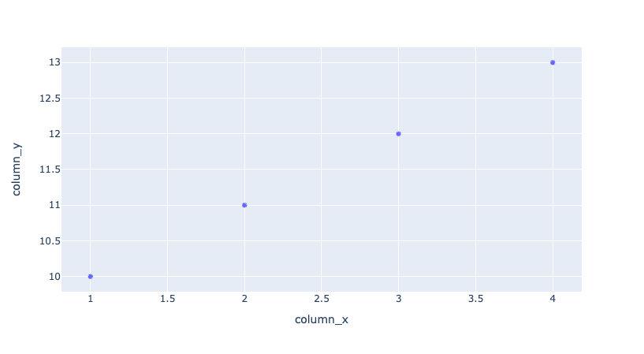
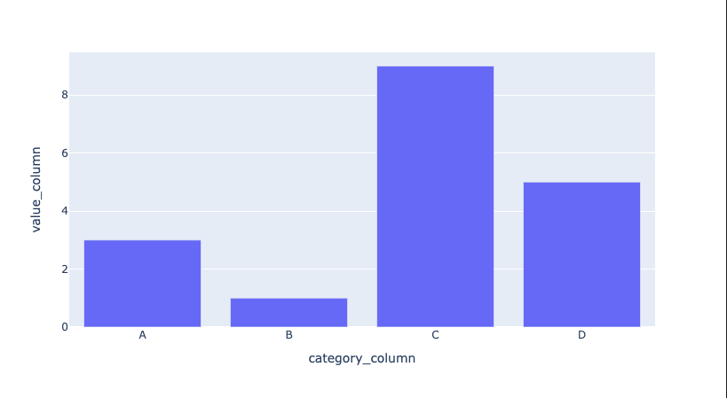
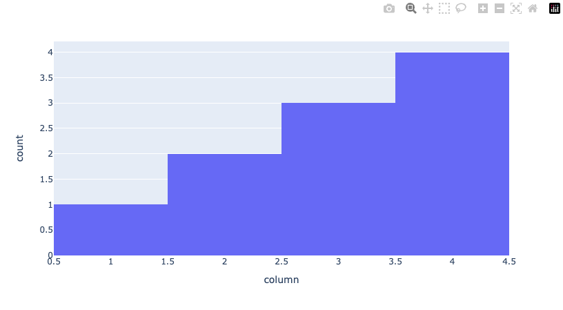
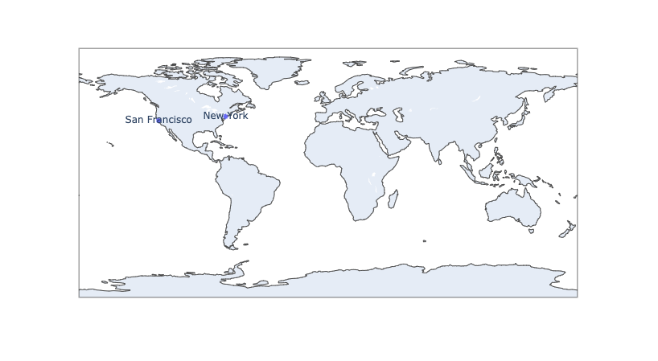

# Dash by Plotly 圖表範例

Dash 是由 Plotly 開發的 Python 網頁框架，用於建立具有豐富的互動性的數據可視化網頁應用。

以下是使用 Plotly Express（`px`）建立的 10 種常見圖表類型的範例和說明。

<br>

## 套件

1. plotly

    ```bash
    pip install plotly
    ```

<br>

## 各種圖表

1. 散點圖 (Scatter Plot)

    ```python
    import plotly.express as px
    import pandas as pd

    # 假設 df 是一個 DataFrame，包含 'column_x' 和 'column_y'
    df = pd.DataFrame({'column_x': [1, 2, 3, 4], 'column_y': [10, 11, 12, 13]})
    fig = px.scatter(data_frame=df, x='column_x', y='column_y')
    fig.show()
    ```
    
    
    - 這個例子建立了一個散點圖，展示了 'column_x' 和 'column_y' 之間的關係。

<br>

2. 柱狀圖 (Bar Chart)

    ```python
    df = pd.DataFrame({'category_column': ['A', 'B', 'C', 'D'], 'value_column': [3, 1, 9, 5]})
    fig = px.bar(data_frame=df, x='category_column', y='value_column')
    fig.show()
    ```

    

    - 這個例子建立了一個柱狀圖，顯示了各類別的數值大小。

<br>

3. 直方圖 (Histogram)
    ```python
    df = pd.DataFrame({'column': [1, 2, 2, 3, 3, 3, 4, 4, 4, 4]})
    fig = px.histogram(data_frame=df, x='column')
    fig.show()
    ```

    

    - 這個例子建立了一個直方圖，展示了單一變數 'column' 的分佈。

<br>

4. 盒鬚圖 (Box Plot)

    ```python
    df = pd.DataFrame({'category_column': ['A', 'A', 'A', 'B', 'B', 'C'], 'value_column': [1, 3, 5, 2, 4, 6]})
    fig = px.box(data_frame=df, x='category_column', y='value_column')
    fig.show()
    ```

    

    - 這個例子建立了一個盒鬚圖，展示了 `value_column` 在不同類別 `category_column` 中的分佈。

<br>

5. 小提琴圖 (Violin Plot)

    ```python
    df = pd.DataFrame({'category_column': ['A', 'A', 'A', 'B', 'B', 'C'], 'value_column': [1, 3, 5, 2, 4, 6]})
    fig = px.violin(data_frame=df, x='category_column', y='value_column')
    fig.show()
    ```

    

    - 這個例子建立了一個小提琴圖，結合了直方圖和盒鬚圖的特點，展示了 `value_column` 在不同類`category_column` 中的分佈。

<br>

6. 3D 散點圖 (3D Scatter Plot)

    ```python
    df = pd.DataFrame({'column_x': [1, 2, 3, 4], 'column_y': [10, 11, 12, 13], 'column_z': [20, 21, 22, 23]})
    fig = px.scatter_3d(data_frame=df, x='column_x', y='column_y', z='column_z')
    fig.show()
    ```

    

    - 這個例子建立了一個 3D 散點圖，展示了 `column_x`，`column_y` 和 `column_z` 三個變數之間的關係。

<br>

7. 熱圖 (Heatmap)

    ```python
    import numpy as np

    matrix = np.array([[1, 2, 3], [4, 5, 6], [7, 8, 9]])
    fig = px.imshow(matrix)
    fig.show()
    ```

    

    - 這個例子建立了一個熱圖，用顏色的深淺來展示矩陣中的數值大小。

<br>

8. 地理資料視覺化 (Geospatial Visualizations)

    ```python
    df = pd.DataFrame({'latitude_column': [37.7749, 40.7128], 'longitude_column': [-122.4194, -74.0060], 'city': ['San Francisco', 'New

    York']})
    fig = px.scatter_geo(data_frame=df, lat='latitude_column', lon='longitude_column', text='city')
    fig.show()
    ```

    

    - 這個例子建立了一個散點地圖，展示了兩個城市的地理位置。

<br>

9. 圓餅圖 (Pie Chart)

    ```python
    df = pd.DataFrame({'category_column': ['A', 'B', 'C', 'D'], 'value_column': [10, 15, 20, 30]})
    fig = px.pie(data_frame=df, names='category_column', values='value_column')
    fig.show()
    ```

    
    
    - 這個例子建立了一個圓餅圖，展示了各類別在總數值中的占比。

<br>

10. 太陽堆疊圖 (Sunburst)

    ```python
    df = pd.DataFrame({'level1_column': ['A', 'A', 'B', 'B'], 'level2_column': ['C', 'D', 'E', 'F'], 'value_column': [10, 15, 20, 25]})
    fig = px.sunburst(data_frame=df, path=['level1_column', 'level2_column'], values='value_column')
    fig.show()
    ```

    

   - 這個例子建立了一個太陽堆疊圖，展示了層次化的數據結構。

<br>

---

_END_