# `pyenv`

_版本管理方式很多，以下將示範其中的 `pyenv`_

<br>

## 安裝

1. 先更新樹莓派。

    ```bash
    sudo apt-get update && sudo apt-get upgrade -y
    ```

<br>

2. 查看系統預裝的 Python 版本；依據結果顯示 `3.11.2`。

    ```bash
    python --version
    ```

    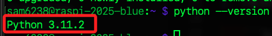

<br>

3. 下載與執行 `pyenv` 安裝腳本；這是 pyenv 官方提供的。

    ```bash
    curl https://pyenv.run | bash
    ```

<br>

4. 特別說明，遇到這類安裝腳本，也可先觀察腳本內容，也就是不要加上語句 `| bash`。

    ```bash
    curl https://pyenv.run
    ```

<br>

## 加入路徑

1. 安裝完成後，會提示尚未加入路徑。 

    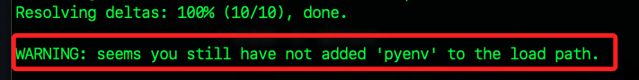

<br>

2. 編輯環境參數。

    ```bash
    nano ~/.bashrc
    ```

<br>

3. 添加以下內容設定路徑。

    ```ini
    export PATH="$HOME/.pyenv/bin:$PATH"
    eval "$(pyenv init --path)"
    eval "$(pyenv init -)"
    ```

    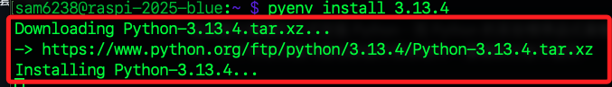

<br>

4. 儲存並退出後，重新載入、套用設定。

    ```bash
    source ~/.bashrc
    ```

<br>

5. 查詢 `pyenv` 版本。

    ```bash
    pyenv --version
    ```

    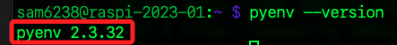

<br>

## 安裝指定版本的 Python

1. 從 [官網](https://www.python.org/downloads/) 下載頁面可查看當前建議版本為 `3.13.4`。

    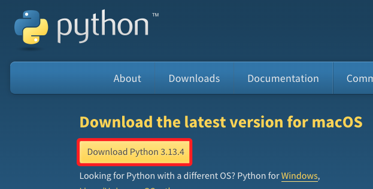

<br>

2. 使用指令查看 `pyenv` 支援可安裝的版本清單，其中會包含官方釋出版本、額外實作版本與開發版本。

    ```bash
    pyenv install --list
    ```

<br>

3. 在輸出中確認官網建議版本也在其中。

    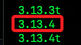

<br>

4. 安裝指定版本 `3.13.4`。

    ```bash
    pyenv install 3.13.4
    ```

<br>

5. 安裝過程可能出現模組未正確編譯的錯誤提示，原因是缺少必要的系統函式庫與開發套件，屬於常見問題，官方也提供了解法連結；依據錯誤訊安裝缺漏套件，安裝前先移除 Python 版本。

    ```bash
    pyenv uninstall 3.13.4
    ```

<br>

6. 安裝遺漏套件。

    ```bash
    sudo apt install -y make build-essential libssl-dev zlib1g-dev \
    libbz2-dev libreadline-dev libsqlite3-dev wget curl llvm \
    libncursesw5-dev xz-utils tk-dev libxml2-dev libxmlsec1-dev \
    libffi-dev liblzma-dev
    ```

<br>

7. 重新安裝 Python。

    ```bash
    pyenv install 3.13.4
    ```

<br>

8. 查看系統預設版本；關於版本切換待後續說明。

    ```bash
    pyenv versions
    ```

    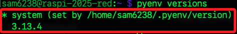

<br>

## 驗證安裝

1. 查詢當前 Python 版本；與前面步驟安裝的版本是不同的。

    ```bash
    python --version
    ```

    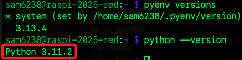

<br>

2. 查詢當前運行的 Python 路徑，可發現 Python 現在已經由 `.pyenv` 進行管理了。

    ```bash
    which python
    ```

    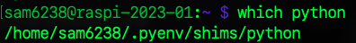

<br>

3. 查詢 Python 存放在系統中的哪些目錄中。

    ```bash
    whereis python
    ```

    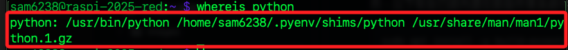

<br>

4. 排版查看。

    ```bash
    python: 
    /usr/bin/python 
    /home/sam6238/.pyenv/shims/python 
    /usr/share/man/man1/python.1.gz
    ```

<br>

5. 特別留意，`pyenv` 看似將 Python 安裝在 `/home/sam6238/.pyenv/shims` 資料夾內，但實際進入查看可以發現，`pyenv` 是通過 `shims` 機制來管理不同版本的 Python，而非將 Python 安裝於此。

    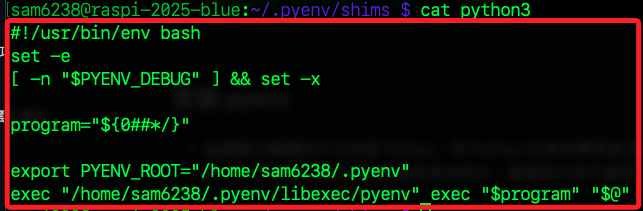

<br>

6. 分別透過以下指令查詢版本並觀察結果。
    
    ```bash
    /home/sam6238/.pyenv/shims/python --version
    ```

    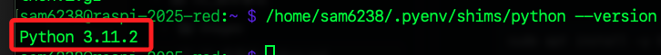

<br>

7. 查看 `pyenv` 當前管理的 Python 版本。

    ```python
    pyenv versions
    ```

<br>

## _究竟在哪裡？_

1. 實際路徑在 `/home/sam6238/.pyenv/versions/3.13.4/bin` 。

    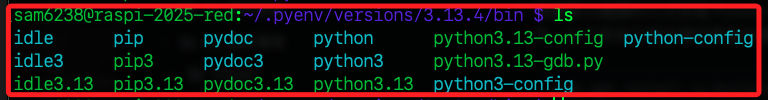

<br>

2. 再次查詢。

    ```bash
    /home/sam6238/.pyenv/versions/3.13.4/bin/python --version
    ```

<br>

3. 確定路徑後，回到 `~/Documents` 或其他指定資料夾建立虛擬環境。

    ```bash
    /home/sam6238/.pyenv/versions/3.13.4/bin/python -m venv env3.13.4
    ```

<br>

4. 編輯環境參數文件 `~/.bashrc` ，添加以下內容。

    ```txt
    source /home/sam6238/Documents/env3.13.4/bin/activate
    ```

<br>

5. 載入更新後的環境設置。

    ```bash
    source ~/.bashrc
    ```

<br>

6. 查詢虛擬環境的 Python 版本。

    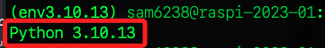

<br>

## 再裝一版

1. 安裝指定版本的 Python。

    ```bash
    pyenv install 3.12.0
    ```

<br>

2. 其餘步驟省略，查看最後結果。

    

<br>

3. 目前安裝了哪些版本。

    ```bash
    pyenv versions
    ```

    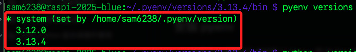

<br>

## pyenv 的官方用法

_刻意寫在了最後面_

<br>

1. 建立一個目錄。

    ```bash
    mkdir envTest
    ```

<br>

2. 透過 `pyenv` 的 `local` 參數設定當前目錄要使用的版本。

    ```bash
    pyenv local 3.12.0
    ```

<br>

3. 使用 `ls -al` 觀察一下，會看到目錄內添加了一個檔案 `.python-version`。

    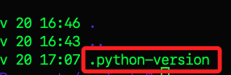

<br>

4. 這時候無需進入任何虛擬環境透過 `python --version` 查詢當前版本。

    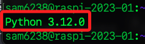

<br>

5. 可手動編輯內容 `sudo nano .python-version` ，達成暴力更改當前版本的目的。

    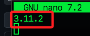

<br>

6. 在查詢一次 `python --version` ，版本確實就更改了。

    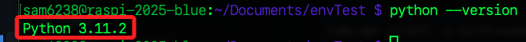

<br>

7. 這時，只要在這個資料夾內建立虛擬環境，就會是指定的 Python 版本，只是這個虛擬環境會在這個路徑之下，雖然版本設定的部分變得很直觀，但虛擬環境的管理卻顯得混亂，我個人是比較建議將版本安裝與虛擬環境管理分開，僅透過 `pyenv` 進行多版本的安裝，虛擬環境管理還是比照原有模式。當然，這僅是個人建議，如何最順手都依主觀執行即可。

<br>

## 其他指令

_除了 `pyenv local` 外，還有其他指令進行設定和切換_

<br>

1. `pyenv global`：

   - 用於設置系統全域的 Python 版本。

   - 這個設置決定執行 Python 時的預設版本。

<br>

1. `pyenv shell`：

   - 在當前終端機視窗中設置臨時的 Python 版本。

   - 這個設置不會影響其他終端機或目錄的設置，關閉後即失效。

<br>

3. `pyenv versions`：

   - 顯示所有已安裝的 Python 版本，並標示當前選擇的版本。

<br>

4. `pyenv install`：

   - 用於安裝新的 Python 版本。

<br>

5. `pyenv uninstall`：

   - 用於卸載已安裝的 Python 版本。

<br>

___

_END_