# `pyenv`

_版本管理方式很多，以下將示範其中的 `pyenv`_

<br>

## 安裝

1. 先更新樹莓派。

    ```bash
    sudo apt-get update && sudo apt-get upgrade -y
    ```

<br>

2. 查看系統預裝的 Python 版本；依據結果顯示 `3.11.2`。

    ```bash
    python --version
    ```

    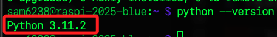

<br>

3. 下載與執行 `pyenv` 安裝腳本；這是 pyenv 官方提供的。

    ```bash
    curl https://pyenv.run | bash
    ```

<br>

4. 特別說明，遇到這類安裝腳本，也可先觀察腳本內容，也就是不要加上語句 `| bash`。

    ```bash
    curl https://pyenv.run
    ```

<br>

## 加入路徑

1. 安裝完成後，會提示尚未加入路徑。 

    

<br>

2. 編輯環境參數。

    ```bash
    nano ~/.bashrc
    ```

<br>

3. 添加以下內容設定路徑；添加在文件末行即可。

    ```ini
    export PATH="$HOME/.pyenv/bin:$PATH"
    eval "$(pyenv init --path)"
    eval "$(pyenv init -)"
    ```

<br>

4. 儲存並退出後，重新載入、套用設定。

    ```bash
    source ~/.bashrc
    ```

<br>

5. 查詢 `pyenv` 版本。

    ```bash
    pyenv --version
    ```

    

<br>

## 安裝 Python

_使用 `pyenv` 安裝指定版本的 Python；特別注意，`pyenv` 不涉及虛擬環境管理_

<br>

1. 從 [官網](https://www.python.org/downloads/) 下載頁面可查看當前建議版本為 `3.13.4`。

    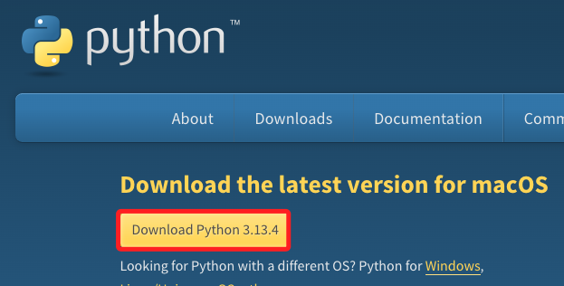

<br>

2. 使用指令查看 `pyenv` 支援可安裝的版本清單，其中會包含官方釋出版本、額外實作版本與開發版本。

    ```bash
    pyenv install --list
    ```

<br>

3. 可使用 `grep` 在輸出中篩選是否包含官網建議版本；有的話會顯示結果。

    ```bash
    pyenv install --list | grep -w 3.13.4
    ```

    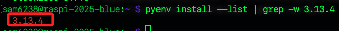

<br>

4. 安裝指定版本 `3.13.4`；這會從官網下載，需要一點時間。

    ```bash
    pyenv install 3.13.4
    ```

    

<br>

5. 安裝過程可能出現模組未正確編譯的錯誤提示，原因是缺少必要的系統函式庫與開發套件，屬於常見問題，官方有提供排除方法的連結。

    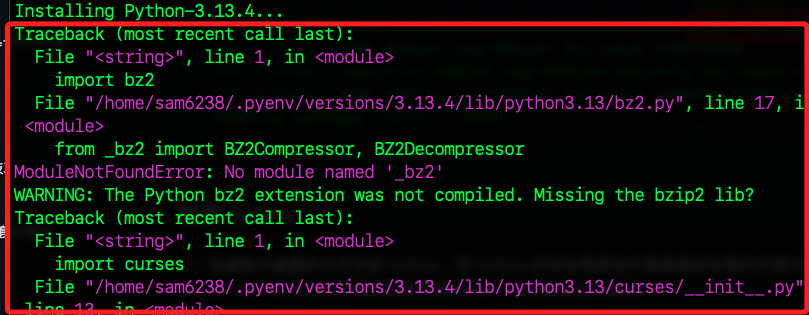

<br>

6. 依據錯誤訊安裝缺漏套件前，先運行移除安裝指令，確保 Python 清理乾淨；一般來說應該會顯示尚未安裝。

    ```bash
    pyenv uninstall 3.13.4
    ```

<br>

7. 安裝遺漏套件。

    ```bash
    sudo apt install -y make build-essential libssl-dev zlib1g-dev \
    libbz2-dev libreadline-dev libsqlite3-dev wget curl llvm \
    libncursesw5-dev xz-utils tk-dev libxml2-dev libxmlsec1-dev \
    libffi-dev liblzma-dev
    ```

<br>

8. 重新安裝 Python。

    ```bash
    pyenv install 3.13.4
    ```

<br>

9. 查看 `pyenv` 當前預設的 Python 版本，其中 `* system` 表示目前使用的是系統預設的 Python 版本，並非 `pyenv` 管理的版本；關於版本切換等操作待後續說明。

    ```bash
    pyenv versions
    ```

    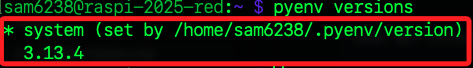

<br>

## 驗證安裝

1. 查詢當前系統管理的 Python 版本；結果顯示與 `pyenv` 所管理的版本不同。

    ```bash
    python --version
    ```

    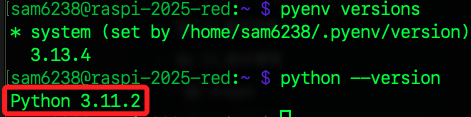

<br>

2. 查詢當前運行的 Python 路徑，可發現 Python 現在已經由 `.pyenv` 進行管理了，這樣的結果似乎與前面的描述有所混淆。

    ```bash
    which python
    ```

    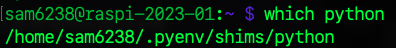

<br>

## 釐清

1. 使用 `which python` 查詢所顯示的結果表示 pyenv 的 shim 機制已經啟動，但是 `python --version` 執行的仍然是系統的版本。

<br>

2. 根本原因是因為目前的 pyenv 使用預設的設定，所以雖然透過 pyenv 呼叫，但 pyenv 仍指向系統內建版本。

    ```bash
    pyenv global system
    ```

<br>

## Python 所在路徑

_繼續相關說明_

<br>

1. 查系統中與關鍵字 `Python` 相關的所有檔案路徑。

    ```bash
    whereis python
    ```

    

<br>

2. 將以上的輸出排版查看；包含系統內建的 Python 執行檔，以及 `pyenv` 所建立的 `shim` 檔案，這是用來轉向目前指定的 Python 版本；另外 `python.1.gz` 則是 Python 指令的說明文件 `man page` 的壓縮檔。

    ```bash
    python: 
    /usr/bin/python 
    /home/sam6238/.pyenv/shims/python 
    /usr/share/man/man1/python.1.gz
    ```

<br>

3. 特別留意，`pyenv` 看似將 Python 安裝在 `/home/sam6238/.pyenv/shims` 資料夾內，但實際上 `shims` 是一種 `轉向機制`，用來根據當前設定的 Python 版本自動導向對應執行檔，實際的 Python 安裝檔則位於 `~/.pyenv/versions/` 目錄下；在 `/shims` 目錄內的是 shim 轉向器腳本。

    ```bash
    cat /home/sam6238/.pyenv/shims/python3
    ```

    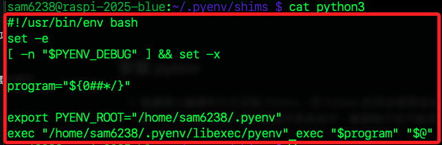

<br>

4. 可查詢版本並觀察結果。
    
    ```bash
    /home/sam6238/.pyenv/shims/python --version
    ```

    

<br>

## 執行檔位置

1. 由以上的說明可知，Python 執行檔的實際路徑是在 `~/.pyenv/versions` 所對應的版本號目錄中，例如 `3.13.4` 即在 `3.13.4/bin` 。

    

<br>

2. 透過實際路徑可查詢版本及運行相關指令。

    ```bash
    ~/.pyenv/versions/3.13.4/bin/python --version
    ```

<br>

3. 確定路徑後，可回到指定路徑如 `~/Documents/PythonVenvs` 建立虛擬環境。

    ```bash
    cd ~/Documents/PythonVenvs
    ~/.pyenv/versions/3.13.4/bin/python -m venv env3.13.4
    ```

<br>

4. 編輯環境參數文件 `~/.bashrc`，添加以下內容。

    ```txt
    source ~/Documents/PythonVenvs/env3.13.4/bin/activate
    ```

<br>

5. 載入更新立即套用環境設置。

    ```bash
    source ~/.bashrc
    ```

<br>

6. 查詢虛擬環境的 Python 版本。

    ```bash
    python --version
    ```

    

<br>

## 再次安裝

_以下安裝另一個版本 `3.12.0`_

<br>

1. 安裝 Python `3.12.0` 版，首先檢查該版本是否存在。

    ```bash
    pyenv install --list | grep -w 3.12.0
    ```

    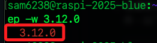

<br>

2. 確定版本號正確，使用 `pyenv` 進行安裝。

    ```bash
    pyenv install 3.12.0
    ```

<br>

3. 完成後，查看目前由 `pyenv` 管理的 Python 版本有哪些。

    ```bash
    pyenv versions
    ```

    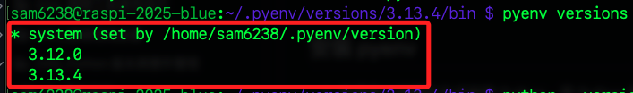

<br>

## pyenv 的官方用法

_官方指引的使用方式_

<br>

1. 建立一個目錄；特別注意，這並非虛擬環境路徑，而是在不同的目錄中指定使用的 Python 版本。

    ```bash
    cd ~/Documents
    mkdir envTest
    cd envTest
    ```

<br>

2. 先在目錄內查詢一下當前環境使用的 Python 版本號，結果是 `3.11.2`。

    ```bash
    python --version
    ```

    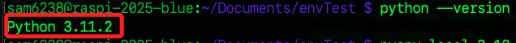

<br>

3. 使用 `pyenv` 搭配參數 `local` 設定當前目錄要使用的版本 `3.12.0`。

    ```bash
    pyenv local 3.12.0
    ```

<br>

4. 完成後可發現添加了一個檔案 `.python-version`。

    ```bash
    ls -al
    ```

    

<br>

5. 無需啟動虛擬環境，再次查詢透過版本號，可發現已經改變為 `3.12.0`。

    ```bash
    python --version
    ```

    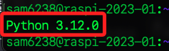

<br>

## 更改版本號

1. 編輯目錄內的 `.python-version`，直接填入其他由 `pyenv` 所管理的版本號如 `3.11.2`。

    ```bash
    nano .python-version
    ```

    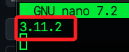

<br>

2. 在查詢一次，可發現版本號更改了。

    ```bash
    python --version
    ````

    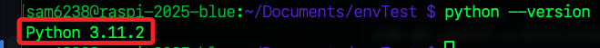

<br>

## 其他指令

_`pyenv` 其他指令_

<br>

1. 設置系統全域的 Python 版本，這個設置決定執行 Python 時的預設版本。

    ```bash
    pyenv global
    ```

<br>

2. 在當前終端機視窗中設置臨時的 Python 版本，這個設置不會影響其他終端機或目錄的設置，關閉後即失效。

    ```bash
    pyenv shell
    ```

<br>

3. 顯示所有已安裝的 Python 版本，並標示當前選擇的版本。

    ```bash
    pyenv versions
    ``` 

<br>

4. 用於安裝新的 Python 版本。

    ```bash
    pyenv install
    ```

<br>

5. 用於卸載已安裝的 Python 版本。

    ```bash
    pyenv uninstall
    ```

<br>

___

_END_