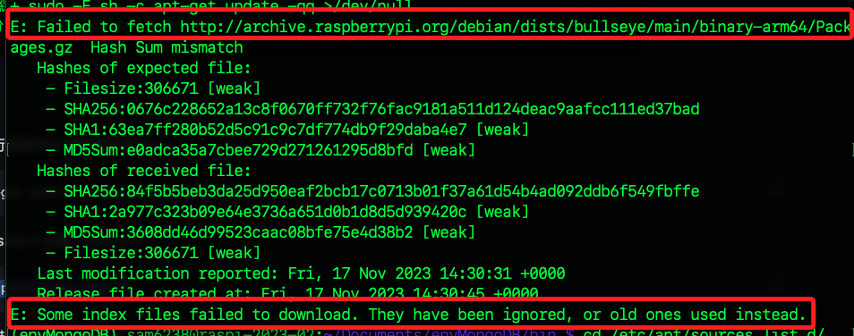
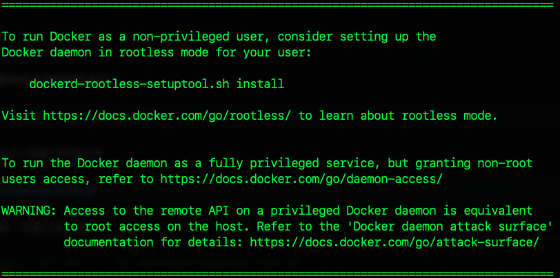

# Docker 安裝與設置

_因為官網並沒有適用於樹莓派4系統架構的安裝，所以使用 Docker 在樹梅派架設 MongoDB Server_

<br>

## 步驟

1. 下載並安裝 Docker。

    ```bash
    curl -sSL https://get.docker.com | sh
    ```

<br>

2. 我在安裝時發生錯誤。

    

<br>

3. 切換到資源列表資料夾。

    ```bash
    cd /etc/apt/sources.list.d/
    ```

<br>

4. 透過 `ls` 指令查詢僅有一個列表檔案。
   
    

<br>

5. 進行編輯。

    ```bash
    sudo nano raspi.list
    ```

<br>

6. 別想太多，註解掉可確認出錯的來源或是索性全部註解都無妨。

    

<br>

7. 再次安裝。

    ```bash
    curl -sSL https://get.docker.com | sh
    ```

<br>

8. 完成後會顯示。

    

<br>

9. 說明了有關 Docker 安裝後如何配置和使用 Docker。

    ```txt
    To run Docker as a non-privileged user, consider setting up the
    Docker daemon in rootless mode for your user:

        dockerd-rootless-setuptool.sh install

    Visit https://docs.docker.com/go/rootless/ to learn about rootless mode.


    To run the Docker daemon as a fully privileged service, but granting non-root
    users access, refer to https://docs.docker.com/go/daemon-access/

    WARNING: Access to the remote API on a privileged Docker daemon is equivalent
            to root access on the host. Refer to the 'Docker daemon attack surface'
            documentation for details: https://docs.docker.com/go/attack-surface/
    ```

<br>

10. 授權：將用戶添加到 docker 群組，請更改自己的帳號。

    ```bash
    sudo usermod -aG docker <自己的樹莓派帳號>
    ```

<br>

11. 查詢用戶是否加入群組。

    ```bash
    groups <自己的樹莓派帳號>
    ```

    

<br>

12. 透過重啟終端或重新連線讓授權生效。

<br>

13. 若修改了 Docker 服務的配置需要重啟 Docker。
    ```bash
    sudo systemctl restart docker
    ```

<br>

## 啟動容器

1. 指令。

    ```bash
    docker run --name mongodb-arm64 -p 27017:27017 --restart always -d arm64v8/mongo:4.4.18
    ```

<br>

2. 會顯示 `Unable to find image` ，然後進行 ` Pull` 下載並安裝。

    

<br>

3. 說明。

   上述指令會建立一個名為 `mongodb-arm64` 的新容器、映射 27017 端口、設定為開機自動重啟，並使用 Docker 映像 `arm64v8/mongo:4.4.18` 來運行 MongoDB，並以 `always` 參數設定容器的重啟策略。

<br>


## 其他指令與說明

_僅說明 Docker 服務常用的指令，以上程序完成後不用做以下說明的指令_

<br>

1. 啟用 Docker 服務。

    ```bash
    sudo systemctl start docker
    ```

<br>

2. 設為開機啟動。

    ```bash
    sudo systemctl enable docker
    ```

<br>

3. 停止 Docker 容器。

    ```bash
    docker stop mongodb-arm64
    ```

<br>

4. 刪除 Docker 容器。

    ```bash
    docker rm mongodb-arm64
    ```

<br>

5. 容器重啟策略的參數。

    若要讓 Docker 容器在樹莓派啟動時自動運行，使用 docker run 命令中的 --restart 參數設定重啟策略，可選的重啟策略如下。

    - `no`：預設值，不自動重新啟動容器。
    - `on-failure`：當容器非正常退出時重啟。
    - `unless-stopped`：除非容器被手動停止，否則始終重啟。
    - `always`：設定容器始終在樹莓派重啟時自動運行。

<br>

___

_END_