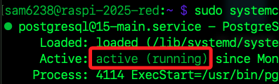

# PostgreSQL 伺服器

_在樹莓派建立 PostgreSQL 伺服器的步驟_

<br>

## 系統更新與升級

1. 先更新系統軟體包並升級至最新版本。

    ```bash
    sudo apt update
    sudo apt upgrade -y
    ```

<br>

2. 安裝 `PostgreSQL`；包含主程式以及官方附加的擴充功能套件，`postgresql-contrib` 包含一些有用的擴展可增強 PostgreSQL 的功能和性能，雖然這些擴展並不是 PostgreSQL 的核心部分，但在許多場景下非常實用，所以這裡進行安裝。

    ```bash
    sudo apt install postgresql postgresql-contrib -y
    ```

<br>

## 狀態檢查

_安裝完成後進行檢查_

<br>

1. 確認服務是否啟動；特別注意，此時服務雖然已啟動 `active`，但主程式執行完畢就結束 `exited`，屬於非常駐型的服務。

    ```bash
    sudo systemctl status postgresql
    ```

<br>

2. 這是因為在樹莓派系統中，`postgresql.service` 是一個 `父級服務管理器`，它會啟動實際版本的 PostgreSQL，而自己會結束；所以要查詢實際版本的服務狀態，查詢前先確認版本。

    ```bash
    psql --version
    ```

<br>

3. 指定版本號進行查詢狀態。

    ```bash
    sudo systemctl status postgresql@15-main
    ```

    

<br>

4. 若需要自動化，可改寫如下。

    ```bash
    sudo systemctl status postgresql@$(psql --version | awk '{print $3}' | cut -d. -f1)-main
    ```

<br>

5. 如果服務沒有啟動，先進行啟動 `start`。

    ```bash
    sudo systemctl start postgresql
    ```

<br>

6. 將服務設置為開機自動啟動 `enable`。

    ```bash
    sudo systemctl enable postgresql
    ```

<br>

## 設置用戶

_PostgreSQL 安裝後會預設建立一個名為 `postgres` 的超級用戶，但初始狀態並未設定密碼_

<br>

1. 透過以下指令切換到預設用戶 `postgres`，參數 `-i` 是啟用 `模擬登錄（login shell）`，這樣 `postgres` 用戶的環境設置將會被加載，使得在進入 postgres 用戶環境後擁有與直接登錄 `postgres` 用戶相同的工作環境；另外 `-u postgres` 是指定以 `postgres` 用戶的身份執行命令。

    ```bash
    sudo -i -u postgres
    ```

    

<br>

2. 設定密碼；替換 `<自訂密碼>`；特別注意，在 `PostgreSQL` 中密碼是字串，根據 SQL 標準必須用 `單引號 ' '` 包起來，否則會被當作 `識別字（identifier）`，導致語法錯誤。

    ```bash
    psql -c "ALTER USER postgres PASSWORD '<自訂密碼>';"
    ```

    

<br>

3. 設定完成退出 `psql`，這會回到樹莓派用戶中。

    ```bash
    exit
    ```

    

<br>

4. 以上步驟設置的是 `PostgreSQL` 資料庫用戶的密碼，與系統層面的用戶密碼是不同的；假如要設置一個系統層用戶 `postgres`，得切換回系統管理者進行建立，在這因為已經在該用戶中，可不用執行。

    ```bash
    su sam6238
    ```

<br>

5. 建立使用者 `postgres` 的密碼。

    ```bash
    sudo passwd postgres
    ```

<br>

6. 接著輸入兩次密碼，完成時會顯示成功。

    

<br>

## 設置遠程訪問

1. 編輯 PostgreSQL 的兩個配置文件 `postgresql.conf`、`pg_hba.conf` 來允許遠程訪問。

    ```bash
    sudo nano /etc/postgresql/*/main/postgresql.conf
    ```

<br>

2. 找到以下行，取消註解並設置 IP 為 `*`；預設在第 `60` 行左右。

    ```bash
    #listen_addresses = 'localhost'
    ```

    

<br>

3. 修改如下，表示將監聽所有可用的 IP 位址，允許來自任意主機的連線請求。

    ```bash
    listen_addresses = '*'
    ```

<br>

4. 編輯 `pg_hba.conf`。

    ```bash
    sudo nano /etc/postgresql/*/main/pg_hba.conf
    ```

<br>

5. 滾動到最下方，在文件末尾添加以下內容；表示允許所有 IP 位址的用戶，以帳號密碼（MD5）驗證方式，連線至所有資料庫與所有用戶。

    ```bash
    host    all             all             0.0.0.0/0               md5
    ```

    

<br>

6. 修改配置文件後皆需要重啟服務。

    ```bash
    sudo systemctl restart postgresql
    ```

<br>

## 關於防火牆

_如果未使用防火牆，不用進行任何操作_

<br>

1. 如果有使用防火牆如 `ufw（Uncomplicated Firewall）`，需要開啟 PostgreSQL 的端口，預設是 `5432`。

    ```bash
    sudo ufw allow 5432/tcp
    ```

<br>

## 測試連接

_從遠程電腦使用 `PostgreSQL 客戶端` 連接到樹莓派的服務上_

<br>

1. 使用 `pgAdmin 4`；下載安裝步驟另外說明。

    

<br>

2. 註冊新的連線，任意命名如 `postgreSQL-1`；特別注意，這是連線的 `顯示名稱`，並非主機名稱。

    

<br>

3. 切換到 `Connection` 頁籤，輸入樹莓派主機名稱或 IP，另外還要設定密碼；其餘使用預設，接著點擊 `Save`。

    

<br>

4. 也可以透過從電腦上連線的樹莓派 PostgreSQL。

    ```bash
    # -U 是使用者名稱 postgres、-d 是資料庫名稱 postgres、
    psql -h <自己的樹莓派 IP> -U postgres -d postgres

    # 使用 Hostname
    psql -h raspi-2024-01 -U postgres -d postgres
    ```

    

<br>

## 關於警告

1. 這裡出現訊息提示客戶端與服務器的版本不同。

    ```bash
    psql (14.12 (Homebrew), server 15.6 (Debian 15.6-0+deb12u1))
    WARNING: psql major version 14, server major version 15.
            Some psql features might not work.
    ```

<br>

2. 這裡不做其他處理，僅升級所有過時的 Formula 和 Cask 即可。

    ```bash
    brew update
    ```

<br>

## 設置自動備份

_補充說明：為了確保數據安全，可以設置自動備份腳本。_

<br>

1. 建立一個腳本文件 `~/backup_pg.sh`。

    ```bash
    sudo nano ~/backup_pg.sh
    ```

<br>

2. 編輯腳本內容。

    ```bash
    #!/bin/bash
    pg_dumpall -U postgres -h localhost | gzip > /home/pi/backup/postgres_backup_$(date +\%Y\%m\%d).gz
    ```

<br>

3. 儲存並設置可執行權限。

    ```bash
    sudo chmod +x ~/backup_pg.sh
    ```

<br>

4. 使用 Python 內建的 `crontab` 添加每日備份計劃。

    ```bash
    crontab -e
    ```

<br>

5. 在文件末尾添加以下設指令，表示 `會在每天的凌晨 2 點進行備份`。

    ```bash
    0 2 * * * /home/pi/backup_pg.sh
    ```

<br>

<br>

___

_END_


