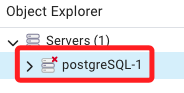
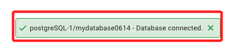
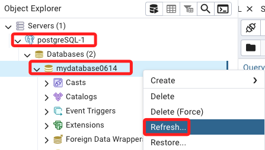
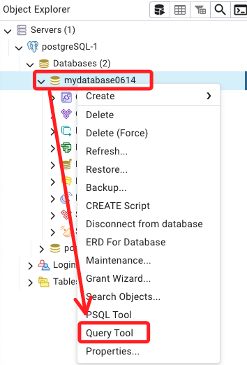
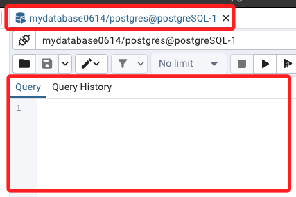
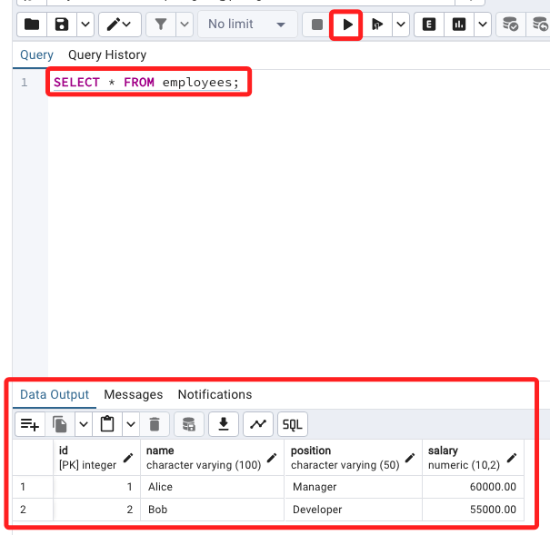
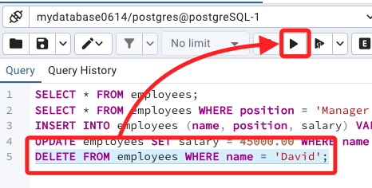
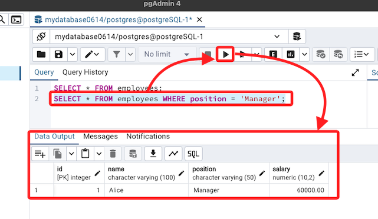
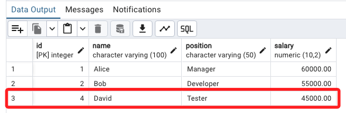

# pgAdmin 4 簡易操作

<br>

## 開始使用

1. 啟動 `pgAdmin 4` 應用程式，在左側欄中可看到目標 PostgreSQL 伺服器，點擊就會自動連線。

    

<br>

2. 點擊連線名稱展開，接著展開 `Databases`，選擇要執行查詢的數據庫，同樣點擊展開資料庫就會自動連線，右下角也會顯示連線資訊。

    

<br>

## 查詢

1. 在數據庫點擊右鍵，選取 `Refresh` 可先進行刷新。

    

<br>

2. 在彈出的右鍵選單中，選擇 `Query Tool`。

    

<br>

3. 右側會出現語法視窗。

    

<br>

3. 輸入查詢語句。

    ```sql
    SELECT * FROM employees;
    ```

<br>

4. 點擊右上方的 `Excute script` 或 `F5` 執行語法，這個查詢將會從 `employees` 表中選取所有的記錄並顯示在下方。

    

<br>

5. 與一般資料庫桌面應用操作方式一樣，若要執行指定行時，先反白選取指定範圍，然後再點擊 `Excute script` 圖標。

    

<br>


## 其他查詢語法

1. 按條件篩選記錄。

    ```sql
    SELECT * FROM employees WHERE position = 'Manager';
    ```

    

<br>

2. 插入新的記錄，人名是 `David`。

    ```sql
    INSERT INTO employees (name, position, salary) 
    VALUES ('David', 'Tester', 40000.00);
    ```

<br>

3. 更新記錄。

    ```sql
    UPDATE employees 
    SET salary = 45000.00 
    WHERE name = 'David';
    ```

    

<br>

4. 刪除記錄。

    ```sql
    DELETE FROM employees WHERE name = 'David';
    ```

<br>

___

_END_