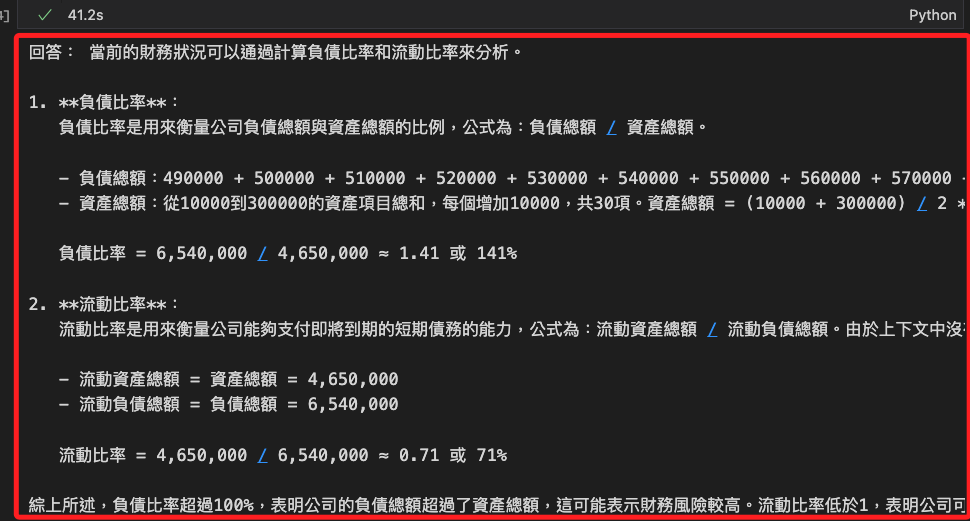

# 封閉 Excel 文件

_讀取、摘要、向量化 Excel 文件並存入 PostgreSQL + `pgvector` 中，進而以 RAG 架構實現問答_

<br>

## 準備工作

1. 安裝套件。

    ```bash
    pip install llama-index llama-index-llms-openai llama-index-embeddings-openai llama-index-vector-stores-postgres openai python-dotenv pandas openpyxl psycopg2-binary
    ```

<br>

2. 編輯 `.env` 設定檔。

    ```env
    OPENAI_API_KEY=<更改-sk-xxxxxxxxxxxxxxxxxxxxxxxxxxxxxxxxxxxx>
    POSTGRES_HOST=localhost
    POSTGRES_PORT=5432
    POSTGRES_DB=testdb
    POSTGRES_USER=postgres
    POSTGRES_PASSWORD=sam112233
    LLM_MODEL=<自選模型如-gpt-3.5-turbo>
    ```

<br>

3. 建立模擬數據。

    ```python
    import pandas as pd

    # 資產負債表（約 60 筆資料）
    assets = [f"資產項目_{i}" for i in range(1, 41)]
    liabilities = [f"負債項目_{i}" for i in range(1, 21)]
    balance_data = {
        "科目": assets + liabilities,
        "分類": ["資產"] * len(assets) + ["負債"] * len(liabilities),
        "金額": [
            i * 10000 for i in range(1, len(assets) + len(liabilities) + 1)
        ]
    }
    balance_sheet = pd.DataFrame(balance_data)

    # 損益表（月）（約 30 筆資料）
    revenue_items = [f"收入項目_{i}" for i in range(1, 11)]
    cost_items = [f"成本項目_{i}" for i in range(1, 11)]
    expense_items = [f"費用項目_{i}" for i in range(1, 11)]
    income_data = {
        "項目": revenue_items + cost_items + expense_items,
        "分類": ["收入"] * 10 + ["成本"] * 10 + ["費用"] * 10,
        "金額": [i * 5000 for i in range(1, 31)]
    }
    income_statement = pd.DataFrame(income_data)

    # 匯率資訊（更多幣別）
    currencies = [
        "美元", "人民幣", "日圓", "歐元", "韓元",
        "港幣", "英鎊", "澳幣", "加幣", "新加坡幣"
    ]
    exchange_rates = [
        30.2, 4.5, 0.21, 32.8, 0.023,
        3.86, 38.1, 20.5, 22.3, 22.9
    ]
    exchange_info = pd.DataFrame({
        "幣別": currencies,
        "試算匯率": exchange_rates
    })

    # 將三個工作表寫入 Excel
    file_path = "財務報表.xlsx"
    with pd.ExcelWriter(file_path) as writer:
        balance_sheet.to_excel(
            writer, sheet_name="資產負債表", index=False
        )
        income_statement.to_excel(
            writer, sheet_name="損益表", index=False
        )
        exchange_info.to_excel(
            writer, sheet_name="匯率", index=False
        )

    file_path
    ```

<br>

## 編輯專案

1. 主程式。

    ```python
    # 建立向量索引
    import os
    from dotenv import load_dotenv
    from llama_index.core import VectorStoreIndex, Document
    from llama_index.core.node_parser import SimpleNodeParser
    from llama_index.embeddings.openai import OpenAIEmbedding
    from llama_index.vector_stores.postgres import PGVectorStore
    from llama_index.llms.openai import OpenAI
    from llama_index.core import Settings

    # 載入 .env 環境變數
    load_dotenv()
    Settings.llm = OpenAI(model=os.getenv("LLM_MODEL"))
    Settings.embed_model = OpenAIEmbedding()

    # 將 Excel 資料轉為自然語言格式
    df_dict = pd.read_excel("財務報表.xlsx", sheet_name=None)
    combined_text = ""
    for sheet_name, df in df_dict.items():
        combined_text += f"[工作表：{sheet_name}]\n"
        for row in df.itertuples(index=False):
            combined_text += "，".join(f"{col}：{getattr(row, col)}" for col in df.columns)
            combined_text += "\n"
        combined_text += "\n"

    # 建立 LlamaIndex 文件與向量節點
    document = Document(text=combined_text)
    nodes = SimpleNodeParser().get_nodes_from_documents([document])

    # 向 pgvector 寫入資料
    vector_store = PGVectorStore.from_params(
        database=os.getenv("POSTGRES_DB"),
        host=os.getenv("POSTGRES_HOST"),
        password=os.getenv("POSTGRES_PASSWORD"),
        user=os.getenv("POSTGRES_USER"),
        port=int(os.getenv("POSTGRES_PORT")),
        table_name="financial_docs"
    )

    index = VectorStoreIndex(nodes, vector_store=vector_store)
    # 查詢流程
    query_engine = index.as_query_engine()
    ```

<br>

2. 問答查詢。

    ```python
    response = query_engine.query(
        "請分析當前財務狀況，提供負債比率與流動比率等財務數據"
    )
    print("回答：", response)
    ```

    

<br>

___

_END_