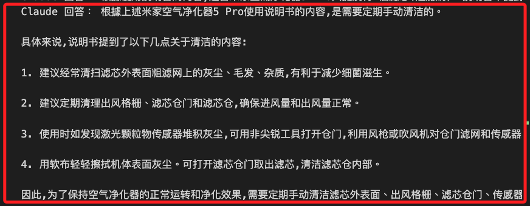

# 簡易專案

_讓樹莓派成為一台智慧知識查詢終端，實現抓取本地檔案或網頁內容，然後用 Claude API 進行知識抽取、問答（Q\&A）與摘要。_

<br>

## 準備工作

1. 更新樹莓派系統中的套件清單，並自動升級所有已安裝套件至最新版本。

    ```bash
    sudo apt update
    sudo apt upgrade -y
    ```

<br>

2. 建立虛擬環境；將虛擬環境安裝在 `~/Documents/PythonVenvs` 中做統一管理，完成後並寫入環境變數，每次進入系統就自動啟動。

    ```bash
    mkdir -p ~/Documents/PythonVenvs
    cd ~/Documents/PythonVenvs
    python -m venv envLLM
    cd envLLM/bin
    VENV_PATH="$(pwd)/activate"
    echo "source $VENV_PATH" >> ~/.bashrc
    source ~/.bashrc
    ```

    

<br>

3. 啟動虛擬環境後，可進行安裝必要套件；`openai` 套件用於範例，也適合換成官方 Claude SDK 或任何 HTTP 調用套件。

    ```bash
    pip install requests beautifulsoup4 openai python-dotenv
    ```

<br>

4. 在 `~/Documents` 建立存放 `知識文件` 的資料夾 `knowledge`。

    ```bash
    mkdir -p ~/Documents/knowledge
    ```

<br>

## Claude API Key

1. 到 [Anthropic Claude 官方平台](https://console.anthropic.com/) 申請帳號並取得 API Key。

<br>

2. 記下你的金鑰，稍後將放到 `.env` 或直接程式碼中。

<br>

## 資料來源準備

1. 本地檔案；可使用任意要查詢的知識如產品說明書等，格式可以是 `TXT/MD/CSV`，放在 `~/Documents/knowledge/`；下方指令示範的範例是將本地 PDF 說明書傳到樹莓派中 。

    ```bash
    scp <本地文件路徑> <使用者帳號>@<主機代號>:~/Documents/knowledge

    # 範例，本機運行
    scp 米家空氣清淨器5Pro.pdf sam6238@red:~/Documents/knowledge
    ```

    

<br>

2. 網頁數據；另製作腳本爬取。

<br>

3. 建立專案資料夾；之後使用 VSCode 連線做開發。

    ```bash
    mkdir -p ~/Documents/exLLM
    cd ~/Documents/exLLM
    touch .gitignore .env ex01.ipynb
    echo ".env" >> .gitignore
    ```

<br>

4. 編輯 `.env`；特別注意，這裡使用覆蓋指令 `>` 進行寫入，因為當前文件是空的，後續若要添加，則改用 `>>`。

    ```bash
    echo "OPENAI_API_KEY=<填入-API-Key>
    POSTGRES_PASSWORD=<填入密碼>
    POSTGRES_USER=postgres
    POSTGRES_HOST=localhost
    POSTGRES_PORT=5432
    POSTGRES_DB=testdb
    LLM_MODEL=gpt-3.5-turbo
    ANTHROPIC_API_KEY=<填入-ANTHROPIC-API-KEY>" > .env
    ```

<br>

## PDF 解析

1. 先安裝必要套件。

    ```bash
    pip install pdfplumber easyocr
    ```

<br>

2. 自訂函數：轉換 PDF 為文字，具體使用套件 `pdfplumber` 把 PDF 頁面轉成影像，再用基於深度學習的 OCR 模型 `EasyOCR` 辨識圖片中的文字，完成圖像文字轉文字的技術流程。

    ```python
    import pdfplumber
    import easyocr
    import numpy as np

    def extract_pdf_with_ocr(filepath, lang=['ch_sim','en']):
        reader = easyocr.Reader(lang, gpu=False)
        result_text = []
        with pdfplumber.open(filepath) as pdf:
            for page in pdf.pages:
                img = page.to_image(resolution=300).original
                # 轉成 numpy array
                img_np = np.array(img)
                ocr_result = reader.readtext(img_np)
                page_text = ' '.join([seg[1] for seg in ocr_result])
                if page_text.strip():
                    result_text.append(page_text)
        return '\n'.join(result_text)
    ```

<br>

## 測試轉換

1. 透過腳本進行測試；特別注意，會提示 `This module is much faster with a GPU`，這是因為 `easyocr` 會自動檢查環境有沒有 `CUDA（NVIDIA 顯卡）` 支援，樹莓派是沒有 `GPU` 的，所以是使用 `CPU` 模式。

    ```python
    import os
    pdf_path = os.path.expanduser(
        '~/Documents/knowledge/米家空氣清淨器5Pro.pdf'
    )
    text = extract_pdf_with_ocr(pdf_path)
    print(text[:1000])
    ```

    

<br>

2. 初次運行會下載模型；之後開始進行轉換，特別注意，這是透過 AI 模型進行轉換，需要一點時間。

    

<br>

3. 另外，訊息顯示 PDF 缺少 `CropBox` 設定，系統自動用 `MediaBox` 當作顯示區域；`MediaBox` 是 `PDF` 頁面的實體紙張範圍，也就是最大外框，`CropBox` 是 `PDF` 頁面實際顯示或裁切的範圍，也就是看到的區域。

    

<br>

4. 可將結果直接儲存成 `.txt` 檔，使用與來源同資料夾、同名。

    ```python
    txt_path = os.path.splitext(pdf_path)[0] + '.txt'
    with open(txt_path, 'w', encoding='utf-8') as f:
        f.write(text)
    ```

    

<br>

## 改寫轉換函數

_完成以上測試後，將功能合併改寫原本的 `extract_pdf_with_ocr()` 函數_

<br>

1. 改寫函數如下，也就是將 PDF 轉為文字後，自動存在來源資料夾中，並使用相同名稱命名 `.txt` 檔案。

    ```python
    import os

    def extract_pdf_with_ocr(
        pdf_path,
        lang=['ch_sim','en','ch_tra']
    ):
        import pdfplumber
        import easyocr
        import numpy as np

        reader = easyocr.Reader(lang, gpu=False)
        result_text = []
        with pdfplumber.open(pdf_path) as pdf:
            for page in pdf.pages:
                img = page.to_image(resolution=300).original
                img_np = np.array(img)
                ocr_result = reader.readtext(img_np)
                page_text = ' '.join([seg[1] for seg in ocr_result])
                if page_text.strip():
                    result_text.append(page_text)
        full_text = '\n'.join(result_text)

        # 自動寫入同資料夾同名 .txt
        txt_path = os.path.splitext(pdf_path)[0] + '.txt'
        with open(txt_path, 'w', encoding='utf-8') as f:
            f.write(full_text)

        return full_text
    ```

<br>

## 正式進行專案

1. 自定義函數：調用本地知識文件，函數中會調用解析 PDF 的函數，由於這個函數會再次優化，所以無需運行前面的函數。

    ```python
    import os

    def load_local_files(directory):
        directory = os.path.expanduser(directory)
        all_text = ""
        for fname in os.listdir(directory):
            path = os.path.join(directory, fname)
            if not os.path.isfile(path):
                continue
            # 純文字檔
            if fname.endswith(('.txt', '.md', '.csv')):
                try:
                    with open(path, encoding='utf-8') as f:
                        all_text += f.read() + "\n"
                except Exception as e:
                    print(f"讀取文字檔失敗：{fname}，原因：{e}")
            # PDF 檔案（自動判斷用 OCR）
            elif fname.endswith('.pdf'):
                try:
                    all_text += extract_pdf_with_ocr(path) + "\n"
                except Exception as e:
                    print(f"解析 PDF 失敗：{fname}，原因：{e}")
        return all_text
    ```

<br>

2. 自定義函數：解析 PDF，再次優化 `extract_pdf_with_ocr()`，OCR 語言支援 `繁體中文`、`簡體中文`、`英文`，每次 OCR 完成後，自動將結果存成同名 `.txt`；未來每次處理 PDF 前，會先檢查是否已有同名 `.txt`，有就直接讀取 `.txt` 檔、跳過 OCR；假如這樣的邏輯有所變更，務必修正函數，或是優化函數跳出提示進行選擇或確認。

    ```python
    import os
    import pdfplumber
    import easyocr
    import numpy as np

    def extract_pdf_with_ocr(filepath, lang=['ch_tra', 'ch_sim', 'en']):
        # 設定 txt 輸出路徑
        txt_path = os.path.splitext(filepath)[0] + '.txt'
        
        # 若有同名 txt 檔，直接讀取返回
        if os.path.isfile(txt_path):
            with open(txt_path, 'r', encoding='utf-8') as f:
                return f.read()
        
        # 沒有 txt 檔才進行 OCR
        reader = easyocr.Reader(lang, gpu=False)
        result_text = []
        with pdfplumber.open(filepath) as pdf:
            for page in pdf.pages:
                img = page.to_image(resolution=300).original
                img_np = np.array(img)
                ocr_result = reader.readtext(img_np)
                page_text = ' '.join([seg[1] for seg in ocr_result])
                if page_text.strip():
                    result_text.append(page_text)
        text = '\n'.join(result_text)
        
        # 儲存 txt 檔到同目錄
        with open(txt_path, 'w', encoding='utf-8') as f:
            f.write(text)
        
        return text
    ```

<br>

3. 調用時方式不變，再次運行就會發現不會進行轉換工作，因為同名的 `.txt` 文件已經存在。

    ```python
    pdf_path = os.path.expanduser(
        '~/Documents/knowledge/米家空氣清淨器5Pro.pdf'
    )
    text = extract_pdf_with_ocr(pdf_path)
    print(text[:1000])
    ```

<br>

## 關於  `easyocr.Reader`

_執行會看到 `Downloading detection model` 的訊息，說明這些下載的模型_

<br>

1. Detection model 是文字區塊偵測模型，用輕量卷積網路來跑目標偵測，判斷圖片裡哪些區域 `看起來像文字`，類似 YOLO、EAST 這種區塊偵測，定位所有有可能是文字的框框，接下來才會 OCR。

<br>

2. Recognition model 是文字辨識模型，通常是 CNN+RNN+CTC 或 attention 類神經網路，把每個被偵測出來的區塊內的內容辨識成對應的字，實際把圖片像素轉成對應的中文/英文文字。

<br>

3. `recognition model` 支援多語言，當前函數中用了 `easyocr.Reader(['ch_sim', 'en'])` 下載 `簡體中文` 與 `英文` 模型，若要添加繁體中文可使用 `'ch_tra'`，另外如日韓等文字可加入 `'ja'`、`'ko'`、`'fr'` 等。

    

<br>

4. 預設在你的使用者主目錄底下 `~/.EasyOCR/model` 資料夾，僅會在首次使用會下載，之後會重複利用，不再重抓。

    ```bash
    cd ~/.EasyOCR/model
    ls -l
    ```

<br>

## 資料網頁資訊

1. 抓網頁內容

    ```python
    import requests
    from bs4 import BeautifulSoup

    def fetch_webpage(url, min_length=50):
        resp = requests.get(url)
        # 避免中文亂碼
        resp.encoding = resp.apparent_encoding
        soup = BeautifulSoup(resp.text, 'html.parser')
        
        # 嘗試優先找 <article>、<main> 或主要內容區
        for tag in ['article', 'main', 'section', 'body']:
            main = soup.find(tag)
            if main and len(main.get_text(strip=True)) > min_length:
                return main.get_text(separator='\n', strip=True)
        
        # fallback: 將所有 <p> 文字串起來
        ps = soup.find_all('p')
        content = '\n'.join(p.get_text(strip=True) for p in ps)
        if len(content) > min_length:
            return content
        
        # fallback: 全頁文字
        return soup.get_text(separator='\n', strip=True)
    ```

<br>

## 整理知識資料

1. 合併本地檔案與網頁資料為一段大文字；特別注意，若是像說明書這樣的封閉資訊，建議可以不用合併網路搜尋。

    ```python
    keyword = '米家空氣清淨器5Pro'
    url = f'https://zh.wikipedia.org/zh-tw/{keyword}'
    docs = load_local_files('~/Documents/knowledge/')
    docs += fetch_webpage(url)
    docs
    ```

<br>

2. 不過特別說明，系統可分辨資料來源，所以只要提示恰當，應該不至於混淆了知識庫。

    

<br>

## 建立查詢

1. 送資料給 Claude 進行知識抽取／問答，以 Anthropic Claude API (v2024.06) 為例。

```python
import requests

def ask_claude(question, context, api_key):
    url = "https://api.anthropic.com/v1/messages"
    headers = {
        "x-api-key": api_key,
        "anthropic-version": "2023-06-01",
        "content-type": "application/json"
    }
    data = {
        # 可根據帳號權限替換
        "model": "claude-3-sonnet-20240229",
        "max_tokens": 1024,
        "system": "你是一個知識查詢助理，根據 context 回答使用者問題。",
        "messages": [{
            "role": "user", 
            "content": f"知識內容：\n{context}\n\n請根據上述內容回答：{question}"
        }]
    }
    r = requests.post(url, headers=headers, json=data)
    if r.ok:
        resp = r.json()
        return resp['content'][0]['text']
    else:
        print("API 錯誤：", r.text)
        return None
```

## 整合互動式查詢

1. 寫一個互動 CLI 介面。

```python
from dotenv import load_dotenv
import os

# 從 .env 檔案載入所有變數
load_dotenv()

if __name__ == '__main__':
    api_key = os.environ.get("ANTHROPIC_API_KEY")
    if not api_key:
        raise ValueError(
            "未找到 ANTHROPIC_API_KEY，"
            "請確認 .env 檔案正確且已載入。"
        )
    # 前面已經合併的知識
    context = docs
    print("智慧查詢系統已啟動，輸入問題即可查詢（Ctrl+C 離開）：")
    while True:
        q = input("請輸入你的問題：")
        ans = ask_claude(q, context, api_key)
        print("Claude 回答：", ans)
```

2. 運行後，會在上方出現互動對話框，可輸入問題如 `是否需要手動清潔？`


3. 下方會回答問題，結束使用 `Ctrl+C`。



## RAG

1. 將本地知識切割成片段，先用簡單 embedding 比對與召回，後丟給 Claude 增強答案品質。

## Web 介面

_用 Flask 或 Streamlit 包裝成可視化網頁版_

## 定時任務

_用 cron 週期性爬網頁或同步本地資料_
