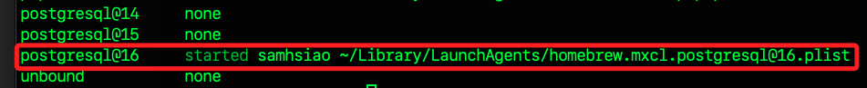
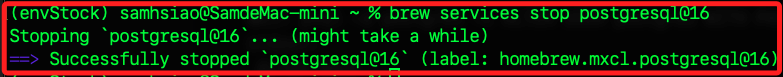
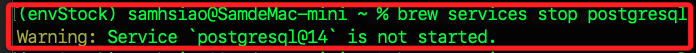
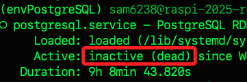
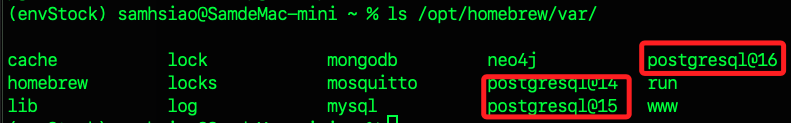
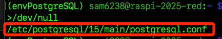
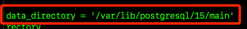
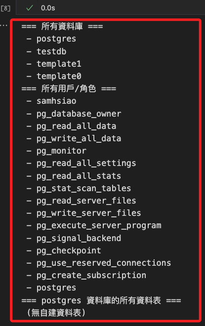

# 重置 PostgreSQL

_重置資料庫伺服器等同於完全清空、回到初次安裝完成的狀態_

<br>

## 查詢服務狀態

_在以下的操作中，樹莓派使用 `systemd` 管理服務，而 MacOS 是使用 `Homebrew` 管理；特別注意，這都不是唯一的管理方式，其餘方式不做贅述。_

<br>

1. 在樹莓派中查詢。

    ```bash
    systemctl status postgresql
    ```

<br>

2. 在 MacOS 上使用以下指令。

    ```bash
    brew services list
    ```

    

<br>

## 查詢位置

_在停止服務之前_


1. 在終端機查詢。

    ```sql
    psql -U postgres -c "SHOW data_directory;"
    ```

<br>

2. 也可以在資料庫中查詢。

    ```bash
    SHOW data_directory;
    ```

<br>

## 停止服務

1. 在 MacOS 停止服務時，若有多版本，需指定所要停止的版本，使用 `@` 符號加上版本號如下。

    ```bash
    brew services stop postgresql@16
    ```

    

<br>

2. 若無指定版本號，預設會以第一個版本作為目標，若該版本服務未啟動，會顯示相關錯誤。

    

<br>

3. 在樹莓派上停止服務；停止後再次查詢 `status` 會是 `inactive（dead）`。

    ```bash
    sudo systemctl stop postgresql
    ```

    

<br>

## 確認安裝位置

1. 在 MacOS 中，若是使用 `Homebrew` 安裝，可先透過指令進行檢查。

    ```bash
    ls /opt/homebrew/var/
    ```

    

<br>

2. 確認版本號之後，可透過參數 `--prefix` 查詢主檔的安裝位置。

```bash
brew --prefix postgresql@16
```

3. 在樹莓派中，可進行整機搜尋。

    ```bash
    sudo find / -name "postgresql.conf" 2>/dev/null
    ```

    

<br>

4. 然後查看內容裡的 `data_directory` 設定。

    

5. 確認所在位置後，手動刪除全部資料；特別注意，刪除的是 `/opt/homebrew/var/*`，而不是 `/opt/homebrew/opt/*`，因為前者是存放資料，後者是軟體本身。

    ```bash
    rm -rf /opt/homebrew/var/postgresql@16/*
    ```

<br>

4. 重新初始化資料庫；特別注意，用 `initdb` 重新初始化資料庫後，並不會再次建立預設用戶 `postgres`，但是 Hmoebrew 會有一個與當前用戶同名的超級用戶。

    ```bash
    initdb /opt/homebrew/var/postgresql@16
    ```

<br>

## 重啟服務

1. MacOS 中透過 Homebrew 啟動服務。

    ```bash
    brew services start postgresql@16
    ```

<br>

2. Linux 或 樹莓派 則透過 systemd 管理服務。

    ```bash
    sudo systemctl restart postgresql
    ```

<br>

## 解決用戶

1. 在終端機查詢當前用戶名稱；假設結果顯示 `samhsiao`。

    ```bash
    whoami
    ```

<br>

2. 依據查詢結果，列出目前 PostgreSQL 伺服器上的所有資料庫清單。

    ```bash
    psql -U samhsiao -d postgres -c "\l"
    ```

<br>

3. 查詢目前有哪些用戶。

    ```bash
    psql -U samhsiao -d postgres -c "\du"
    ```

<br>

4. 使用當前用戶登入。

```bash
psql -U samhsiao -d postgres
```

5. 建立 postgres 超級用戶

    ```bash
    CREATE ROLE postgres WITH LOGIN SUPERUSER PASSWORD '<自訂新的密碼>';
    ```

<br>

6. 建立測試資料庫。

    ```bash
    createdb -U samhsiao testdb
    ```

<br>

7. 使用腳本查詢所有資料庫名稱、顯示所有用戶、所有自建資料表。

    ```python
    import psycopg2
    from dotenv import load_dotenv
    import os

    load_dotenv()

    def show_all_dbs():
        conn = psycopg2.connect(
            dbname=os.getenv('POSTGRES_DB', 'postgres'),
            user=os.getenv('POSTGRES_USER', 'postgres'),
            password=os.getenv('POSTGRES_PASSWORD', ''),
            host=os.getenv('POSTGRES_HOST', 'localhost'),
            port=os.getenv('POSTGRES_PORT', '5432')
        )
        cur = conn.cursor()
        print('=== 所有資料庫 ===')
        cur.execute("SELECT datname FROM pg_database;")
        for db in cur.fetchall():
            print(' -', db[0])
        cur.close()
        conn.close()

    def show_all_roles():
        conn = psycopg2.connect(
            dbname=os.getenv('POSTGRES_DB', 'postgres'),
            user=os.getenv('POSTGRES_USER', 'postgres'),
            password=os.getenv('POSTGRES_PASSWORD', ''),
            host=os.getenv('POSTGRES_HOST', 'localhost'),
            port=os.getenv('POSTGRES_PORT', '5432')
        )
        cur = conn.cursor()
        print('=== 所有用戶/角色 ===')
        cur.execute("SELECT rolname FROM pg_roles;")
        for r in cur.fetchall():
            print(' -', r[0])
        cur.close()
        conn.close()

    def show_tables(db_name):
        conn = psycopg2.connect(
            dbname=db_name,
            user=os.getenv('POSTGRES_USER', 'postgres'),
            password=os.getenv('POSTGRES_PASSWORD', ''),
            host=os.getenv('POSTGRES_HOST', 'localhost'),
            port=os.getenv('POSTGRES_PORT', '5432')
        )
        cur = conn.cursor()
        print(f'=== {db_name} 資料庫的所有資料表 ===')
        cur.execute("""
            SELECT tablename FROM pg_catalog.pg_tables
            WHERE schemaname = 'public';
        """)
        tables = cur.fetchall()
        if tables:
            for t in tables:
                print(' -', t[0])
        else:
            print(' (無自建資料表)')
        cur.close()
        conn.close()

    if __name__ == '__main__':
        show_all_dbs()
        show_all_roles()
        # 可以視需要多查幾個資料庫
        show_tables('postgres')
    ```

    

<br>

## 重新安裝

_僅重新安裝軟體主體，不會自動移除或清空資料目錄_

<br>

1. 重新安裝。

    ```bash
    brew uninstall postgresql
    brew install postgresql
    brew services start postgresql
    ```

<br>

## 自動化

1. 指令一次搞定。

    ```bash
    brew services stop postgresql
    rm -rf /usr/local/var/postgres/*
    initdb /usr/local/var/postgres
    brew services start postgresql
    ```

<br>

## 僅清除所有資料庫與用戶

1. 如果只是要刪光所有 `user/database` 而不重建目錄，可依序把所有的資料庫與帳號 drop 掉。

    ```bash
    psql -U postgres -c "DROP DATABASE IF EXISTS testdb;"
    psql -U postgres -c "DROP USER IF EXISTS sam6238;"
    ```

<br>

___

_END_
