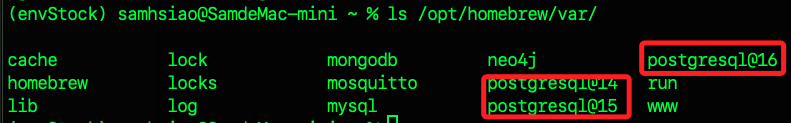
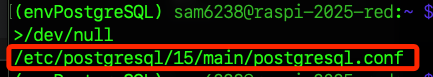

# 重置 PostgreSQL

_重置資料庫伺服器等同於完全清空、回到初次安裝完成的狀態；以下除了在樹莓派運行外，也附帶 Linux/MacOS 的操作_

<br>

## 查詢服務狀態

_在以下的操作中，樹莓派使用 `systemd` 管理服務，而 MacOS 是使用 `Homebrew` 管理；特別注意，這都不是唯一的管理方式，其餘方式不做贅述。_

<br>

1. 在樹莓派中查詢。

    ```bash
    systemctl status postgresql
    ```

    

<br>

2. 在 MacOS 上使用以下指令查詢，結果顯示目前只有 postgresql@16 服務有啟動，其他 PostgreSQL 版本（@14、@15）都未啟動。

    ```bash
    brew services list
    ```

    

<br>

## 查詢位置

_在停止服務之前_

<br>

1. 在終端機查詢；特別注意，MacOS 可使用以下兩個指令，而樹莓派只可用第二個，因為第一個指令用目前 shell 用戶登入 PostgreSQL，指定帳號為 postgres；第二個指令是切換到系統帳號 `postgres` 再登入資料庫，由於樹莓派預設用 `peer 認證`，只有系統 `postgres` 用戶能用 `peer` 登入；MacOS 用戶本身已是超級使用者且多用密碼認證，所以兩種都可用；Peer 認證是 PostgreSQL 的本地登入方式，只允許 `系統使用者名稱` 和 `資料庫用戶名稱` 一致時直接登入，不需密碼。

    ```sql
    # MacOS 使用
    psql -U postgres -c "SHOW data_directory;"
    
    # 兩者皆可
    sudo -i -u postgres psql -c "SHOW data_directory;"
    ```

<br>

2. 也可進入資料庫後，在資料庫內查詢；先進入資料庫。

    ```bash
    sudo -i -u postgres psql
    ```

<br>

3. 顯示路徑。

    ```sql
    SHOW data_directory;
    ```

<br>

4. 當前 MacOS 的版本與路徑。

    

<br>

5. 樹莓派安裝版本與路徑。

    

<br>

6. 退出資料庫。

    ```sql
    exit
    ```

<br>

## 清除所有資料庫與用戶

_停用服務之前_

<br>

1. 如果只是要刪光所有 `user/database` 而不重建目錄，可依序把所有的資料庫與帳號 drop 掉。

    ```bash
    psql -U postgres -c "DROP DATABASE IF EXISTS testdb;"
    psql -U postgres -c "DROP USER IF EXISTS sam6238;"
    ```

<br>

## 停止服務

1. 在 MacOS 停止服務時，若有多版本，需指定所要停止的版本，使用 `@` 符號加上版本號如下。

    ```bash
    brew services stop postgresql@16
    ```

    

<br>

2. 特別注意，若無指定版本號，預設會以第一個版本號作為目標，若該版本服務未啟動，會顯示相關錯誤。

    

<br>

3. 在樹莓派上使用 `systemctl` 指令停止服務；停止後可再次查詢 `status` 會是 `inactive（dead）`。

    ```bash
    sudo systemctl stop postgresql
    ```

    

<br>

## 確認安裝位置

1. 在 MacOS 中，若是使用 `Homebrew` 安裝，可先透過指令進行檢查；`opt` 存放 Homebrew 安裝的軟體本體，`var` 存放這些服務或資料庫的資料檔案、設定或數據目錄。

    ```bash
    ls /opt/homebrew/var/
    ```

    

<br>

2. 軟體本身。

    ```bash
    ls /opt/homebrew/opt/postgre*
    ```

    

<br>

3. 確認版本號之後，也可可透過參數 `--prefix` 查詢主檔的安裝位置。

    ```bash
    brew --prefix postgresql@16
    ```

<br>

4. 在樹莓派中，可進行整機搜尋。

    ```bash
    sudo find / -name "postgresql.conf" 2>/dev/null
    ```

    

<br>

5. 然後使用 `cat` 查看內容裡的 `data_directory` 設定。

    

<br>

## 刪除資訊

1. 在 MacOS 中，以上個步驟已確認所在位置，可手動刪除全部資料；特別注意，若僅僅是要刪除資料庫中的數據，則刪除對象是 `/opt/homebrew/var/*`，而不是軟體本身所在的 `/opt/homebrew/opt/*`。

    ```bash
    rm -rf /opt/homebrew/var/postgresql@16
    ```

<br>

2. 在樹莓派中可先用 grep 直接查詢設定檔內容中的 data_directory 路徑。

    ```bash
    grep data_directory /etc/postgresql/17/main/postgresql.conf
    ```

    

<br>

3. 依據結果進行刪除，在樹莓派系統的標準套件結構下，

    ```bash
    sudo rm -rf /var/lib/postgresql/17/main
    ```

<br>

4. 另外補充說明，可使用指令確認軟體主體安裝位置；之所以加上篩選條件 `bin` 只是減少輸出筆數，確認前綴路徑即可，不加也無妨。

    ```bash
    dpkg -L postgresql-17 | grep '/bin'
    ```

    

<br>

## 初始化資料庫

1. 使用 `initdb` 重新初始化資料庫；特別注意，這指令並不會再次建立預設用戶 `postgres`，但是 Hmoebrew 會有一個與當前用戶同名的超級用戶。

    ```bash
    initdb /opt/homebrew/var/postgresql@16
    ```

<br>

2. 在樹莓派使用指定版本的 `initdb` 初始化資料目錄。

    ```bash
    sudo -u postgres /usr/lib/postgresql/17/bin/initdb -D /var/lib/postgresql/17/main
    ```

<br>

## 重啟服務

1. MacOS 中透過 Homebrew 啟動服務。

    ```bash
    brew services start postgresql@16
    ```

<br>

2. 接著檢查啟動狀態。

    ```bash
    brew services list
    ```

<br>

3. 在樹莓派則透過 `systemd` 管理服務進行重啟。

    ```bash
    sudo systemctl restart postgresql
    ```

<br>

4. 同樣僅接著檢查啟動狀態。

    ```bash
    sudo systemctl status postgresql
    ```

<br>

## 刪除安裝

1. MacOS 刪除指定版本；可忽略被其他套件依賴進行強制移除。

    ```bash
    brew uninstall --ignore-dependencies postgresql@14 postgresql@15 postgresql@16
    ```

<br>

2. 可透過查詢可安裝版本來確認是不是都刪除完畢。

    ```bash
    brew search postgresql
    ```

<br>

3. 樹莓派解除安裝。

    ```bash
    sudo apt purge postgresql* -y
    sudo apt autoremove -y
    ```

<br>

4. 確認是否刪除乾淨。

    ```bash
    dpkg -l | grep postgresql
    ```

<br>

## MacOS 查詢資料庫現況

1. 在終端機查詢當前用戶名稱。

    ```bash
    whoami
    ```

<br>

2. 在 MacOS 中，依據查詢結果 `samhsiao` 列出目前 PostgreSQL 伺服器上的所有資料庫清單。

    ```bash
    psql -U samhsiao -d postgres -c "\l"
    ```

<br>

3. 查詢目前有哪些用戶。

    ```bash
    psql -U samhsiao -d postgres -c "\du"
    ```

    

<br>

4. 使用當前用戶 `samhsiao` 登入。

    ```bash
    psql -U samhsiao -d postgres
    ```

<br>

5. 建立新的超級用戶 `postgres`。

    ```bash
    CREATE ROLE postgres WITH LOGIN SUPERUSER PASSWORD '<自訂新的密碼>';
    ```

<br>

6. 建立測試資料庫 `testdb`。

    ```bash
    createdb -U samhsiao testdb
    ```

<br>

## 樹莓派查詢資料庫現況

1. 同樣查詢當前用戶；再次提醒，Homebrew 初始化資料庫時會自動建立與當前系統帳號同名的超級用戶，但樹莓派只會建立 `postgres` 用戶，所以並沒有當前用戶這個資料庫用戶 `sam6238`，所以無法用這個帳號連線。

    ```bash
    whiami
    ```

<br>

2. 先用系統 `postgres` 用戶進入 psql。

    ```bash
    sudo -u postgres psql
    ```

<br>

3. 建立同名新用戶。

    ```sql
    CREATE ROLE sam6238 WITH LOGIN SUPERUSER PASSWORD '<自訂密碼>';
    ```

<br>

4. 離開 `exit` 後，使用新用戶連線。

    ```bash
    psql -U sam6238 -d postgres
    ```

<br>

5. 講本部分先略過。

<br>

## 重新安裝

_僅重新安裝軟體主體 `opt`，不會自動移除或清空資料目錄 `var`_

<br>

1. 先查詢版本，兩系統指令相同；假如未安裝，則會顯示找不到指令 `command not found: psql`。

    ```bash
    psql --version
    ```

<br>

2. MacOS 安裝前可先使用 `brew` 查詢可安裝版本。

    ```bash
    brew search postgresql
    ```

<br>

3. MacOS 透過 `brew` 安裝，若要指定安裝版本號需加上版本標註參數 `@17`；若未指定版本，當前官方預設的版本號是 `@14`，所以移除時未指定版本也會移除預設版本 `@14`，另外若要移除多個版本，需使用多指令逐一指定版本號。

    ```bash
    brew uninstall postgresql
    brew install postgresql@17
    brew services start postgresql@17
    ```

<br>

4. 樹莓派使用 `apt` 安裝無需指定版本號，預設會安裝最新版本。

    ```bash
    sudo apt purge postgresql* -y
    sudo apt autoremove -y
    sudo apt install postgresql -y
    sudo systemctl start postgresql
    ```

<br>

5. 特別注意，MacOS 安裝出先有關於 MariaDB 及 mysql 的套件衝突訊息，在此僅針對 postgreSQL，所以不做贅述。

<br>

## Python 腳本

1. 確認 `.env` 設定。

```json
POSTGRES_PASSWORD=<使用者密碼>
POSTGRES_USER=<使用者名稱>
POSTGRES_HOST=localhost
POSTGRES_PORT=5432
POSTGRES_DB=postgres
```

<br>

2. 在樹莓派中，postgres 用戶預設，沒有密碼，且只允許用系統帳號 postgres 本地登入（peer 認證），可先運行腳本建立密碼。

    ```python
    import os
    from dotenv import load_dotenv
    import subprocess

    load_dotenv()

    pg_user = os.getenv('POSTGRES_USER', 'postgres')
    pg_pass = os.getenv('POSTGRES_PASSWORD', '')

    # 呼叫 SQL 用 subprocess 設定密碼
    subprocess.run([
        'sudo', '-u', 'postgres', 'psql', '-c',
        f"ALTER USER {pg_user} WITH PASSWORD '{pg_pass}';"
    ])
    ```

<br>

2. 接著在 MacOS 或是樹莓派皆可使用以下腳本查詢所有資料庫名稱、顯示所有用戶、所有自建資料表。

    ```python
    import psycopg2
    from dotenv import load_dotenv
    import os

    load_dotenv()

    def show_all_dbs():
        conn = psycopg2.connect(
            dbname=os.getenv('POSTGRES_DB', 'postgres'),
            user=os.getenv('POSTGRES_USER', 'postgres'),
            password=os.getenv('POSTGRES_PASSWORD', ''),
            host=os.getenv('POSTGRES_HOST', 'localhost'),
            port=os.getenv('POSTGRES_PORT', '5432')
        )
        cur = conn.cursor()
        print('=== 所有資料庫 ===')
        cur.execute("SELECT datname FROM pg_database;")
        for db in cur.fetchall():
            print(' -', db[0])
        cur.close()
        conn.close()

    def show_all_roles():
        conn = psycopg2.connect(
            dbname=os.getenv('POSTGRES_DB', 'postgres'),
            user=os.getenv('POSTGRES_USER', 'postgres'),
            password=os.getenv('POSTGRES_PASSWORD', ''),
            host=os.getenv('POSTGRES_HOST', 'localhost'),
            port=os.getenv('POSTGRES_PORT', '5432')
        )
        cur = conn.cursor()
        print('=== 所有用戶/角色 ===')
        cur.execute("SELECT rolname FROM pg_roles;")
        for r in cur.fetchall():
            print(' -', r[0])
        cur.close()
        conn.close()

    def show_tables(db_name):
        conn = psycopg2.connect(
            dbname=db_name,
            user=os.getenv('POSTGRES_USER', 'postgres'),
            password=os.getenv('POSTGRES_PASSWORD', ''),
            host=os.getenv('POSTGRES_HOST', 'localhost'),
            port=os.getenv('POSTGRES_PORT', '5432')
        )
        cur = conn.cursor()
        print(f'=== {db_name} 資料庫的所有資料表 ===')
        cur.execute("""
            SELECT tablename FROM pg_catalog.pg_tables
            WHERE schemaname = 'public';
        """)
        tables = cur.fetchall()
        if tables:
            for t in tables:
                print(' -', t[0])
        else:
            print(' (無自建資料表)')
        cur.close()
        conn.close()

    if __name__ == '__main__':
        show_all_dbs()
        show_all_roles()
        # 可以視需要多查幾個資料庫
        show_tables('postgres')
    ```

    

<br>

___

_END_
