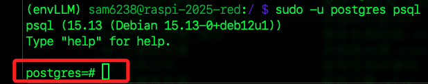
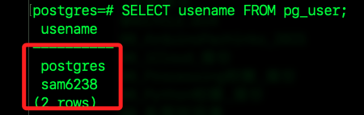

#  結合 PostgreSQL

_實作問答快取系統，讓樹莓派查詢時，先查資料庫是否有類似問答，有就直接回覆，沒命中才丟 LLM，並將新問答寫回資料庫。_

<br>

## 流程

_以下操作主要在樹莓派運行_

<br>

1. 安裝 PostgreSQL；apt 預設會安裝最穩定的版本，通常不是最新的，若無特殊需求，按照預設版本安裝即可。

    ```bash
    sudo apt update
    sudo apt install postgresql postgresql-contrib -y
    sudo systemctl enable postgresql
    sudo systemctl start postgresql
    ```

<br>

2. 查詢版本。

    ```bash
    psql --version
    ```

<br>

3. 查詢服務狀態；正常會顯示 `active (exited)`。

    ```bash
    systemctl status postgresql
    ```

<br>

## 建立資料庫與用戶

_僅首次設定時，替換以下的 `<資料庫名稱>`、`<用戶名稱>` 及 `<用戶密碼>`_

<br>

1. 建立用戶；特別注意，當使用 `sudo -u postgres` 執行指令時，系統會嘗試將目前目錄變成 `/home/<當前用戶帳號>`，但 `postgres` 用戶預設沒有權限讀取家目錄 `~` 所以顯示 `Permission denied`，但是這不影響 `createuser` 指令的實際功能，只是提示無權限進入目前目錄。

    ```bash
    sudo -u postgres createuser <用戶名稱>
    ```

    

<br>

2. 若想避免這個提示，可先切換到系統根目錄 `/` 中再運行指令。

    ```bash
    cd /
    ```

<br>

3. 建立資料庫。

    ```bash
    sudo -u postgres createdb <資料庫名稱> -O <用戶名稱>
    ```

<br>

4. 連線資料庫。

    ```bash
    sudo -u postgres psql
    ```

    

<br>

5. 進入 SQL 介面後，設定密碼，密碼必須使用單引號包覆。

    ```bash
    ALTER USER <用戶名稱> WITH PASSWORD '<用戶密碼>';
    ```

<br>

## 刪除

1. 查詢當前使用者；特別注意，元命令 `meta-command` 並非資料庫語句，通常在多頁瀏覽的時候，使用元命令比較方便閱讀，若要退出則點擊 `q` 即可。

    ```bash
    SELECT usename FROM pg_user;
    ```

    _或使用元命令_

    ```bash
    \du
    ```

    

<br>

2. 查詢當前資料庫。

    ```bash
    SELECT datname FROM pg_database;
    ```

    _或使用元命令_

    ```bash
    \l
    ```

<br>

3. 刪除用戶及資料庫；特別注意，刪除時一行指令只能刪除一個，另外，系統預設資料庫如 `template0`、`template1` 是不可刪除的；因為後續還會實作以 Python 進行建立，避免出現重複命名的錯誤，這裡建議先行刪除。

    ```bash
    DROP DATABASE <資料庫名稱>;
    DROP USER <用戶名稱>;
    ```

<br>

4. 在終端機中查詢與刪除指令；特別注意，若是在 MacOS 中操作，可將 `-u` 替換為 `-U`，這是因為設定了密碼授權。

    ```bash
    # 查詢
    sudo -u postgres psql -c "\l"
    sudo -u postgres psql -c "\du"

    # 刪除
    sudo -u postgres dropdb <資料庫名稱>
    sudo -u postgres dropuser <用戶名稱>
    ```

<br>

5. 退出資料庫。

    ```bash
    \q
    ```

<br>

## Python 腳本

_這是接續之前的操作，所以當前應該已經啟動虛擬環境_

<br>

1. 安裝 psycopg2。

    ```bash
    pip install psycopg2-binary python-dotenv
    ```

<br>

2. 確認 `.env` 文件中的對於 `帳號` 及 `資料庫名稱` 的設定。

    ```bash
    POSTGRES_USER=sam6238
    POSTGRES_DB=testdb
    ```

<br>

3. 使用腳本進行查詢。

    ```python
    import subprocess
    import os
    from dotenv import load_dotenv

    load_dotenv()

    # 從 .env 取得設定值
    pg_user = os.environ.get('POSTGRES_USER', '')
    pg_db = os.environ.get('POSTGRES_DB', 'testdb')
    pg_pass = os.environ.get('POSTGRES_PASSWORD', '')

    # 建立用戶
    subprocess.run(
        ['sudo', '-u', 'postgres', 'createuser', pg_user]
    )
    # 建立資料庫並指定擁有者
    subprocess.run([
        'sudo', '-u', 'postgres', 'createdb', pg_db, '-O', pg_user
    ])
    # 設定用戶密碼
    subprocess.run([
        'sudo', '-u', 'postgres', 'psql', '-c',
        f"ALTER USER {pg_user} WITH PASSWORD '{pg_pass}';"
    ])
    ```

<br>

3. 在 MacOS 中可用以下腳本。

    ```python
    import subprocess
    import os
    from dotenv import load_dotenv

    load_dotenv()

    # 從 .env 取得設定值
    pg_user = os.environ.get('POSTGRES_USER', '')
    pg_db = os.environ.get('POSTGRES_DB', 'testdb')
    pg_pass = os.environ.get('POSTGRES_PASSWORD', '')

    def run_cmd(cmd):
        print(f'執行: {" ".join(cmd)}')
        result = subprocess.run(cmd, capture_output=True, text=True)
        if result.stdout:
            print('stdout:\n', result.stdout)
        if result.stderr:
            print('stderr:\n', result.stderr)
        return result

    # 建立用戶
    run_cmd(['createuser', pg_user])

    # 建立資料庫並指定擁有者
    run_cmd(['createdb', pg_db, '-O', pg_user])

    # 設定用戶密碼（連接到 postgres 這個預設資料庫）
    run_cmd([
        'psql', '-d', 'postgres', '-c',
        f"ALTER USER {pg_user} WITH PASSWORD '{pg_pass}';"
    ])
    ```

<br>

## 建立快取表格

1. 使用資料庫語句，可使用 `psql` 指令或 `pgAdmin` 執行。

    ```sql
    CREATE TABLE IF NOT EXISTS qa_cache (
        id SERIAL PRIMARY KEY,
        question TEXT NOT NULL,
        answer TEXT NOT NULL
    );
    ```

<br>

2. 使用腳本。

    ```python
    import subprocess
    import os
    from dotenv import load_dotenv

    load_dotenv()

    pg_user = os.environ.get('POSTGRES_USER', '')
    pg_db = os.environ.get('POSTGRES_DB', 'testdb')

    sql = """
    CREATE TABLE IF NOT EXISTS qa_cache (
        id SERIAL PRIMARY KEY,
        question TEXT NOT NULL,
        answer TEXT NOT NULL
    );
    """

    subprocess.run([
        'sudo', '-u', 'postgres', 'psql', '-d', pg_db, '-c', sql
    ])
    ```

<br>

## 整合

1. Python 主程式。

    ```python
    import psycopg2
    import os
    from dotenv import load_dotenv

    load_dotenv()

    def get_pg_conn():
        return psycopg2.connect(
            host=os.getenv('POSTGRES_HOST', 'localhost'),
            port=os.getenv('POSTGRES_PORT', '5432'),
            dbname=os.getenv('POSTGRES_DB', 'testdb'),
            user=os.getenv('POSTGRES_USER', ''),
            password=os.getenv('POSTGRES_PASSWORD', '')
        )

    def init_db():
        with get_pg_conn() as conn:
            with conn.cursor() as c:
                c.execute("""
                    CREATE TABLE IF NOT EXISTS qa_cache (
                        id SERIAL PRIMARY KEY,
                        question TEXT NOT NULL,
                        answer TEXT NOT NULL
                    );
                """)
                conn.commit()

    def find_similar_question(question):
        with get_pg_conn() as conn:
            with conn.cursor() as c:
                # 這裡採用簡單完全比對，可自行改進 LIKE/全文檢索/向量相似度
                c.execute("SELECT answer FROM qa_cache WHERE question=%s LIMIT 1;", (question,))
                row = c.fetchone()
                return row[0] if row else None

    def save_qa(question, answer):
        with get_pg_conn() as conn:
            with conn.cursor() as c:
                c.execute("INSERT INTO qa_cache (question, answer) VALUES (%s, %s);", (question, answer))
                conn.commit()

    #  Claude 問答函數略（建議用上一題範例） 
    # def ask_claude(question, context): ...

    # -- 主流程 --
    if __name__ == '__main__':
        api_key = os.environ.get("ANTHROPIC_API_KEY")
        # 前面已經整理好的知識資料
        context = docs
        init_db()

        print("智慧查詢系統已啟動，輸入問題即可查詢（Ctrl+C 離開）：")
        while True:
            q = input("請輸入你的問題：")
            cached = find_similar_question(q)
            if cached:
                print("（資料庫命中）Claude 回答：", cached)
            else:
                ans = ask_claude(q, context, api_key)
                print("Claude 回答：", ans)
                save_qa(q, ans)
    ```

<br>

## 進階查詢建議

1. 若想模糊搜尋，可改寫如下。

    ```python
    c.execute("SELECT answer FROM qa_cache WHERE question ILIKE %s LIMIT 1;", ('%'+question+'%',))
    ```

<br>

2. 或使用全文檢索、embedding 向量查詢（如 pgvector）；若資料量大，請注意加 index。

<br>

___

_END_