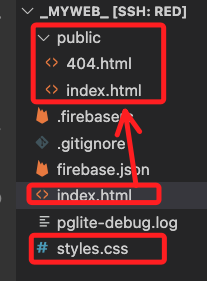
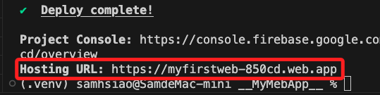
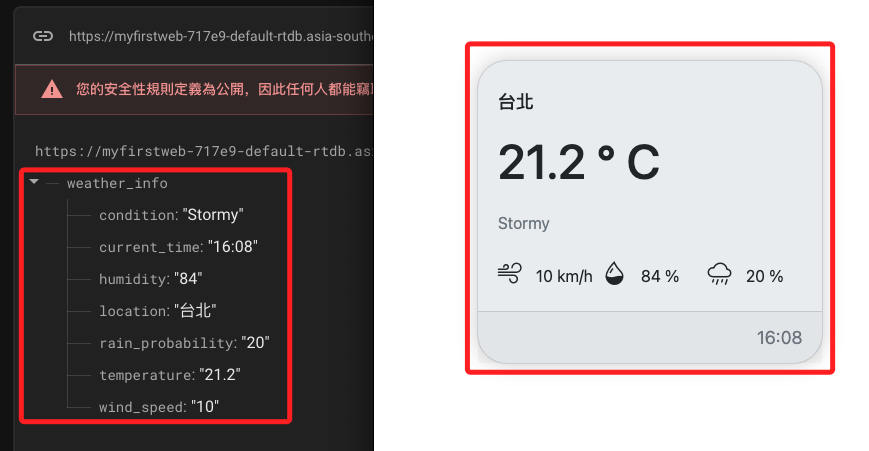

# 部署到 Hosting

_這裡只簡單交代指令，詳細步驟說明參考之前講義_

<br>

## 步驟

1. 若需要切換帳號，要先登出當前帳號。

    ```bash
    firebase logout
    ```

<br>

2. 登入。

    ```bash
    firebase login
    ```

<br>

3. 初始化。

    ```bash
    firebase init
    ```

<br>

4. 將原本的 `index.html` 及 `style.css` 拖曳到 `public` 資料夾內，直接覆蓋原本的文本。

    

<br>

5. 部署。

    ```bash
    firebase deploy
    ```

<br>

6. 完成後，使用配發的網址瀏覽。

    

<br>

7. 這是一個位在公網上，可與資料庫連動的動態網頁。

    

<br>

## 結語

_至此完成網頁端與即時資料庫的連動，未來所有的互動都可以使用資料庫作為中樞，感測器只管發布訊息到節點上，訂閱端僅需監聽節點變化，以資料庫為中樞的資訊流動機制就完成佈基礎置。_

<br>

___

_END_