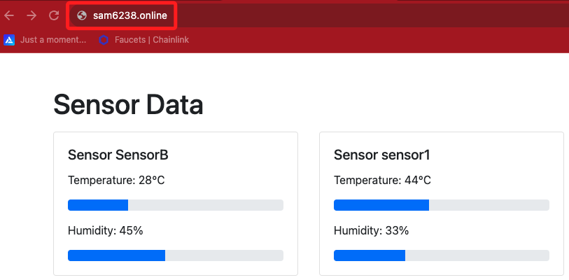

# 轉址設定

_以下使用 GoDaddy 服務示範_

<br>

## 步驟

1. 進入 `Hosting`。

   

<br>

2. 點擊 `新增自訂網域`。

   

<br>

3. 輸入註冊的網址。

   

<br>

4. 會顯示一組 A 紀錄及 TXT 紀錄。

   

<br>

## 前往 Godaddy

_移除原本的 A 紀錄_

<br>

1. 分別寫入兩筆紀錄；名稱部分填入 `@` 即可。

   

<br>

2. 也可以一並設定子網域，用以攔截 `www.` 使用者，提升可用性。

   ```bash
   www.samhsiao6238.online
   ```

<br>

3. 驗證無誤就完成了。

   

<br>

4. 這裡部署的是另一個站台，內容與前面範例不一樣，無需在意。

   

<br>

5. 可點擊進行進階設定，有興趣同學可以自行研究。

   

<br>

## 補充

1. 若 `尚未通過驗證` 或 `正在建立憑證` 會顯示如下。

   

<br>

___

_END_