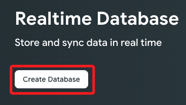
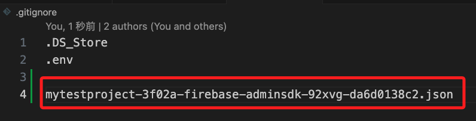

# 寫入節點

_前面的範例是讀取節點資料顯示在網頁上；本範例是取得樹莓派溫度並寫入資料庫，同時網頁也會連動_

<br>

## 成果

1. 寫入數據到 `Firebase` 資料庫。

    

<br>

2. 網頁會連動。

    

<br>

## 準備工作

1. 安裝套件。

    ```bash
    pip install firebase-admin
    ```

<br>

2. 進入 `Firebase` 專案，點擊 `Build`。

    

<br>

3. 建立資料庫。

    

<br>

4. 選取位置。

    

<br>

5. 設定模式。

    

<br>

6. 設定權限。

    

<br>

## 下載憑證

1. 進入專案設定，切換到 `服務帳戶` 頁籤。

    

<br>

2. 滾動到下方點擊 `產生新的私密金鑰`。

    

<br>

3. 並在彈窗中點擊 `產生金鑰` 就會自動下載。

    

<br>

4. 將憑證加入之前，可先寫入 `.gitignore`。

    

<br>

5. 將憑證拖曳到專案中。

    

<br>

12. 複製資料庫 URL。

    

<br>

13. 先提示一下專案結構。

    

<br>

14. 安裝庫。

    ```bash
    pip install pytz
    ```

<br>

15. 貼上範例。

    ```python
    import time
    import subprocess
    import firebase_admin
    from firebase_admin import credentials
    from firebase_admin import db
    from datetime import datetime
    import pytz

    # 更改實際私鑰文件路徑
    if not firebase_admin._apps:
        cred = credentials.Certificate('./PrivateKey/mytestproject-3f02a-firebase-adminsdk-92xvg-da6d0138c2.json')
        firebase_admin.initialize_app(cred, {
            'databaseURL': 'https://mytestproject-3f02a-default-rtdb.firebaseio.com/'
        })

    # 樹莓派溫度讀取函數
    def get_pi_temperature():
        # 執行命令並返回溫度
        temp_output = subprocess.check_output(['vcgencmd', 'measure_temp']).decode()
        temp = float(temp_output.split('=')[1].split("'")[0])
        return temp

    # Firebase 中溫度數據的節點
    temp_ref = db.reference('/raspberrypi/temperature')

    # 台灣時區
    taiwan = pytz.timezone('Asia/Taipei')

    # 主循環
    while True:
        # 取得溫度
        temp = get_pi_temperature()
        print(f"Current temperature is: {temp} C")
        
        # 取得台灣時區的當前時間
        tz_now = datetime.now(taiwan)
        
        # 將溫度寫入 Firebase
        temp_ref.set({
            'timestamp': int(tz_now.timestamp()),
            'temperature': temp
        })
        
        # 每隔 10 秒鐘檢查一次（在網頁中顯示時可加快到1秒）
        time.sleep(10)
    ```

<br>

16. 切記更改兩處資料為自己的憑證與資料庫 URL。

    

<br>

17. 運行腳本之後去資料庫查看。

    

<br>

___

_END_