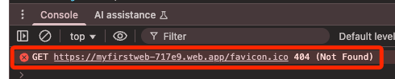

# 讀取節點數據

_讀取溫度數據並繪製動態圖表_

<br>

## 建立網站

_沿用前面步驟建立的網站進行修改_

<br>

1. 編輯 `public` 資料夾內的文本 `index.html`，貼上以下內容覆蓋。

    ```html
    <!DOCTYPE html>
    <html lang="en">
    <head>
    <meta charset="UTF-8">
    <title>Temperature Chart</title>
    <meta name="viewport" content="width=device-width, initial-scale=1">
    
    <!-- Bootstrap CSS -->
    <link rel="stylesheet" href="https://stackpath.bootstrapcdn.com/bootstrap/4.5.2/css/bootstrap.min.css">

    <!-- Firebase -->
    <script src="https://www.gstatic.com/firebasejs/8.0.0/firebase-app.js"></script>
    <script src="https://www.gstatic.com/firebasejs/8.0.0/firebase-database.js"></script>

    <!-- Chart.js -->
    <script src="https://cdn.jsdelivr.net/npm/chart.js"></script>
    </head>
    <body>

    <div class="container">
    <h2>Temperature Chart</h2>
    <canvas id="tempChart"></canvas>
    </div>

    <script>
    // 更改為自己的設定，從 Firebase 複製貼上
    var firebaseConfig = {
        // 更改為自己的
    };
    // 初始化 Firebase
    firebase.initializeApp(firebaseConfig);
    var database = firebase.database();

    // 初始化 Chart.js
    var ctx = document.getElementById('tempChart').getContext('2d');
    var tempChart = new Chart(ctx, {
        type: 'line',
        data: {
            labels: [],
            datasets: [{
                label: 'Temperature (°C)',
                data: [],
                backgroundColor: 'rgba(54, 162, 235, 0.2)',
                borderColor: 'rgba(54, 162, 235, 1)',
                borderWidth: 1
            }]
        },
        options: {
            scales: {
                y: {
                    beginAtZero: true
                }
            }
        }
    });

    // 監聽 Firebase
    var temperatureRef = firebase.database().ref('raspberrypi/temperature');
    temperatureRef.on('value', function(snapshot) {
        var temperature = snapshot.val().temperature;
        var timestamp = snapshot.val().timestamp;
        // 
        var date = new Date(timestamp * 1000);
        // 
        var label = date.getHours() + ':' + date.getMinutes().toString().padStart(2, '0') + ':' + date.getSeconds().toString().padStart(2, '0');

        // Update chart
        tempChart.data.labels.push(label);
        tempChart.data.datasets.forEach((dataset) => {
            dataset.data.push(temperature);
        });
        tempChart.update();
    });
    </script>

    </body>
    </html>

    ```

<br>

1. 進入主控台，點擊齒輪展開選單，點選 `專案設定`。

    

<br>

3. 切換到 `一般設定` 頁籤，複製這段代碼中的 `const firebaseConfig = {...}` 區塊。

    

<br>

3. 貼到文本的 `<script></script>` 區塊中的最上方；因為這是主控台提供代碼，無需修正。

    ```html
    <script>
    // 複製貼上
    var firebaseConfig = {
        // 略 ...
    };
    
    // 其餘省略
    </script>
    ```

<br>

4. 在專案的根目錄中開啟終端機，運行指令再次部署。

    ```bash
    firebase deploy
    ```

<br>

## 關於 `/favicon.ico`

1. 開啟瀏覽器 Console 會看到以下錯誤。

    

<br>

2. 在 `public` 資料夾中添加一個空檔案 `favicon.ico` 即可。

<br>

3. 可使用 [線上工具](https://favicon.io/) 實作。

<br>

___

_END_
