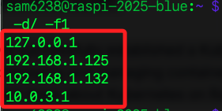
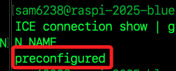

# 準備工作

<br>

## 連線樹莓派

1. 連接樹莓派。

    ```bash
    ssh <使用者名稱>@<樹莓派主機名稱或-IP>
    ```

<br>

2. 確認當前 IP；以下指令會做篩選，僅顯示 `有線網路 eth0` 資訊。

    ```bash
    ip -4 addr show eth0 | grep inet | awk '{print $2}' | cut -d/ -f1
    ```

<br>

3. 如果想查詢的是 `無線網卡 (wlan0)`，將 `eth0` 更改成 `wlan0` 即可；通常會是連號的 IP，先是有線、再是無線。

    ```bash
    ip -4 addr show wlan0 | grep inet | awk '{print $2}' | cut -d/ -f1
    ```

<br>

4. 完整查詢；依序會得到 `localhost`、`有線網路`、`無線網路`；若有虛擬網路接口如 `Docker` 或 `橋接網路` 分配的地址會接續顯示在其後。

    ```bash
    ip -4 addr show | grep inet | awk '{print $2}' | cut -d/ -f1
    ```

    

<br>

## 新版系統設置固定 IP

_為了確保 `Master 節點` 和 `Worker 節點` 的網路地址不變，以下先設置節點固定 IP；由於樹莓派新、舊版本設置 IP 的方式並不相同，以下分開新、舊兩部分說明；簡言之，新版系統不再使用 `/etc/dhcpcd.conf` 配置靜態 IP，改用 `nmcli` 進行管理，這是 `NetworkManager` 的命令行工具。_

<br>

1. 檢查當前的網路介面名稱，通常是 `eth0` 或 `wlan0`；其中 `lo (loopback)` 是 `回環介面`，也就是內建的虛擬網路，用來將封包回送至本機，通常為 `127.0.0.1`；`br` 前綴是 `橋接網路`，`Wi-Fi P2P` 則是 `點對點網路`，當前並無相關連接。

    ```bash
    nmcli device status
    ```

    

<br>

2. 查詢並輸出 `wlan0` 介面的 _連線名稱_，預設是 `preconfigured`，同時存入變數 `CONNECTION_NAME` 中備用。

    ```bash
    CONNECTION_NAME=$(nmcli -t -f NAME,DEVICE connection show | grep wlan0 | cut -d: -f1) && echo $CONNECTION_NAME
    ```

    

<br>

3. 查詢並輸出當前 `wlan0` 的 IP 並存入變數 `CURRENT_IP` 中備用。

    ```bash
    CURRENT_IP=$(nmcli -t -f IP4.ADDRESS device show wlan0 | cut -d: -f2 | cut -d'/' -f1) && echo $CURRENT_IP
    ```

<br>

4. 查看預設的設定文件，可知已設置了無線網路 `preconfigured.nmconnection`。

    ```bash
    ls /etc/NetworkManager/system-connections/
    ```

    

<br>

5. 使用以下指令將網路介面 `wlan0` 設定為靜態 IP，通常可直接綁定在當前由 DHCP 分配的 IP 上；避免變數解析時出錯所以加上引號。

    ```bash
    sudo nmcli con modify "$CONNECTION_NAME" ipv4.method manual
    sudo nmcli con modify "$CONNECTION_NAME" ipv4.addresses "$CURRENT_IP"/24
    sudo nmcli con modify "$CONNECTION_NAME" ipv4.gateway 192.168.1.254
    sudo nmcli con modify "$CONNECTION_NAME" ipv4.dns 8.8.8.8,8.8.4.4
    ```

<br>

6. 設置完成後查看 `NetworkManager` 所管理的連線設定檔內容；其中 `IPv4` 採用 `manual` 設定，表示這條連線已配置固定 IP。

    ```bash
    sudo cat "/etc/NetworkManager/system-connections/$CONNECTION_NAME.nmconnection"
    ```

    

<br>

7. 也可使用 `grep` 指令篩選 `ipv4` 相關設定並顯示於畫面。

    ```bash
    sudo cat "/etc/NetworkManager/system-connections/$CONNECTION_NAME.nmconnection" | grep -A5 '\[ipv4\]'
    ```

<br>

# 舊版系統設定固定 IP

_`Bookworm` 以前的作業系統，如 `Bullseye`_

<br>

1. 編輯 `/etc/dhcpcd.conf` 文件。

    ```bash
    sudo nano /etc/dhcpcd.conf
    ```

<br>

2. 設定為靜態 IP。

    ```bash
    interface wlan0
    static ip_address=<更改為-樹莓派-IP>/24
    static routers=192.168.1.254
    static domain_name_servers=8.8.8.8
    ```

<br>

3. 重新啟動網路服務。

    ```bash
    sudo systemctl restart networking
    ```

<br>

## 套用變更

_完成設定後，重啟連線或重啟服務套用變更_

<br>

1. 重啟網路連線。

    ```bash
    sudo nmcli con down "$CONNECTION_NAME" && sudo nmcli con up "$CONNECTION_NAME"
    ```

    

<br>

2. 或是 `重啟服務`。

    ```bash
    sudo systemctl restart NetworkManager
    ```

<br>

## 檢查

1. 查看當前 `default route` 設定；`Linux` 會選擇 `metric` 較低者作為預設路由；`metric` 的值代表路由的 `成本` 或 `優先順序`，數值越小也就是成本越低，所以優先順序越高。

    ```bash
    ip route show
    ```

    

<br>

2. 刪除指定的路由。

    ```bash
    sudo ip route del <複製查詢內容進行刪除>
    ```

<br>

3. 修改路由優先權；特別注意，這可能會造成無法連線的狀況；無法連線時恢復原設定值即可。

    ```bash
    sudo nmcli con modify "preconfigured" ipv4.route-metric 50
    ```

<br>

4. 恢復原值。

    ```bash
    sudo nmcli con modify "preconfigured" ipv4.route-metric 600
    nmcli con up "preconfigured"
    ```

<br>

5. 設定 `metric` 之後，需重啟該連線套用變更。

    ```bash
    sudo nmcli con down "preconfigured" && sudo nmcli con up "preconfigured"
    ```

<br>

6. 嘗試安裝套件 `dnsutils` 以觀察網路狀態是否正常。

    ```bash
    sudo apt update && sudo apt install -y dnsutils
    ```

<br>

7. 再次查看當前 `default route` 設定；若要重設回原本內容則重複以上步驟。

    ```bash
    ip route show
    ```

<br>

8. 查詢 DNS 解析結果，顯示 `get.k3s.io` 對應的 IP 地址；這是較舊的工具。

    ```bash
    nslookup get.k3s.io
    ```

<br>

9. 查詢 DNS 解析詳細資訊，包括 `伺服器回應、查詢時間、TTL` 等；這是較新的工具。

    ```bash
    dig get.k3s.io
    ```

<br>

## 直接編輯設定文件

_以下直接編輯設定文件設定無線網路固定 IP_

<br>

1. 列出現有連線檔案，其中 `preconfigured.nmconnection` 控制無線網路；`Wired connection 1.nmconnection` 控制有線網路，由 `NetworkManager` 建立。

    ```bash
    ls /etc/NetworkManager/system-connections/
    ```

    

<br>

2. 查詢當前配發的無線網路 IP。

    ```bash
    ip -4 addr show wlan0 | grep inet | awk '{print $2}' | cut -d/ -f1
    ```

<br>

3. 輯器修改該檔，依據查詢結果填入 IP。

    ```bash
    sudo nano /etc/NetworkManager/system-connections/preconfigured.nmconnection
    ```

<br>

4. 在 `[ipv4]` 區段中，預設為 `method=auto`。

    

<br>

5. 將方法改為 `manual`，詳細內容如下；特別注意，多個 DNS 伺服器需用 `分號 (;)` 分隔，建議尾端也加上分號，否則可能解析失敗。

    ```bash
    [ipv4]
    method=manual
    addresses=<更改為-樹莓派-IP>/24
    gateway=192.168.1.254
    dns=8.8.8.8;8.8.4.4;
    ```

<br>

6. 儲存、退出並重啟 `NetworkManage`；特別注意，重啟後，原本的終端機畫面會暫時卡住，需稍作等待重啟。

    ```bash
    sudo systemctl restart NetworkManager
    ```

<br>

7. 檢查 IP。

    ```bash
    ip -4 addr show | grep inet | awk '{print $2}' | cut -d/ -f1
    ```

<br>

___

_END_