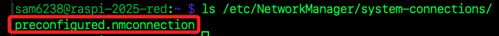
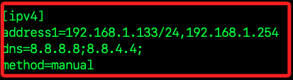
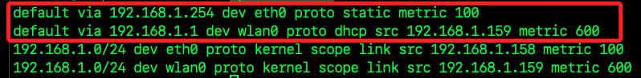
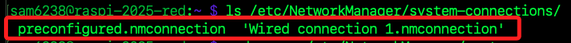

# 部署 K3s 主節點

_因為 K8s 需要耗用大量資源，不建議在邊緣設備如樹莓派上部署 K8s，以下將進行 K3s 部署。_ 

<br>

## 連線樹莓派

1. 連接樹莓派。

    ```bash
    ssh <使用者名稱>@<樹莓派主機名稱或-IP>
    ```

<br>

2. 確認當前 IP；以下指令會做篩選，僅顯示 `有線網路 eth0` 資訊。

    ```bash
    ip -4 addr show eth0 | grep inet | awk '{print $2}' | cut -d/ -f1
    ```

<br>

3. 如果想查詢的是 `無線網卡 (wlan0)`，將 `eth0` 更改成 `wlan0` 即可；通常會是連號的 IP，先是有線、再是無線。

    ```bash
    ip -4 addr show wlan0 | grep inet | awk '{print $2}' | cut -d/ -f1
    ```

<br>

4. 完整查詢；依序會得到 `localhost`、`有線網路`、`無線網路`；若有虛擬網路接口如 `Docker` 或 `橋接網路` 分配的地址會接續顯示在其後。

    ```bash
    ip -4 addr show | grep inet | awk '{print $2}' | cut -d/ -f1
    ```

    

<br>

## 新版系統設置固定 IP

_為了確保 `Master 節點` 和 `Worker 節點` 的網路地址不變，以下先設置節點固定 IP；由於樹莓派新、舊版本設置 IP 的方式並不相同，以下分開新、舊兩部分說明；簡言之，新版系統不再使用 `/etc/dhcpcd.conf` 配置靜態 IP，改用 `nmcli` 進行管理，這是 `NetworkManager` 的命令行工具。_

<br>

1. 檢查當前的網路介面名稱，通常是 `eth0` 或 `wlan0`；其中 `lo (loopback)` 是 `回環介面`，內部測試用，通常為 `127.0.0.1`；`br` 前綴是橋接網路，`Wi-Fi P2P` 則是點對點網路，當前並無相關連接。

    ```bash
    nmcli device status
    ```

    

<br>

2. 查詢並輸出 `wlan0` 介面的 _連線名稱_，預設是 `preconfigured`，同時存入變數 `CONNECTION_NAME` 中備用。

    ```bash
    CONNECTION_NAME=$(nmcli -t -f NAME,DEVICE connection show | grep wlan0 | cut -d: -f1) && echo $CONNECTION_NAME
    ```

<br>

3. 查詢並輸出當前 `wlan0` 的 IP 並存入變數 `CURRENT_IP` 中備用。

    ```bash
    CURRENT_IP=$(nmcli -t -f IP4.ADDRESS device show wlan0 | cut -d: -f2 | cut -d'/' -f1) && echo $CURRENT_IP
    ```

<br>

4. 可先查看預設的設定文件，可知已設置了無線網路 `preconfigured.nmconnection`。

    ```bash
    ls /etc/NetworkManager/system-connections/
    ```

    

<br>

5. 使用以下指令將網路介面 `wlan0` 設定為靜態 IP，通常可直接綁定在當前由 DHCP 分配的 IP 上；避免變數解析時出錯所以加上引號。

    ```bash
    sudo nmcli con modify "$CONNECTION_NAME" ipv4.addresses "$CURRENT_IP"/24
    sudo nmcli con modify "$CONNECTION_NAME" ipv4.gateway 192.168.1.254
    sudo nmcli con modify "$CONNECTION_NAME" ipv4.dns 8.8.8.8,8.8.4.4
    sudo nmcli con modify "$CONNECTION_NAME" ipv4.method manual
    ```

<br>

6. 設置完成後查看內容。

    ```bash
    sudo cat "/etc/NetworkManager/system-connections/$CONNECTION_NAME.nmconnection"
    ```

    

<br>

7. 也可使用 `grep` 指令篩選 `ipv4` 相關設定並顯示於畫面。

    ```bash
    sudo cat "/etc/NetworkManager/system-connections/$CONNECTION_NAME.nmconnection" | grep -A5 '\[ipv4\]'
    ```

<br>

# 舊版系統設定固定 IP

_`Bookworm` 以前的作業系統，如 `Bullseye`_

<br>

1. 編輯 `/etc/dhcpcd.conf` 文件。

    ```bash
    sudo nano /etc/dhcpcd.conf
    ```

<br>

2. 設定為靜態 IP。

    ```bash
    interface wlan0
    static ip_address=<更改為-樹莓派-IP>/24
    static routers=192.168.1.254
    static domain_name_servers=8.8.8.8
    ```

<br>

3. 重新啟動網路服務。

    ```bash
    sudo systemctl restart networking
    ```

<br>

## 套用變更

_可以重啟連線或重啟服務_

<br>

1. 重啟網路連線，讓設定生效。

    ```bash
    sudo nmcli con down "$CONNECTION_NAME" && sudo nmcli con up "$CONNECTION_NAME"
    ```

    

<br>

2. 也可以重啟服務。

    ```bash
    sudo systemctl restart NetworkManager
    ```

<br>

## 檢查

1. 查看當前 `default route` 設定；Linux 會選擇 metric 較低者作為預設路由。

    ```bash
    ip route show
    ```

    

<br>

2. 使用以下指令可刪除指定的路由。

    ```bash
    sudo ip route del <複製查詢內容進行刪除>
    ```

<br>

3. 使用以下指令可修改路由優先權；特別注意，這可能會造成無法連線問題，出現問題可恢復原值。

    ```bash
    sudo nmcli con modify "preconfigured" ipv4.route-metric 50
    ```

<br>

4. 設定 `metric` 之後，需重啟該連線套用變更。

    ```bash
    sudo nmcli con down "preconfigured" && sudo nmcli con up "preconfigured"
    ```

<br>

5. 嘗試安裝套件 `dnsutils` 以觀察網路狀態是否正常。

    ```bash
    sudo apt update && sudo apt install -y dnsutils
    ```

<br>

6. 再次查看當前 `default route` 設定；若要重設回原本內容則重複以上步驟。

    ```bash
    ip route show
    ```

<br>

7. 查詢 DNS 解析結果，顯示 `get.k3s.io` 對應的 IP 地址；這是較舊的工具。

    ```bash
    nslookup get.k3s.io
    ```

<br>

7. 查詢 DNS 解析詳細資訊，包括 `伺服器回應、查詢時間、TTL` 等；這是較新的工具。

    ```bash
    dig get.k3s.io
    ```

<br>

## 直接編輯設定文件

_以下直接編輯設定文件設定無線網路固定 IP_

<br>

1. 列出現有連線檔案，其中 `preconfigured.nmconnection` 控制無線網路；`Wired connection 1.nmconnection` 控制有線網路，由 `NetworkManager` 建立。

    ```bash
    ls /etc/NetworkManager/system-connections/
    ```

    

<br>

2. 查詢當前配發的無線網路 IP。

    ```bash
    ip -4 addr show wlan0 | grep inet | awk '{print $2}' | cut -d/ -f1
    ```

<br>

3. 輯器修改該檔，依據查詢結果填入 IP。

    ```bash
    sudo nano /etc/NetworkManager/system-connections/preconfigured.nmconnection
    ```

<br>

4. 在 `[ipv4]` 區段中，預設為 `method=auto`。

    

<br>

5. 將方法改為 `manual`，詳細內容如下；特別注意，多個 DNS 伺服器需用 `分號 (;)` 分隔，建議尾端也加上分號，否則可能解析失敗。

    ```bash
    [ipv4]
    method=manual
    addresses=<更改為-樹莓派-IP>/24
    gateway=192.168.1.254
    dns=8.8.8.8;8.8.4.4;
    ```

<br>

6. 儲存、退出並重啟 `NetworkManage`；特別注意，重啟後，原本的終端機畫面會暫時卡住，需稍作等待重啟。

    ```bash
    sudo systemctl restart NetworkManager
    ```

<br>

7. 檢查 IP。

    ```bash
    ip -4 addr show | grep inet | awk '{print $2}' | cut -d/ -f1
    ```

<br>

## 設置 cgroups

_是 Linux 核心的一個功能，主要用於管理和限制系統資源的使用；在 K8s / K3s 中用來管理 Pod 和容器的資源配額。_

<br>

1. 編輯 `/boot/firmware/cmdline.txt`。

    ```bash
    sudo nano /boot/firmware/cmdline.txt
    ```

<br>

2. 當前設置如下；特別注意，這個設定是單行表示、不可換行的，參數以間隔表示。

    ```bash
    console=serial0,115200 console=tty1 root=PARTUUID=9ac2899b-02 rootfstype=ext4 fsck.repair=yes rootwait quiet splash plymouth.ignore-serial-consoles cfg80211.ieee80211_regdom=TW
    ```

<br>

3. 在最右邊空一格之後加入以下參數。

    ```bash
    cgroup_memory=1 cgroup_enable=memory systemd.unified_cgroup_hierarchy=1
    ```

<br>

4. 可先查看設定內容。

    ```bash
    cat /boot/firmware/cmdline.txt
    ```

<br>

## 檢查 `cgroup` 狀態

1. 接續安裝步驟前先重啟系統。

    ```bash
    sudo reboot now
    ```

<br>

2. 檢查當前系統使用的 `cgroup` 版本。

    ```bash
    mount | grep cgroup
    ```

<br>

3. 檢查 `cgroup` 是否啟用了 `memory`，`memory` 的 `enabled` 應顯示為 `1`。

    ```bash
    cat /proc/cgroups
    ```

<br>

## 安裝 K3s

1. 執行以下指令安裝 K3s。

    ```bash
    curl -sfL https://get.k3s.io | sudo sh -
    ```

<br>

2. 安裝完成後檢查 K3s 狀態；務必確認狀態為 `active`。

    ```bash
    sudo systemctl status k3s
    ```

<br>

3. 查看日誌；參數 `-n` 表示顯示的資料筆數。

    ```bash
    journalctl -xeu k3s.service -n 30
    ```

<br>

4. 確認節點狀態，`master` 表示這個節點是 `K3s` 的 `主節點`，將負責管理 Kubernetes 控制平面。

    ```bash
    sudo kubectl get nodes
    ```

<br>

5. 使用 `awk` 篩選節點名稱；`NR==2` 表示取 `第二行`，第一行是標題，`{print $1}` 取出該行的第一欄 `NAME`。

    ```bash
    NODE_NAME=$(sudo kubectl get nodes | awk 'NR==2 {print $1}')
    echo $NODE_NAME
    ```

<br>

6. 確認節點資源狀態；帶入前一個步驟取得的名稱變數 `NODE_NAME`。

    ```bash
    sudo kubectl describe node $NODE_NAME
    ```

<br>

6. 檢查所有命名空間中的 `Pod`。

    ```bash
    sudo kubectl get pods -A
    ```

    

<br>

## K3s 預設 Pod 說明

1. `coredns-ccb96694c-jmh2n`，CoreDNS 是 Kubernetes 內建的 DNS 服務，用於解析 Pod 及 Service 名稱。

<br>

2. `helm-install-traefik-crd-hk6gg`，Helm 安裝 Traefik CRD，Traefik 是 K3s 預設的 Ingress Controller，這個 Pod 用於安裝 Custom Resource Definitions (CRD)。

<br>

3. `helm-install-traefik-hd6kh`，Helm 安裝 Traefik，負責部署 Traefik Ingress Controller。

<br>

4. `local-path-provisioner-5cf85fd84d-gmrxp`，本地存儲供應器，用於動態配置 PVC（Persistent Volume Claims），允許 Pod 使用本機存儲。

<br>

5. `metrics-server-5985cbc9d7-bs25r`，Metrics Server，提供 Kubernetes 監控數據，如 CPU 和記憶體使用率，支援 kubectl top 指令。

<br>

6. `svclb-traefik-87972c75-jgpjc`，Traefik 服務負載均衡器，用來將外部請求轉發到 Kubernetes 內部的 Traefik Ingress Controller。

<br>

7. `traefik-5d45fc8cc9-wtg9c`，Traefik Ingress Controller，負責處理 HTTP / HTTPS 進入 Kubernetes 叢集的流量。

<br>

___

_END_