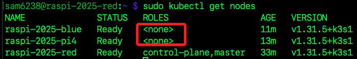

# 加入 K3s 叢集

_將其他樹莓派設備加入叢集_

<br>

## 準備工作

1. 系統設定。

    ```bash
    sudo apt update && sudo apt upgrade -y
    ```

<br>

2. 安裝必要工具。

    ```bash
    sudo apt install -y curl iptables
    ```

<br>

3. 啟用 cgroup 支援，確保工作節都啟用了 `cgroup_memory` 和 `systemd.unified_cgroup_hierarchy=1`。

    ```bash
    sudo nano /boot/firmware/cmdline.txt
    ```

<br>

4. 加入參數。

    ```bash
    cgroup_memory=1 cgroup_enable=memory systemd.unified_cgroup_hierarchy=1
    ```

<br>

5. 儲存並重啟。

    ```bash
    sudo reboot
    ```

<br>

## 加入工作節點

_繼續在工作節點上安裝 K3s Agent_

<br>

1. 先在主節點查詢 Token。

    ```bash
    sudo cat /var/lib/rancher/k3s/server/node-token
    ```

<br>

2. 在工作節點紀錄 Token。

    ```bash
    K3S_TOKEN=<查詢到的-TOKEN>
    ```

<br>

3. 確認主節點 IP 並在工作節點寫入變數。

    ```bash
    MASTER_IP=<主節點-IP>
    ```

<br>

4. 安裝 K3s Agent；需要帶入前面取得的兩個變數。

    ```bash
    curl -sfL https://get.k3s.io | K3S_URL=https://$MASTER_IP:6443 K3S_TOKEN=$K3S_TOKEN sh -
    ```

<br>

5. 檢查安裝日誌，確保 `Agent` 正常啟動並連接到 `Master Node`。

    ```bash
    sudo journalctl -u k3s-agent -f
    ```

<br>

## 確認工作節點狀態

1. 在主節點上執行以下命令，確認新節點已成功加入，如果節點顯示 `Ready`，則表示工作節點已成功加入叢集。

    ```bash
    sudo kubectl get nodes
    ```

    

<br>

## 部署 Pod

_在主節點運行指令部署測試應用，Pod 會根據 Kubernetes 的調度機制，分配到主節點或工作節點上。_

<br>

1. 在主節點建立一個 `Nginx Deployment`，`Kubernetes` 會自動安排並分配 `Pod` 到任意可用節點，包括工作節點。

    ```bash
    sudo kubectl create deployment nginx --image=nginx
    ```

<br>

2. 將 Nginx 部署暴露為 NodePort 類型的服務，這會讓 Nginx 服務通過節點的 隨機高位端口暴露，從任何節點的 IP 都可以訪問此服務。

    ```bash
    sudo kubectl expose deployment nginx --port=80 --type=NodePort
    ```

<br>

3. 確認服務狀態。

    ```bash
    sudo kubectl get svc
    ```

<br>

4. 檢查 Pod 是否已分配到新加入的工作節點上，NODE 欄位顯示該 Pod 運行在哪個節點上，確認 Pod 是否被分配到新加入的 工作節點 `raspi-2025-red`。

    ```bash
    sudo kubectl get pods -o wide
    ```

<br>

5. 從本地瀏覽器中訪問任意節點的指定端口，這個端口在前面查詢時會輸出，`NodePort`是任意指派的高位端口，範圍在 `30000-32767` 之間，`Kubernetes` 會在此範圍內隨機選擇一個未使用的端口，也可在 `kubectl expose` 指令中手動指定該端口；一切正常便可看到 Nginx 的歡迎頁面，這表示 Pod 正常運行，且工作節點的功能已正常啟用。

    ```bash
    <任意節點-IP>:<指定端口>
    ```

<br>

6. 預設情況 Pod 可以被分配到任何節點，如果主節點有 `Taint 標記` 如 `NoSchedule`，Pod 只會部署到工作節點。

    ```bash
    kubectl taint nodes <主節點名稱> node-role.kubernetes.io/master=:NoSchedule
    ```

<br>

## 自動化完成環境配置

_後補_

<br>

## 監控叢集狀態

_使用 Prometheus 和 Grafana 進行資源使用分析。_

<br>

## 擴展工作節點數量

_根據應用負載需求靈活擴充叢集_

<br>

___

_END_
