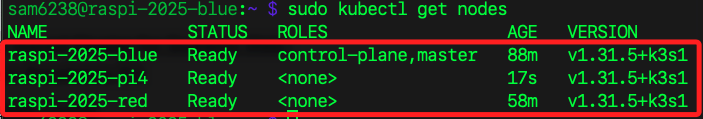
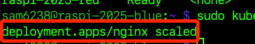
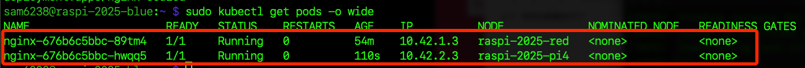
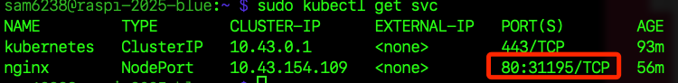

# 加入新節點

_`Kubernetes` 的設計是可擴展的，可隨時動態添加新的節點，而不影響現有節點或應用的運行。_

<br>

## 準備環境

_再新增一台設備，並測試樹莓派三可否負載 K3s 工作_

<br>

1. 執行系統升級。

    ```bash
    sudo apt update && sudo apt upgrade -y
    ```

<br>

2. 安裝必要工具。

    ```bash
    sudo apt install -y iptables
    ```

<br>

## 啟用 cgroup 支援

_這在前面已經做過兩次，這裡是相同的步驟_

<br>

2. 編輯 `/boot/firmware/cmdline.txt`。

    ```bash
    sudo nano /boot/firmware/cmdline.txt
    ```

<br>

3. 添加以下參數。

    ```bash
    cgroup_memory=1 cgroup_enable=memory systemd.unified_cgroup_hierarchy=1
    ```

<br>

4. 重啟系統。

    ```bash
    sudo reboot
    ```

<br>

## 加入新的工作節點

_繼續在新的 `工作節點` 上安裝 `K3s Agent`_

<br>

1. 先在 `主節點` 查詢 `Token`。

    ```bash
    sudo cat /var/lib/rancher/k3s/server/node-token
    ```

<br>

2. 在 `工作節點` 紀錄 `Token`。

    ```bash
    K3S_TOKEN=<查詢到的-TOKEN>
    ```

<br>

3. 查詢 `主節點` IP。

    ```bash
    ip -4 addr show dev wlan0 | awk '/inet /{print $2}' | cut -d/ -f1
    ```

<br>

4. 在 `工作節點` 將 `主節點` IP 寫入變數。

    ```bash
    MASTER_IP=<主節點-IP>
    ```

<br>

5. 在工作節點安裝 `K3s Agent`。

    ```bash
    curl -sfL https://get.k3s.io | K3S_URL=https://$MASTER_IP:6443 K3S_TOKEN=$K3S_TOKEN sh -
    ```

<br>

## 確認新節點已加入

1. 回到主節點進行查詢。

    ```bash
    sudo kubectl get nodes
    ```

    

<br>

## 測試 Pod 調度到新節點

1. 新增一個 Nginx 副本，讓 Kubernetes 自動調度到新節點；參數指定將 nginx 部署的副本數從 1 增加到 2，scaled 的訊息代表 Kubernetes 已接受並開始調度一個新的 Pod，使 nginx 部署的副本數達到 2。

    ```bash
    sudo kubectl scale deployment nginx --replicas=2
    ```

    

<br>

2. 檢查 Pod 分佈情況，可看到第二個 Pod 被調度到新節點。

    ```bash
    sudo kubectl get pods -o wide
    ```

    

<br>

## 測試

1. 檢查 Nginx 服務是否暴露為 NodePort，並確認暴露的端口；在這個查詢中，可知端口為 `31195`，至此可透過任意節點 IP 訪問指定端口。

    ```bash
    sudo kubectl get svc
    ```

    

<br>

2. 在第二個節點上運行以下指令，模擬節點離線。

    ```bash
    sudo systemctl stop k3s-agent
    ```

<br>

3. 在主節點上執行以下命令。

    ```bash
    sudo kubectl get pods -o wide
    ```

<br>

4. 重新啟動節點服務；Kubernetes 不會自動將已運行的 Pod 移動到重新連線的節點，新節點重新加入後，未來的 Pod 調度可能會優先分配到該節點，但現有的 Pod 會繼續運行在健康的節點上。

    ```bash
    sudo systemctl start k3s-agent
    ```

<br>

<br>

___

_END_
