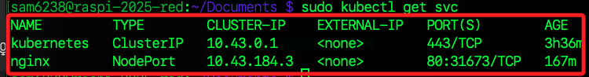
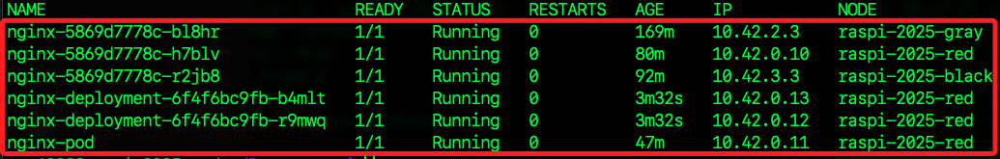

## 負載均衡

_可在叢集中進行模擬並觀察，以下將使用多個 `Pod` 副本和 `NodePort` 服務，然後從外部模擬多次請求，檢查請求是否被分配到不同的 Pod，從而觀察 `負載均衡` 行為。_

<br>

## 檢查現有服務狀態

1. 首先確認 `Nginx` 服務是 `NodePort` 類型，並記下 `NodePort` 的端口

    ```bash
    sudo kubectl get svc
    ```

    

<br>

2. 確認所有 `Nginx Pod` 名稱。

    ```bash
    sudo kubectl get pods -o wide
    ```

    

<br>

3. 在 `主節點` 開啟多個終端機，運行以下指令觀察 `Pod` 的日誌，每個終端機開啟一個。

    ```bash
    sudo kubectl logs -f <逐一複製-Pod-名稱>
    ```

<br>

4. 在本地電腦開啟終端視窗，使用 `curl` 指令模擬多次請求，並觀察每次請求是否有不同 Pod 處理了請求。

    ```bash
    curl http://<節點-IP>:<指定端口>
    ```

<br>

5. 從觀察結果可知，`Pod` 處理請求分佈均勻，也就是負載均衡正在生效，多個節點的 Pod 都能處理請求，實現跨節點的高可用性。

<br>

## 使用 Ingress Controller

_如果想要更高階的負載均衡，可以使用 `Ingress Controller` 如 `Traefik` 或 `Nginx Ingress` 進行更細粒度的流量管理和負載分配。_

<br>

1. 建立新的腳本。

```bash
cd ~/.Documents
nano nginx-ingress.yaml
```

<br>

2. 腳本範例，將 `curl` 模擬請求改為 `http://nginx.local`，Ingress Controller 將自動負載均衡到不同 Pod。

    ```yaml
    apiVersion: networking.k8s.io/v1
    kind: Ingress
    metadata:
      name: nginx-ingress
    spec:
      rules:
      - host: nginx.local
        http:
          paths:
          - path: /
            pathType: Prefix
            backend:
              service:
                name: nginx
                port:
                  number: 80
    ```

<br>

___

_END_