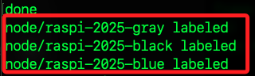

# 分散式運算演練

_使用多台樹莓派建立 `K3s` 叢集進行 `數值計算`，並實際測量效能提升_

## 環境檢查

1. 確認所有節點皆為 Ready

    ```bash
    sudo kubectl get nodes
    ```

    

2. 限制 `Job` 不要在 `master` 節點運行，為每台工作節點加上標籤。

    ```bash
    for node in raspi-2025-gray raspi-2025-black raspi-2025-blue; do
        sudo kubectl label node $node role=worker
    done
    ```

    

3. 建立命名空間 `pi-workload`，所有後續資源都部署在這個命名空間，方便管理與刪除。

```bash
sudo kubectl create namespace pi-workload
```

## 撰寫 Job 定義

1. 建立腳本。

```bash
cd ~/Documents
nano pi-calculation-job.yaml
```

2. 這個 Job 會透過 Python 計算 π 值，並透過 K3s 自動分配到三台 Raspberry Pi 運行。

    ```yaml
    apiVersion: batch/v1
    kind: Job
    metadata:
      name: pi-calculation-job
      namespace: pi-workload
    spec:
      # 產生 3 個獨立 Pod，並同時執行
      completions: 3
      parallelism: 3
      template:
        spec:
          # 只排程到標籤為 role=worker 的節點上
          nodeSelector:
            role: worker
          # 禁止重新啟動，失敗即視為該任務結束
          restartPolicy: Never
          containers:
          - name: pi-calculator
            image: python:3.9-slim
            command: ["python3", "-c"]
            args:
              - |
                import time, random
                def monte_carlo_pi(n):
                    inside = 0
                    for _ in range(n):
                        x, y = random.random(), random.random()
                        if x*x + y*y <= 1:
                            inside += 1
                    return (inside / n) * 4
                n = 10_000_000
                t0 = time.time()
                pi_est = monte_carlo_pi(n)
                dt = time.time() - t0
                print(f"Node {__import__('socket').gethostname()}: π ≈ {pi_est:.6f}, Time: {dt:.2f}s")
    ```

## 部署與監控

1. 刪除舊的 Job。

```bash
sudo kubectl delete job pi-calculation-job \
    --namespace pi-workload --ignore-not-found
```

1. 套用新的 Job

```bash
sudo kubectl apply -f ~/Documents/pi-calculation-job.yaml
```

3. 觀察 Job 狀態，終端機會卡住，等到 completions 欄顯示 3/3，代表所有 Pod 都執行完畢。

```bash
sudo kubectl get jobs -n pi-workload -w
```

4. 查看 Pod 詳細。

```bash
sudo kubectl get pods -n pi-workload -o wide
```

5. 收集並比較計算時間，看到三行訊息，分別顯示各節點的計算時間；平均時間 ≈ 三者平均，用來代表 `分散式執行單次任務` 的耗時，若想比較 `合併效能`，可用 `3 * 平均時間` 與單機測試時間相較。

```bash
sudo kubectl logs -l job-name=pi-calculation-job -n pi-workload
```

## 單機測試


1. 啟動 Docker Daemon。

```bash
docker -a "Docker"
```

2. 手動拉取映像

    ```bash
    docker pull python:3.9-slim
    ```

3. 使用小樣本快速驗證流程，立刻看到 `Start small test` 與計算結果，就能確定流程無誤。

    ```bash
    time docker run --rm python:3.9-slim python3 - << 'EOF'
    print("Start small test")
    import time, random

    def monte_carlo_pi(n):
        inside = 0
        for _ in range(n):
            x, y = random.random(), random.random()
            if x*x + y*y <= 1:
                inside += 1
        return inside / n * 4

    n = 100_000       # 小樣本 10 萬次
    t0 = time.time()
    pi_est = monte_carlo_pi(n)
    dt = time.time() - t0
    print(f"π≈{pi_est:.6f}, Time: {dt:.2f}s")
    EOF
    ```

4. 大樣本正式測試；先建立運算腳本檔，然後執行並計時（shell 內建 time）

    ```bash
    cat > pi_calc.py <<EOF
    import time, random

    def monte_carlo_pi(n):
        inside = 0
        for _ in range(n):
            x, y = random.random(), random.random()
            if x*x + y*y <= 1:
                inside += 1
        return inside / n * 4

    n = 10_000_000
    t0 = time.time()
    pi_est = monte_carlo_pi(n)
    dt = time.time() - t0
    print(f"π≈{pi_est:.6f}, Time: {dt:.2f}s")
    EOF

    time docker run --rm -v "$PWD/pi_calc.py":/pi_calc.py python:3.9-slim python3 /pi_calc.py
    ```


## 查看輸出

1. Python 腳本內部計算時間，這是程式在容器內實際跑完 `10,000,000` 次蒙地卡羅取樣運算的耗時（Tₛ），應以此作為 `單機基準`。

    ```bash
    π≈3.141308, Time: 1.52s
    ```

2. `time` 指令的整體耗時，其中的 `real` 約 1.78 s，包含了容器啟動與鏡像拉取等額外開銷；`user`/`sys` 則是 CPU 花在用戶態與核心態的時間。

    ```bash
    real    0m1.780s  
    user    0m0.01s  
    sys     0m0.01s
    ```


## 多機效能比較

1. 取得三個節點的計算時間

    ```bash
    sudo kubectl logs -n pi-workload -l job-name=pi-calculation-job
    ```

2. 在家目錄建立 `analyze_pi_perf.sh`，注意使用單引號包住 `EOF`，並在檔案開頭加入 shebang，但要讓 zsh 不把 `!` 當成歷史事件展開符號。

    ```bash
    cat > ~/analyze_pi_perf.sh << 'EOF'
    #!/usr/bin/env bash

    # 用法: ./analyze_pi_perf.sh <單機耗時秒數> [命名空間] [Job 名稱]
    # 例如: ./analyze_pi_perf.sh 1.52 pi-workload pi-calculation-job

    T_S="$1"
    NAMESPACE="${2:-pi-workload}"
    JOB_NAME="${3:-pi-calculation-job}"

    if [[ -z "$T_S" ]]; then
      echo "錯誤：請傳入單機耗時 (秒)，例如 ./analyze_pi_perf.sh 1.52"
      exit 1
    fi

    # 1. 抓 logs 並解析各節點耗時
    mapfile -t TIMES < <(
      kubectl logs -n "$NAMESPACE" -l job-name="$JOB_NAME" \
        | awk -F'Time: ' '{print $2}' \
        | sed 's/s$//'
    )

    # 2. 計算平均 Tₚ
    N=${#TIMES[@]}
    SUM=0
    for t in "${TIMES[@]}"; do
      SUM=$(echo "$SUM + $t" | bc)
    done
    T_P=$(echo "scale=4; $SUM / $N" | bc)

    # 3. 計算 Speed-up
    SPEEDUP=$(echo "scale=4; $T_S / $T_P" | bc)

    # 4. 計算 Parallel Efficiency
    EFF=$(echo "scale=4; $SPEEDUP / $N" | bc)

    # 5. 輸出結果
    echo "—— 多機效能分析 ——"
    echo "節點數量 (N):        $N"
    echo "各節點耗時 (s):      ${TIMES[*]}"
    echo "分散式平均耗時 Tₚ:  $T_P s"
    echo "單機耗時 Tₛ:         $T_S s"
    echo "Speed-up (Tₛ/Tₚ):    $SPEEDUP"
    echo "Parallel Efficiency: $EFF"
    echo "理論三機合力 (3×Tₚ): $(echo "scale=4; $N * $T_P" | bc) s"
    echo "線性加速比 (3Tₚ/Tₛ): $(echo "scale=4; $N * $T_P / $T_S" | bc)×"
    EOF
    ```

3. 加入執行權限

   ```bash
   chmod +x ~/analyze_pi_perf.sh
   ```

4. 執行並傳入單機測得的時間
   假設你單機測試得出耗時 1.52 秒：

   ```bash
   ~/analyze_pi_perf.sh 1.52 pi-workload pi-calculation-job
   ```

5. 範例輸出

   ```
   —— 多機效能分析 ——
   節點數量 (N):        3
   各節點耗時 (s):      4.18 8.89 4.09
   分散式平均耗時 Tₚ:  5.7200 s
   單機耗時 Tₛ:         1.52 s
   Speed-up (Tₛ/Tₚ):    0.2657
   Parallel Efficiency: 0.0886
   理論三機合力 (3×Tₚ): 17.1600 s
   線性加速比 (3Tₚ/Tₛ): 11.2895×
   ```

這樣就可一鍵自動完成「多機效能比較」的所有步驟。
