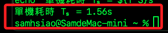

# 分散式運算演練

_使用多台樹莓派建立 `K3s` 叢集進行 `數值計算`，並實際測量效能提升_

## 環境檢查

_若在本機運行，不要使用 `sudo`；在主節點上則必須使用 `sudo`_

1. 確認所有節點皆為 Ready。

    ```bash
    sudo kubectl get nodes
    ```

    

2. 限制 `Job` 不要在 `master` 節點運行，為每台工作節點加上標籤。

    ```bash
    for node in raspi-2025-gray raspi-2025-black raspi-2025-blue; do
        sudo kubectl label node $node role=worker
    done
    ```

    

3. 建立命名空間 `pi-workload`，所有後續資源都部署在這個命名空間，方便管理與刪除。

    ```bash
    sudo kubectl create namespace pi-workload
    ```

## 撰寫 Job 定義

1. 建立腳本。

    ```bash
    cd ~/Documents
    nano pi-calculation-job.yaml
    ```

2. 這個 Job 會透過 Python 計算 π 值，並透過 K3s 自動分配到三台 Raspberry Pi 運行。

    ```yaml
    apiVersion: batch/v1
    kind: Job
    metadata:
      name: pi-calculation-job
      namespace: pi-workload
    spec:
      # 產生 3 個獨立 Pod，並同時執行
      completions: 3
      parallelism: 3
      template:
        spec:
          # 只排程到標籤為 role=worker 的節點上
          nodeSelector:
            role: worker
          # 禁止重新啟動，失敗即視為該任務結束
          restartPolicy: Never
          containers:
          - name: pi-calculator
            image: python:3.9-slim
            command: ["python3", "-c"]
            args:
              - |
                import time, random
                def monte_carlo_pi(n):
                    inside = 0
                    for _ in range(n):
                        x, y = random.random(), random.random()
                        if x*x + y*y <= 1:
                            inside += 1
                    return (inside / n) * 4
                n = 10_000_000
                t0 = time.time()
                pi_est = monte_carlo_pi(n)
                dt = time.time() - t0
                print(f"Node {__import__('socket').gethostname()}: π ≈ {pi_est:.6f}, Time: {dt:.2f}s")
    ```

## 部署與監控

1. 刪除舊的 Job。

    ```bash
    sudo kubectl delete job pi-calculation-job \
        --namespace pi-workload --ignore-not-found
    ```

2. 套用新的 Job

    ```bash
    sudo kubectl apply -f ~/Documents/pi-calculation-job.yaml
    ```

3. 觀察 Job 狀態，終端機會卡住，等到 completions 欄顯示 3/3，代表所有 Pod 都執行完畢。

    ```bash
    sudo kubectl get jobs -n pi-workload -w
    ```

4. 查看 Pod 詳細。

    ```bash
    sudo kubectl get pods -n pi-workload -o wide
    ```

5. 收集並比較計算時間，看到三行訊息，分別顯示各節點的計算時間；平均時間 ≈ 三者平均，用來代表 `分散式執行單次任務` 的耗時，若想比較 `合併效能`，可用 `3 * 平均時間` 與單機測試時間相較。

    ```bash
    sudo kubectl logs -l job-name=pi-calculation-job -n pi-workload
    ```

## 單機測試

1. 啟動 Docker Daemon。

    ```bash
    docker -a "Docker"
    ```

2. 手動拉取鏡像

    ```bash
    docker pull python:3.9-slim
    ```

3. 使用小樣本快速驗證流程，立刻看到 `Start small test` 與計算結果，就能確定流程無誤。

    ```bash
    time docker run --rm python:3.9-slim python3 - << 'EOF'
    print("Start small test")
    import time, random

    def monte_carlo_pi(n):
        inside = 0
        for _ in range(n):
            x, y = random.random(), random.random()
            if x*x + y*y <= 1:
                inside += 1
        return inside / n * 4

    n = 100_000       # 小樣本 10 萬次
    t0 = time.time()
    pi_est = monte_carlo_pi(n)
    dt = time.time() - t0
    print(f"π≈{pi_est:.6f}, Time: {dt:.2f}s")
    EOF
    ```

4. 大樣本正式測試；在當前資料夾建立運算腳本檔 `pi_calc.py`，然後執行並使用 shell 內建 time 進行計時。

    ```bash
    cat > pi_calc.py <<EOF
    import time, random

    def monte_carlo_pi(n):
        inside = 0
        for _ in range(n):
            x, y = random.random(), random.random()
            if x*x + y*y <= 1:
                inside += 1
        return inside / n * 4

    n = 10_000_000
    t0 = time.time()
    pi_est = monte_carlo_pi(n)
    dt = time.time() - t0
    print(f"π≈{pi_est:.6f}, Time: {dt:.2f}s")
    EOF

    T_S=$(
      docker run --rm -v "$PWD/pi_calc.py":/pi_calc.py python:3.9-slim python3 /pi_calc.py \
        | sed -n 's/.*Time: \([0-9.]*\)s/\1/p'
    )
    echo "單機耗時 Tₛ = ${T_S}s"
    ```

5. 最終會輸出單機耗時 `Tₛ`，同時存入變數 `T_S`；特別注意，這在當前視窗中有效。

    

## 多機效能比較

_延續前面步驟，自動化取得三台樹莓派上已完成 Job 的日誌，計算時間並快速算出分散式平均耗時、Speed-up 與平行效率_

1. 從主節點複製 `k0ubeconfig` 文件到本機 `~/.kube`。

    ```bash
    mkdir -p ~/.kube
    ssh red "sudo cat /etc/rancher/k3s/k3s.yaml" \
        > ~/.kube/k3s.yaml
    ```

2. 編輯其中的 `~/.kube/k3s.yaml` 腳本。

    ```bash
    nano ~/.kube/k3s.yaml
    ```

3. 修改 `server: https://127.0.0.1:6443` 如下。

    ```yaml
    server: https://<主節點-IP>:6443
    ```

4. 設定環境變數並立即套用。

    ```bash
    echo >> ~/.zshrc
    echo "# K3s" >> ~/.zshrc
    echo "export KUBECONFIG=~/.kube/k3s.yaml" >> ~/.zshrc
    source ~/.zshrc
    ```

5. 確認能連上叢集並看到節點狀態為 `Ready`。

    ```bash
    kubectl get nodes
    ```

6. 從 `pi-workload` 命名空間內、所有被標籤為 `job-name=pi-calculation-job` 的 `Pod`，取得它們容器的標準輸出日誌。

    ```bash
    kubectl logs -n pi-workload -l job-name=pi-calculation-job
    ```

    

## 建立分析腳本

_取得資料之後，在本機進行分析_

<br>

1. 建立檔案。

    ```bash
    nano ~/analyze_pi_perf.sh
    ```

2. 貼上以下內容。

    ```bash
    #!/usr/bin/env bash

    # analyze_pi_perf.sh
    # 用法：
    #   手動傳入 T_S：./analyze_pi_perf.sh 1.52 ~/.kube/k3s.yaml pi-workload pi-calculation-job
    #   自動計算 T_S：./analyze_pi_perf.sh auto ~/.kube/k3s.yaml pi-workload pi-calculation-job

    KUBECONFIG_PATH="$2"
    NAMESPACE="${3:-pi-workload}"
    JOB_NAME="${4:-pi-calculation-job}"

    # 1. 計算或讀取單機耗時 T_S
    if [[ "$1" == "auto" ]]; then
      # 假設當前目錄已有 pi_calc.py
      T_S=$(docker run --rm -v "$PWD/pi_calc.py":/pi_calc.py python:3.9-slim \
        python3 /pi_calc.py | sed -n 's/.*Time: \([0-9.]*\)s/\1/p')
      echo "自動測得單機耗時 Tₛ = ${T_S}s"
    else
      T_S="$1"
    fi

    if [[ -z "$T_S" || -z "$KUBECONFIG_PATH" ]]; then
      cat <<EOF
    錯誤：請傳入單機耗時（秒）或 "auto"，以及 kubeconfig 路徑。
    例如：$0 auto ~/.kube/k3s.yaml pi-workload pi-calculation-job
    EOF
      exit 1
    fi

    # 設定 kubectl 使用的 kubeconfig
    export KUBECONFIG="$KUBECONFIG_PATH"

    # 2. 擷取日誌並解析各節點耗時
    TIMES=()
    while IFS= read -r line; do
      # 假設每行格式為 "... Time: 4.18s"
      val=$(echo "$line" | awk -F'Time: ' '{print $2}' | sed 's/s$//')
      TIMES+=("$val")
    done < <(kubectl logs -n "$NAMESPACE" -l job-name="$JOB_NAME")

    if [[ "${#TIMES[@]}" -eq 0 ]]; then
      echo "錯誤：未從 kubectl 日誌取得任何耗時，請確認 Job 已完成。"
      exit 1
    fi

    # 3. 計算分散式平均耗時 Tₚ
    N=${#TIMES[@]}
    SUM=0
    for t in "${TIMES[@]}"; do
      SUM=$(echo "$SUM + $t" | bc)
    done
    T_P=$(echo "scale=4; $SUM / $N" | bc)

    # 4. 計算 Speed-up 與平行效率
    SPEEDUP=$(echo "scale=4; $T_S / $T_P" | bc)
    EFF=$(echo "scale=4; $SPEEDUP / $N" | bc)

    # 5. 輸出結果
    echo "—— 多機效能分析 ——"
    echo "節點數量 (N):         $N"
    echo "各節點耗時 (s):       ${TIMES[*]}"
    echo "分散式平均耗時 Tₚ:   $T_P s"
    echo "單機耗時 Tₛ:          $T_S s"
    echo "Speed-up (Tₛ/Tₚ):     $SPEEDUP"
    echo "Parallel Efficiency:  $EFF"
    echo "理論合力 (N×Tₚ):      $(echo "scale=4; $N * $T_P" | bc) s"
    echo "線性加速比 (N×Tₚ/Tₛ):  $(echo "scale=4; $N * $T_P / $T_S" | bc)×"
    ```

3. 加入執行權限；`+x` 就是新增執行權限。

    ```bash
    chmod +x ~/analyze_pi_perf.sh
    ```

4. 執行並傳入單機耗時；其中 `1.52` 是單機正式樣本計算得到的秒數；`~/.kube/k3s.yaml` 是步驟 1 中設定好的 `kubeconfig`；`pi-workload / pi-calculation-job` 對應命名空間與 Job 名稱。

```bash
~/analyze_pi_perf.sh 1.52 ~/.kube/k3s.yaml pi-workload pi-calculation-job
```

## 解讀結果

1. 輸出。

```text
—— 多機效能分析 ——
節點數量 (N):        3
各節點耗時 (s):      8.89 4.09 4.18
分散式平均耗時 Tₚ:  5.7200 s
單機耗時 Tₛ:         1.52 s
Speed-up (Tₛ/Tₚ):    .2657
Parallel Efficiency: .0885
理論合力 (N×Tₚ):     17.1600 s
線性加速比 (N×Tₚ/Tₛ): 11.2894×
```

1. `raspi-2025-black` 耗時約 8.89 s，遠高於另外兩台，這明顯是因硬體差異所致。

2. 平均耗時 Tₚ ≈ 5.72 s，這是三台獨立各做一次 10 M 取樣計算的 `單份任務平均耗時`。

1. Speed-up = Tₛ / Tₚ ≈ 0.2657；以 Mac 單機完成同樣任務（1.52 s）為基準，三台 Pi 平均要 5.72 s，反而比單機慢（Speed-up < 1），表示這種 `多機各自跑完整任務` 的方式並沒有提升單份任務的速度。

1. Parallel Efficiency ≈ 0.0885；這個值＝Speed-up／N，即 0.2657/3。低於 1/N（約 0.33）表示資源利用率非常低，主要因為每台 Pi 都在做重複工作，並未分工協作。

1. 理論合力 (N×Tₚ) = 17.16 s；如果把三台 Pi 的計算結果合併（3 × 10 M samples），完成所有 30 M samples 需時約 17.16 s。

1. 線性加速比 (N×Tₚ / Tₛ) ≈ 11.29×；將三台 Pi 合力跑 30 M 次，與 Mac 單機跑 10 M (1.52 s) 比，總吞吐量約提升 11.3 倍，這才是真正意義上的 `多機分攤總工作量` 效能，用 `Cluster` 3 台 Pi 在 17 s 內做 30 M 次取樣，相當於 Mac 在 1.52 s 內做 10 M 次，集群吞吐是單機的 11×。


## 建議改進

1. 分工協作：若希望縮短單次 10 M 任務時間，可考慮把 10 M 這個任務本身拆分成 3 個子任務（例如，每台只算 \~3.3 M samples），然後再把結果合併，才能真正縮短單份任務的完成時間。

2. 去除異常值：觀察到黑 Pi 慢很多，應先檢查其 CPU 佔用、散熱、頻率限制等，再重測。

3. 量化網路與啟動開銷：目前每次啟動容器都要下載鏡像（除非預先部署），可改用 DaemonSet 或 CronJob 等方式先行拉取、預熱容器，以減少這部分 overhead。

4. 同質化硬體：若想公平比較，應先測量單台 Pi 跑 10 M samples 的耗時（T\_pi\_single），再用該值來計算 Cluster 的真實 Speed-up 與 Efficiency。如此，你就能更精準地評估 K3s Cluster 在分散式運算場景下的效能表現。
