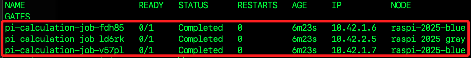
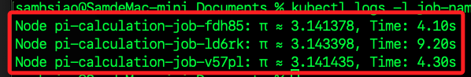
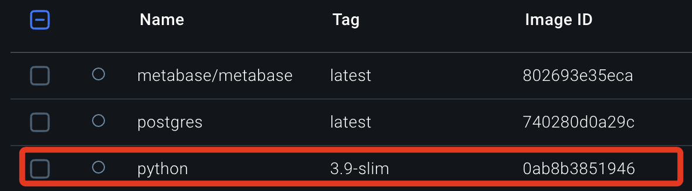
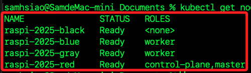
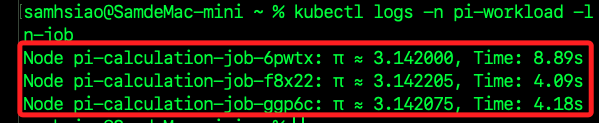
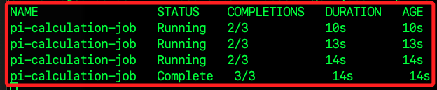
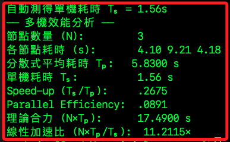
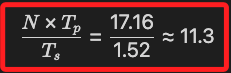

# 分散式運算演練

_使用多台樹莓派建立 `K3s` 叢集進行 `數值計算`，並實際測量效能提升_

<br>

## 環境檢查

_若在本機運行，不要使用 `sudo`；在主節點上則必須使用 `sudo`_

<br>

1. 確認所有節點皆為 Ready。

    ```bash
    sudo kubectl get nodes
    ```

    

<br>

2. 限制 `Job` 不要在 `master` 節點運行，為每台工作節點加上標籤。

    ```bash
    for node in raspi-2025-gray raspi-2025-black raspi-2025-blue; do
        sudo kubectl label node $node role=worker
    done
    ```

    

<br>

3. 建立命名空間 `pi-workload`，所有後續資源都部署在這個命名空間，方便管理與刪除。

    ```bash
    sudo kubectl create namespace pi-workload
    ```

<br>

## 撰寫 Job 定義

1. 建立腳本。

    ```bash
    cd ~/Documents
    nano pi-calculation-job.yaml
    ```

<br>

2. 這個 Job 會透過 Python 計算 π 值，並透過 K3s 自動分配到三台 Raspberry Pi 運行。

    ```yaml
    apiVersion: batch/v1
    kind: Job
    metadata:
      name: pi-calculation-job
      namespace: pi-workload
    spec:
      # 產生 3 個獨立 Pod，並同時執行
      completions: 3
      parallelism: 3
      template:
        spec:
          # 只排程到標籤為 role=worker 的節點上
          nodeSelector:
            role: worker
          # 禁止重新啟動，失敗即視為該任務結束
          restartPolicy: Never
          containers:
          - name: pi-calculator
            image: python:3.9-slim
            command: ["python3", "-c"]
            args:
              - |
                import time, random
                def monte_carlo_pi(n):
                    inside = 0
                    for _ in range(n):
                        x, y = random.random(), random.random()
                        if x*x + y*y <= 1:
                            inside += 1
                    return (inside / n) * 4
                n = 10_000_000
                t0 = time.time()
                pi_est = monte_carlo_pi(n)
                dt = time.time() - t0
                print(f"Node {__import__('socket').gethostname()}: π ≈ {pi_est:.6f}, Time: {dt:.2f}s")
    ```

<br>

## 部署與監控

_若要在主節點運行，需加上 `sudo`_

<br>

1. 刪除舊的 Job。

    ```bash
    kubectl delete job pi-calculation-job \
        --namespace pi-workload --ignore-not-found
    ```

<br>

2. 套用新的 Job。

    ```bash
    kubectl apply -f ~/Documents/pi-calculation-job.yaml
    ```

<br>

3. 列出 `pi-workload` 命名空間內所有的 `Job`，並觀察 `Job` 狀態變化，確認所有 `Pod` 都執行完畢後再往後做日誌擷取和效能分析；因為使用參數 `-w` 持續監聽，等到 `completions` 欄顯示 `3/3`，代表所有 `Pod` 都執行完畢，可按下 `comtrol+C` 退出。

    ```bash
    kubectl get jobs -n pi-workload -w
    ```

<br>

4. 查看 Pod 詳細。

    ```bash
    kubectl get pods -n pi-workload -o wide
    ```

    

<br>

5. 收集並比較計算時間，看到三行訊息，分別顯示各節點的計算時間；平均時間 ≈ 三者平均，用來代表 `分散式執行單次任務` 的耗時，若想比較 `合併效能`，可用 `3 * 平均時間` 與單機測試時間相較。

    ```bash
    kubectl logs -l job-name=pi-calculation-job -n pi-workload
    ```

    

<br>

## 單機測試

_在本機測試_

<br>

1. 啟動 `Docker Daemon`。

    ```bash
    docker -a Docker
    ```

<br>

2. 若在 `Linux` 系統中運作。

    ```bash
    sudo systemctl start docker
    ```

<br>

3. 手動拉取鏡像。

    ```bash
    docker pull python:3.9-slim
    ```

    

<br>

## 驗證

1. 撰寫 Python 腳本檔小樣本快速驗證。

    ```bash
    cat > pi_small.py <<'EOF'
    import time, random

    def monte_carlo_pi(n):
        inside = 0
        for _ in range(n):
            x, y = random.random(), random.random()
            if x*x + y*y <= 1:
                inside += 1
        return inside / n * 4

    n = 100_000       # 小樣本 10 萬次
    t0 = time.time()
    pi_est = monte_carlo_pi(n)
    dt = time.time() - t0
    print(f"π≈{pi_est:.6f}, Time: {dt:.2f}s")
    EOF
    ```

<br>

2. 執行並計時。

    ```bash
    time docker run --rm \
        -v "$PWD/pi_small.py":/pi_small.py \
        python:3.9-slim \
        python3 /pi_small.py
    ```

<br>

3. 大樣本正式測試；在當前資料夾建立運算腳本檔 `pi_calc.py`，然後執行並使用 shell 內建 time 進行計時。

    ```bash
    cat > pi_calc.py <<EOF
    import time, random

    def monte_carlo_pi(n):
        inside = 0
        for _ in range(n):
            x, y = random.random(), random.random()
            if x*x + y*y <= 1:
                inside += 1
        return inside / n * 4

    n = 10_000_000
    t0 = time.time()
    pi_est = monte_carlo_pi(n)
    dt = time.time() - t0
    print(f"π≈{pi_est:.6f}, Time: {dt:.2f}s")
    EOF

    T_S=$(
      docker run --rm -v "$PWD/pi_calc.py":/pi_calc.py python:3.9-slim python3 /pi_calc.py \
        | sed -n 's/.*Time: \([0-9.]*\)s/\1/p'
    )
    echo "單機耗時 Tₛ = ${T_S}s"
    ```

<br>

4. 最終會輸出單機耗時 `Tₛ`，同時存入變數 `T_S`；特別注意，這在當前視窗中有效。

    

<br>

## 多機效能比較

_延續前面步驟，自動化取得三台樹莓派上已完成 Job 的日誌，計算時間並快速算出分散式平均耗時、Speed-up 與平行效率_

<br>

1. 從主節點複製 `k0ubeconfig` 文件到本機 `~/.kube`。

    ```bash
    mkdir -p ~/.kube
    ssh red "sudo cat /etc/rancher/k3s/k3s.yaml" \
        > ~/.kube/k3s.yaml
    ```

<br>

2. 編輯其中的 `~/.kube/k3s.yaml` 腳本。

    ```bash
    nano ~/.kube/k3s.yaml
    ```

<br>

3. 修改 `server: https://127.0.0.1:6443` 中的 `127.0.0.1` 為主節點 IP，如下。

    ```yaml
    server: https://<主節點-IP>:6443
    ```

<br>

4. 設定環境變數並立即套用。

    ```bash
    echo >> ~/.zshrc
    echo "# K3s" >> ~/.zshrc
    echo "export KUBECONFIG=~/.kube/k3s.yaml" >> ~/.zshrc
    source ~/.zshrc
    ```

<br>

5. 確認能連上叢集並看到節點狀態為 `Ready`。

    ```bash
    kubectl get nodes
    ```

    

<br>

6. 從 `pi-workload` 命名空間內、所有被標籤為 `job-name=pi-calculation-job` 的 `Pod`，取得它們容器的標準輸出日誌。

    ```bash
    kubectl logs -n pi-workload -l job-name=pi-calculation-job
    ```

    

<br>

## 建立分析腳本

_取得資料之後，在本機進行分析_

<br>

1. 建立檔案。

    ```bash
    nano ~/analyze_pi_perf.sh
    ```

<br>

2. 貼上以下內容。

    ```bash
    #!/usr/bin/env bash

    # analyze_pi_perf.sh
    # 用法：
    #   手動傳入 T_S：./analyze_pi_perf.sh 1.52 ~/.kube/k3s.yaml pi-workload pi-calculation-job
    #   自動計算 T_S：./analyze_pi_perf.sh auto ~/.kube/k3s.yaml pi-workload pi-calculation-job

    KUBECONFIG_PATH="$2"
    NAMESPACE="${3:-pi-workload}"
    JOB_NAME="${4:-pi-calculation-job}"

    # 1. 計算或讀取單機耗時 T_S
    if [[ "$1" == "auto" ]]; then
      # 假設當前目錄已有 pi_calc.py
      T_S=$(docker run --rm -v "$PWD/pi_calc.py":/pi_calc.py python:3.9-slim \
        python3 /pi_calc.py | sed -n 's/.*Time: \([0-9.]*\)s/\1/p')
      echo "自動測得單機耗時 Tₛ = ${T_S}s"
    else
      T_S="$1"
    fi

    if [[ -z "$T_S" || -z "$KUBECONFIG_PATH" ]]; then
      cat <<EOF
    錯誤：請傳入單機耗時（秒）或 "auto"，以及 kubeconfig 路徑。
    例如：$0 auto ~/.kube/k3s.yaml pi-workload pi-calculation-job
    EOF
      exit 1
    fi

    # 設定 kubectl 使用的 kubeconfig
    export KUBECONFIG="$KUBECONFIG_PATH"

    # 2. 擷取日誌並解析各節點耗時
    TIMES=()
    while IFS= read -r line; do
      # 假設每行格式為 "... Time: 4.18s"
      val=$(echo "$line" | awk -F'Time: ' '{print $2}' | sed 's/s$//')
      TIMES+=("$val")
    done < <(kubectl logs -n "$NAMESPACE" -l job-name="$JOB_NAME")

    if [[ "${#TIMES[@]}" -eq 0 ]]; then
      echo "錯誤：未從 kubectl 日誌取得任何耗時，請確認 Job 已完成。"
      exit 1
    fi

    # 3. 計算分散式平均耗時 Tₚ
    N=${#TIMES[@]}
    SUM=0
    for t in "${TIMES[@]}"; do
      SUM=$(echo "$SUM + $t" | bc)
    done
    T_P=$(echo "scale=4; $SUM / $N" | bc)

    # 4. 計算 Speed-up 與平行效率
    SPEEDUP=$(echo "scale=4; $T_S / $T_P" | bc)
    EFF=$(echo "scale=4; $SPEEDUP / $N" | bc)

    # 5. 輸出結果
    echo "—— 多機效能分析 ——"
    echo "節點數量 (N):         $N"
    echo "各節點耗時 (s):       ${TIMES[*]}"
    echo "分散式平均耗時 Tₚ:   $T_P s"
    echo "單機耗時 Tₛ:          $T_S s"
    echo "Speed-up (Tₛ/Tₚ):     $SPEEDUP"
    echo "Parallel Efficiency:  $EFF"
    echo "理論合力 (N×Tₚ):      $(echo "scale=4; $N * $T_P" | bc) s"
    echo "線性加速比 (N×Tₚ/Tₛ):  $(echo "scale=4; $N * $T_P / $T_S" | bc)×"
    ```

<br>

3. 加入執行權限；`+x` 就是新增執行權限。

    ```bash
    chmod +x ~/analyze_pi_perf.sh
    ```

<br>

4. 執行並傳入單機耗時；其中 `$T_S` 就是先前步驟存入當前終端的單機秒數；`~/.kube/k3s.yaml` 是步驟 1 中設定好的 `kubeconfig`；`pi-workload / pi-calculation-job` 對應命名空間與 Job 名稱。

    ```bash
    ~/analyze_pi_perf.sh "$T_S" ~/.kube/k3s.yaml pi-workload pi-calculation-job
    ```

<br>

5. 若要在本機重跑一次 `pi_calc.py` 取得新的 `單機耗時 Tₛ` 再取值，可運行以下指令。

    ```bash
    ~/analyze_pi_perf.sh auto ~/.kube/k3s.yaml pi-workload pi-calculation-job
    ```

<br>

## 快速重新統計

_特別注意，雖然本機不是叢集節點，但前面步驟已經在 `~/.kube/k3s.yaml` 裡設定主節點的 IP 和憑證，就能遠端操作整個 K3s 叢集，完全不需要成為節點或運行 K3s_

<br>

1. 在本機運行，將叢集中與 `pi-calculation-job` 相關的所有 Pod 都刪掉再重新排程。

    ```bash
    kubectl delete job pi-calculation-job -n pi-workload
    ```

<br>

2. 用原本的 YAML 檔重新部署 Job；這會立刻在三台標上 `pi-workload` 標籤的節點上，各跑一個新 Pod 開始計算。

    ```bash
    kubectl apply -f ~/Documents/pi-calculation-job.yaml
    ```

<br>

3. 等到三個 Pod 都完成。

    ```bash
    kubectl get jobs -n pi-workload -w
    ```

    

<br>

4. 取回最新日誌。

    ```bash
    kubectl logs -n pi-workload -l job-name=pi-calculation-job
    ```

<br>

5. 再執行分析腳本；`auto` 的用意是腳本先在本機跑一次 `pi_calc.py` 得到最新的 Tₛ，然後再去叢集抓剛才新跑的三個 Pod 耗時，計算平均、Speed-up、效率。

    ```bash
    ~/analyze_pi_perf.sh auto ~/.kube/k3s.yaml pi-workload pi-calculation-job
    ```

    

<br>

## 解讀結果

1. `平均耗時 Tₚ` 是三台獨立各做一次 `10 M` 取樣計算的 `單份任務平均耗時`。

<br>

2. `Speed-up = Tₛ / Tₚ` 是以本機單機完成同樣任務為基準，三台樹莓派平均耗時，結果顯示比單機慢，表示這種 `多機各自跑完整任務` 的方式並沒有提升單份任務的速度。

<br>

3. `Parallel Efficiency` 這個值 `＝Speed-up／N`，顯示低於 `1/N（約 0.33）` 表示資源利用率非常低，主要因為每台 Pi 都在做重複工作，並未分工協作。

<br>

4. `理論合力 (N×Tₚ)` 表示如果把三台 Pi 的計算結果合併 `（3 × 10 M samples）`，完成所有 `30 M samples` 需時約多少。

<br>

5. `線性加速比 (N×Tₚ / Tₛ)` 表示將三台 Pi 合力跑 `30 M` 次，與 `本機單機` 跑 `10 M` 比，總吞吐量約提升 `11.3` 倍，這才是真正意義上的 `多機分攤總工作量` 效能，用叢集 `3 台 Pi` 在 `17 s` 內做 `30 M` 次取樣，相當於 `Mac` 在 `1.52 s` 內做 `10 M` 次，集群吞吐是單機的 `11×`。

<br>

## 何謂 `多機分攤總工作量`

_若把原本要在單機上一次做完的 `N 倍工作量` 拆成 `N` 份，分別丟給 `N` 台機器同時計算，再把結果合併，這就稱作把 `總工作量` 分攤到多機上執行_

<br>

1. 單機基準就是 `本機單台` 處理 `10 M` 次蒙地卡羅取樣的耗時。

    

<br>

2. 多機各自跑 10 M 就是 `三台 Pi` 各自執行 10 M 次，耗時的平均。

    

<br>

3. 總工作量放大 N 倍，如果要處理 `3×10 M = 30 M` 次取樣，單機要依序跑 `3` 次的耗時。

    

<br>

4. 而叢集則是 `三台 Pi` 同時計算各自 `10 M`，等到最慢的那台跑完總共耗時。

    

<br>

5. 線性加速比是比較 `叢集處理 30 M` 和 `單機處理 10 M` 的時間比；這個比值說明在 `一次完成 N 倍工作量` 的情境下，叢集能在同樣時間內處理的取樣總數，是單機的約 `11` 倍。

    

<br>

___

_END_