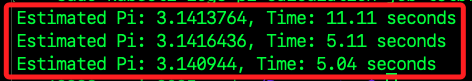

# 分散式運算演練

_使用多台樹莓派建立 K3s 叢集進行 數值計算，並實際測量效能提升。_


## 目標

1. 利用 K3s 分散執行數值運算

2. 比較單機 vs. 多機計算效能

3. 透過 Kubernetes 自動分配計算工作

## 環境準備

1. 確認 K3s 叢集正常運行

    ```bash
    sudo kubectl get nodes
    ```

2. 在主節點建立 YAML 檔

    ```bash
    cd ~/Documents && sudo nano pi-calculation-job.yaml
    ```

3. 這個 Job 會透過 Python 計算 π 值，並透過 K3s 自動分配到三台 Raspberry Pi 運行。

```yaml
apiVersion: batch/v1
kind: Job
metadata:
  name: pi-calculation-job
spec:
  completions: 3
  parallelism: 3
  template:
    spec:
      nodeSelector:
        kubernetes.io/arch: arm64
      containers:
      - name: pi-calculator
        image: python:3.9
        command: ["python3", "-c"]
        args:
          - |
            import time
            import random

            def monte_carlo_pi(num_samples):
                inside_circle = 0
                for _ in range(num_samples):
                    x, y = random.random(), random.random()
                    if x**2 + y**2 <= 1:  # 修正錯誤
                        inside_circle += 1
                return (inside_circle / num_samples) * 4

            num_samples = 10_000_000  # 1000 萬次計算
            start_time = time.time()
            pi_estimate = monte_carlo_pi(num_samples)
            duration = time.time() - start_time
            print(f"Estimated Pi: {pi_estimate}, Time: {duration:.2f} seconds")
      restartPolicy: Never
```

4. 刪除舊有的 Job。

```bash
sudo kubectl delete job pi-calculation-job
```

5. 刪除 Error 的 Job。 

```bash
sudo kubectl get pods --no-headers | grep Error | awk '{print $1}' | xargs sudo kubectl delete pod
```

6. 部署 Job

    ```bash
    sudo kubectl apply -f pi-calculation-job.yaml
    ```

7. 監控 Pod 運行狀態

    ```bash
    sudo kubectl get pods -o wide
    ```

8. 查看計算結果

    ```bash
    sudo kubectl logs pi-calculation-job-2fsnq
    sudo kubectl logs pi-calculation-job-nzs57
    sudo kubectl logs pi-calculation-job-t6tbf
    ```

    

## 比較單機 vs. 多機計算效能

1. 單機測試。

```bash
docker run --rm python:3.9 python3 -c "
import time
import random

def monte_carlo_pi(num_samples):
    inside_circle = 0
    for _ in range(num_samples):
        x, y = random.random(), random.random()
        if x2 + y2 <= 1:
            inside_circle += 1
    return (inside_circle / num_samples) * 4

num_samples = 10_000_000  # 1000 萬次計算
start_time = time.time()
pi_estimate = monte_carlo_pi(num_samples)
duration = time.time() - start_time
print(f'Estimated Pi: {pi_estimate}, Time: {duration:.2f} seconds')"
```

