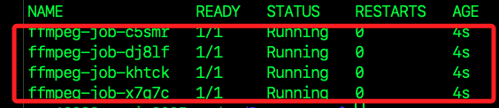

# 分散運算範例

_分布式影像處理 (FFmpeg)_

## 說明

1. 此範例使用 FFmpeg 進行影片轉碼，並分配到多台 Raspberry Pi 進行並行處理。  

2. FFmpeg 在 Raspberry Pi 確保可行，並支援 ARM 架構。  

3. K3s 可將影片轉檔任務分配到不同的節點，提高處理速度。

## 目標

1. 在 K3s 叢集中運行 FFmpeg 進行影片轉碼

2. K3s 自動負載均衡，將轉碼工作分配到多台機器

3. 比較單機 VS. 多機效能提升

## 環境準備

1. 安裝 Docker。

```bash
curl -fsSL https://get.docker.com | sudo sh
```

2. 啟動並設定 Docker

```bash
sudo systemctl enable docker
sudo systemctl start docker
```

3. 確保當前用戶可以使用 Docker

```bash
sudo usermod -aG docker $USER
newgrp docker
```

4. 確保 K3s 叢集正常運行

```bash
sudo kubectl get nodes
```

## 登入

1. 帳號與憑證。

```bash
ACCOUNT=samhsiao6238
TOKEN=
```

3. 有些 GHCR 容器 需要登入 GitHub 帳戶 才能下載。

```bash
echo "$TOKEN" | docker login ghcr.io -u $ACCOUNT --password-stdin
```

4. 確認 FFmpeg 可運行

```bash
docker run --rm lscr.io/linuxserver/ffmpeg:latest ffmpeg -version
```

## 分割並傳送文件

1. 在本機終端機運行指令分割影片

```bash
cd ~/Downloads && ffmpeg -i test.mp4 -c copy -map 0 -segment_time 60 -f segment -reset_timestamps 1 "test_part%03d.mp4"
```

2. 將測試文件從本機傳送到各節點。

```bash
# 傳送第一批片段到 red
scp test_part00[0-3].mp4 red:~/Downloads/

# 傳送第二批片段到 blue
scp test_part00[4-7].mp4 blue:~/Downloads/

# 傳送第三批片段到 pi4
scp test_part00[8-9].mp4 pi4:~/Downloads/
```

## 建立 FFmpeg 轉檔任務

1. 建立 `ffmpeg-job.yaml`

```bash
cd ~/Documents && sudo nano ffmpeg-job.yaml
```

2. 確保 每個 Pod 只轉碼自己節點上的片段，轉碼後回傳至 red

```yaml
apiVersion: batch/v1
kind: Job
metadata:
  name: ffmpeg-job
spec:
  completions: 3
  parallelism: 3
  template:
    spec:
      nodeSelector:
        kubernetes.io/arch: arm64
      containers:
      - name: ffmpeg
        image: ubuntu:22.04
        command: ["/bin/sh", "-c"]
        args:
          - |
            echo "Updating packages and installing ffmpeg & scp..."
            apt update && apt install -y ffmpeg openssh-client

            echo "Checking if files exist..."
            ls -lh /mnt/Downloads/

            echo "Processing video files..."
            for file in /mnt/Downloads/test_part*.mp4; do
              echo "Processing $file..."
              ffmpeg -i "$file" -c:v libx264 -preset veryfast -crf 28 -c:a aac -b:a 128k "${file%.mp4}_output.mp4"
            done

            echo "Transcoding complete! Uploading to red..."
            scp -o StrictHostKeyChecking=no /mnt/Downloads/*_output.mp4 sam6238@192.168.1.158:/home/sam6238/Downloads/
        volumeMounts:
        - name: downloads
          mountPath: /mnt/Downloads
      restartPolicy: Never
      volumes:
      - name: downloads
        hostPath:
          path: /home/sam6238/Downloads
          type: Directory
```

3. 刪除舊的 Job

```bash
sudo kubectl delete job ffmpeg-job
```

4. 部署 Job

```bash
sudo kubectl apply -f ffmpeg-job.yaml
```

4. 監控運行狀態，會從 `ContainerCreating` 到 `Running`，然後 `Completed`，若有錯誤會顯示為 `Error`。

```bash
sudo kubectl get pods
```



5. 顯示詳細資訊。

```bash
sudo kubectl get pods -o wide
```

6. 預設 K3s 不會在控制節點上執行 Pod，要讓它參與計算需要移除 `NoSchedule` 限制。

```bash
sudo kubectl taint nodes raspi-2025-red node-role.kubernetes.io/control-plane:NoSchedule-
```

## 觀察日誌

1. 一次性輸出所有 Pod 日誌。

```bash
sudo kubectl logs -l job-name=ffmpeg-job --all-containers=true
```

2. 逐一查看 Pod 日誌，需自行填入 Pod 帶有尾綴的名稱。

```bash
sudo kubectl logs <Pod-名稱>
```

## 分析 FFMPEG 分散式計算效能

1. 查看轉碼完成的片段

```bash
ls -lh ~/Downloads/*_output.mp4
```

2. 合併轉碼完成的片段

```bash
cd ~/Downloads
ls *_output.mp4 > file_list.txt
sed -i 's/^/file /' file_list.txt
ffmpeg -f concat -safe 0 -i file_list.txt -c copy final_output.mp4
```

## 效能分析

1. 分散式測試

```bash
sudo kubectl logs -l job-name=ffmpeg-job --all-containers=true | grep "Total processing time"
```

2. 單機測試。

```bash
time ffmpeg -i test.mp4 -c:v libx264 -preset veryfast -crf 28 -c:a aac -b:a 128k single_output.mp4
```


