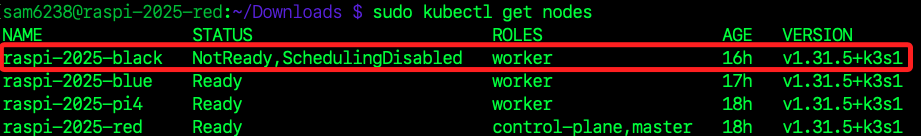
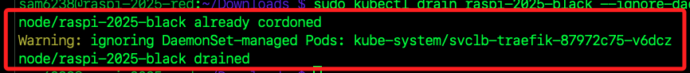
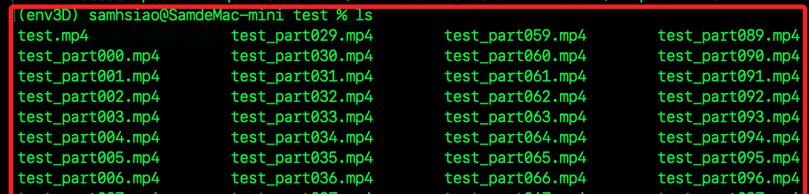
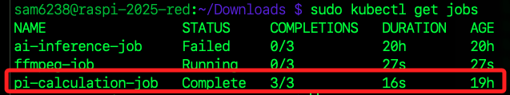

_尚未成功，先擱置_

<br>

# 分散運算範例

_分布式影像處理 (FFmpeg)_

<br>

## 說明

1. 此範例使用 FFmpeg 進行影片轉碼，並分配到多台 Raspberry Pi 進行並行處理。  

<br>

2. FFmpeg 在 Raspberry Pi 確保可行，並支援 ARM 架構。  

<br>

3. K3s 可將影片轉檔任務分配到不同的節點，提高處理速度。

<br>

## 目標

1. 在 K3s 叢集中運行 FFmpeg 進行影片轉碼。

<br>

2. K3s 自動負載均衡，將轉碼工作分配到多台機器。

<br>

3. 比較單機 VS. 多機效能提升。

<br>

## 檢視節點狀態

1. 確保 K3s 叢集正常運行。

    ```bash
    sudo kubectl get nodes
    ```

    

<br>

2. 確認沒有 Pod 被排程到指定節點。

    ```bash
    sudo kubectl drain <節點名稱> --ignore-daemonsets --delete-emptydir-data
    ```

    

<br>

3. 將節點標記為 `不可調度 (SchedulingDisabled)`。

    ```bash
    sudo kubectl cordon <節點名稱>
    ```

<br>

4. 從清單中徹底 `刪除 (delete)` 指定節點。

    ```bash
    sudo kubectl delete node <節點名稱>
    ```

<br>

5. 預設 K3s 不會在控制節點上執行 Pod，要讓它參與計算需要移除 `NoSchedule` 限制。

    ```bash
    sudo kubectl taint nodes raspi-2025-red node-role.kubernetes.io/control-plane:NoSchedule-
    ```

<br>

6. 允許 red 參與運行 Pod，檢查 red 是否有 Taints。

    ```bash
    sudo kubectl describe node raspi-2025-red | grep Taint
    ```

<br>

7. 手動允許 red 參與 Job 執行。

    ```bash
    sudo kubectl taint nodes raspi-2025-red node-role.kubernetes.io/control-plane-
    ```

<br>

## 準備工作

1. 確認 FFmpeg 容器在每個節點上正常運行，並確認版本一致。

    ```bash
    docker run --rm lscr.io/linuxserver/ffmpeg:latest ffmpeg -version
    ```

<br>

## 準備文件

1. 進入本機的工作目錄；另外，將準備要使用的影音檔案 `test.mp4` 放入該路徑中，此部分不做贅述。

    ```bash
    mkdir -p ~/Downloads/test && cd ~/Downloads/test
    ```

<br>

2. 在本機終端機運行指令分割影片。

    ```bash
    ffmpeg -i test.mp4 -c copy -map 0 -segment_time 60 -f segment -reset_timestamps 1 "test_part%03d.mp4" && ls
    ```

    

<br>

3. 將測試文件從本機傳送到各節點；以下指令會將片段依據分配規則傳送到 `red、blue、pi4`。

    ```bash
    scp ~/Downloads/test/test_part{000..114}.mp4 red:~/Downloads/
    ```

<br>

## 建立 Job

1. 編輯腳本前，先在工作節點 blue 及 pi4 進行連線主節點的測試，確認腳本中的傳輸方式不會出錯。

    ```bash
    ssh sam6238@192.168.1.158 "echo OK"
    ```

<br>

2. 在主節點建立並編輯 Job 腳本 `ffmpeg-job.yaml`。

    ```bash
    sudo nano ~/Documents/ffmpeg-job.yaml
    ```

<br>

3. 讓 Red 作為共享儲存區，所有 Worker 節點從 Red 的共享資料夾 讀取影片並轉換，最後再傳回 Red。

```yaml
apiVersion: batch/v1
kind: Job
metadata:
  name: ffmpeg-job
spec:
  completions: 3
  parallelism: 3
  template:
    spec:
      nodeSelector:
        kubernetes.io/arch: arm64
      securityContext:
        fsGroup: 1000
      containers:
      - name: ffmpeg
        image: lscr.io/linuxserver/ffmpeg:latest
        securityContext:
          runAsUser: 1000
          runAsGroup: 1000
        command: ["/bin/sh", "-c"]
        args:
          - |
            echo "Checking if files exist in shared storage..."
            ls -lh /mnt/shared/
            if [ "$(ls -A /mnt/shared/test_part*.mp4 2>/dev/null)" ]; then
              echo "Processing video files..."
              for file in $(find /mnt/shared -maxdepth 1 -type f -name "test_part*.mp4" | shuf -n 10); do
                output_file="/mnt/shared/$(basename ${file%.mp4}_output.mp4)"
                if [ ! -f "$output_file" ]; then
                  echo "Processing $file..."
                  ffmpeg -i "$file" -c:v libx264 -preset veryfast -crf 28 -c:a aac -b:a 128k "$output_file"
                else
                  echo "Skipping already processed file: $file"
                fi
              done
              echo "Transcoding complete! Files are stored in shared storage."
            else
              echo "No files found in /mnt/shared/"
            fi
        volumeMounts:
        - name: shared-storage
          mountPath: /mnt/shared
      restartPolicy: Never
      volumes:
      - name: shared-storage
        hostPath:
          path: /home/sam6238/Downloads
          type: Directory
```

<br>

## 開始部署

1. 部署前先預防性刪除舊的 Job；若沒有 Job 會顯示 `Error from server (NotFound)`。

    ```bash
    sudo kubectl delete job ffmpeg-job --force --grace-period=0
    ```

<br>

2. 部署 Job。

    ```bash
    sudo kubectl apply -f ~/Documents/ffmpeg-job.yaml
    ```

<br>

3. 監控運行狀態，正常會從 `ContainerCreating` 到 `Running`，然後 `Completed`，若有錯誤會顯示為 `Error`。

    ```bash
    sudo kubectl get pods
    ```

    

<br>

4. 顯示詳細資訊。

    ```bash
    sudo kubectl get pods -o wide
    ```

<br>

5. 檢查 Job 的執行狀態。

    ```bash
    sudo kubectl get jobs
    ```

    

<br>

6. 如果 FFmpeg 仍在運行，可查看 Pod 佔用的資源。

    ```bash
    sudo kubectl top pods
    ```

<br>

7. 查詢指定狀態的容器，例如查詢是否還有活躍 `Running` 的 Container。

    ```bash
    sudo kubectl get pods --field-selector=status.phase=Running
    ```

<br>

## 觀察日誌

1. 輸出所有 Pod 的日誌。

    ```bash
    sudo kubectl logs -l job-name=ffmpeg-job --all-containers=true
    ```

<br>

2. 若要查看即時日誌，可添加參數 `-f`，這會鎖定視窗。

    ```bash
    sudo kubectl logs -l job-name=ffmpeg-job --all-containers=true -f
    ```

<br>

3. 指定查看某個 Pod 的日誌，需填入 Pod 名稱作為參數，這個名稱尾綴每次都會不同。

    ```bash
    sudo kubectl logs <Pod-名稱>
    ```

<br>

## 分析 FFMPEG 分散式計算效能

1. 查看轉碼完成的片段。

```bash
ls -lh ~/Downloads/*_output.mp4
```

2. 合併轉碼完成的片段。

```bash
cd ~/Downloads
ls *_output.mp4 > file_list.txt
sed -i 's/^/file /' file_list.txt
ffmpeg -f concat -safe 0 -i file_list.txt -c copy final_output.mp4
```

## 效能分析

1. 分散式測試。

```bash
sudo kubectl logs -l job-name=ffmpeg-job --all-containers=true | grep "Total processing time"
```

2. 單機測試。

```bash
time ffmpeg -i test.mp4 -c:v libx264 -preset veryfast -crf 28 -c:a aac -b:a 128k single_output.mp4
```


