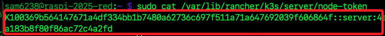
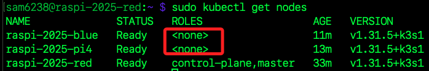
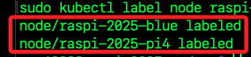
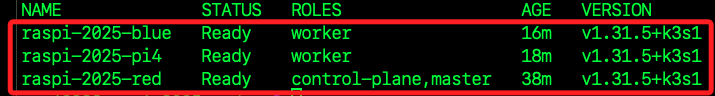
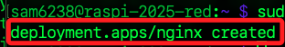
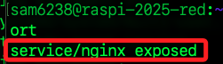
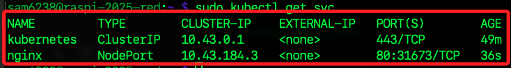
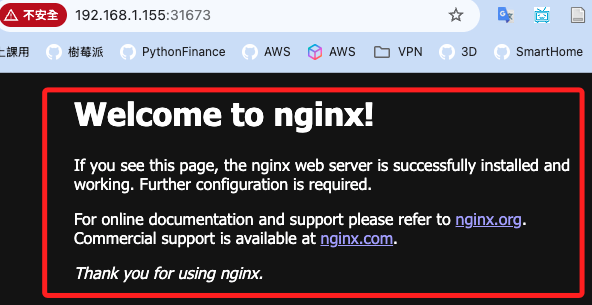
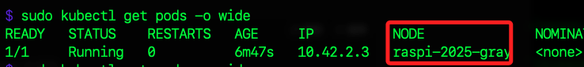

# 加入 K3s 叢集

_將其他樹莓派設備加入叢集_

<br>

## 準備工作

1. 更新系統，不贅述。

    ```bash
    sudo apt update && sudo apt upgrade -y
    ```

<br>

2. 安裝必要工具。

    ```bash
    sudo apt install -y iptables
    ```

<br>

3. 啟用 `cgroup` 支援，確保工作節都啟用了 `cgroup_memory` 和 `systemd.unified_cgroup_hierarchy=1`。

    ```bash
    sudo nano /boot/firmware/cmdline.txt
    ```

<br>

4. 在行末加入參數；與原本設定以空格相隔，千萬不要斷行。

    ```bash
    cgroup_memory=1 cgroup_enable=memory systemd.unified_cgroup_hierarchy=1
    ```

<br>

5. 儲存並重啟。

    ```bash
    sudo reboot now
    ```

<br>

## 加入工作節點

_重啟後，安裝 `K3s Agent` 加入工作節點_

<br>

1. 先在 `主節點` 查詢 `Token`。

    ```bash
    sudo cat /var/lib/rancher/k3s/server/node-token
    ```

    

<br>

2. 在工作節點紀錄 `Token`；這是在當前終端機視窗中將值存入變數，供後續指令使用。

    ```bash
    K3S_TOKEN=<查詢到的-TOKEN>
    ```

<br>

3. 查詢主節點 IP。

    ```bash
    ip -4 addr show dev wlan0 | awk '/inet /{print $2}' | cut -d/ -f1
    ```

<br>

4. 寫入前一步驟查得的主節點 IP，並在當前終端視窗中寫入變數。

    ```bash
    MASTER_IP=<主節點-IP>
    ```

<br>

5. 安裝 `K3s Agent`；會自動帶入前面取得的兩個變數，所以要確認已經存入。

    ```bash
    curl -sfL https://get.k3s.io | K3S_URL=https://$MASTER_IP:6443 K3S_TOKEN=$K3S_TOKEN sh -
    ```

<br>

## 查看日誌

_如需了解詳盡的運行內容，可查看日誌_

<br>

1. 檢查安裝日誌，確保 `Agent` 正常啟動並連接到 `Master Node`。

    ```bash
    sudo journalctl -u k3s-agent -f
    ```

<br>

## 確認工作節點狀態

_【特別說明】預設情況下，`K3s` 不會自動指派 `worker` 角色，需要手動標記，而工作節點本身無法查詢標記狀態，只能查詢服務狀態_

<br>

1. 在 `主節點` 上執行以下命令，確認新的 `工作節點` 已成功加入叢集；成功會顯示 `Ready`，由於預設不會指派角色，所以新加入節點的 `ROLES` 顯示為 `<none>`。

    ```bash
    sudo kubectl get nodes
    ```

    

<br>

2. 在主節點標記工作節點；依據設備實際名稱填入 `<主機名稱>`；特別注意，這個名稱無需加入尾綴 `.local`；正確設置後會回傳 `labeled`。

    ```bash
    sudo kubectl label node <主機名稱> node-role.kubernetes.io/worker=true
    ```

    

<br>

3. 在 `主節點` 上再次查詢叢集節點狀態，在 `ROLES` 就會看到 `worker` 加入。

    ```bash
    sudo kubectl get nodes
    ```

    

<br>

## 部署 Pod

_在 `主節點` 運行指令部署測試應用，`Pod` 會根據 `Kubernetes` 的調度機制，分配到主節點或工作節點上。_

<br>

1. 在 `主節點` 建立一個 `Nginx Deployment`，`Kubernetes` 會自動安排並分配 `Pod` 到任意可用節點，包括工作節點；正確設置會顯示 `deployment.apps/nginx created`。

    ```bash
    sudo kubectl create deployment nginx --image=nginx
    ```

    

<br>

2. 繼續在主節點上將 `Nginx` 部署暴露為 `NodePort` 類型的服務，這會讓 `Nginx` 服務通過節點的 `隨機高位端口` 暴露，從任何節點的 IP 都可以訪問此服務；正確會顯示 `service/nginx exposed`。

    ```bash
    sudo kubectl expose deployment nginx --port=80 --type=NodePort
    ```

    

<br>

3. 確認服務狀態；從結果可以看出叢集裡有兩個 `Service`，其中 `Nginx` 透過 `NodePort 31673` 暴露在每台節點上；`NodePort` 是 `Kubernetes` 隨機指派未使用的高位端口，範圍在 `30000-32767` 之間；另外，也可在 `kubectl expose` 指令中手動指定使用的端口。

    ```bash
    sudo kubectl get svc
    ```

    

<br>

4. 在區網中，可透過任意設備訪問任意一個節點的指定端口。

    ```bash
    http://<任意節點-IP>:<隨機指派的端口號>
    ```

    

<br>

5. 檢查 `Pod` 是否已分配到新加入的工作節點上，`NODE` 欄位顯示該 `Pod` 運行在哪個節點上。

    ```bash
    sudo kubectl get pods -o wide
    ```

    

<br>

## Taints - Tolerations 機制

_髒污容忍機制；阻止或允許 Pod 被排程到特定節點上_

1. 以下指令會在 `主節點` 上新增 `NoSchedule`，使未宣告相應容忍的 `Pod` 無法排程到 `主節點` 上，也就是只部署在 `工作節點` 上，這個 `NoSchedule` 就是一個節點污點 `Taint`，表示禁止新 `Pod` 排程到該節點；預設情況下，也就是沒有任何 `taint` 時，所有 `Pod` 都可被排程到集群中任何一台節點上，也包含 `master` 節點；如果節點被標記 `Taint`，這會讓沒有對應容忍 `toleration` 的 Pod 無法落在該節點上；如以下範例，`NoSchedule` 的效果就是除非 `Pod` 明確宣告容忍這個 `taint`，否則就不會被排程。


    ```bash
    kubectl taint nodes <主節點名稱> node-role.kubernetes.io/master=:NoSchedule
    ```

<br>

2. 若要移除 `taint` 把 `master` 重新開放給 `Pod`。

    ```bash
    kubectl taint nodes <主節點名稱> node-role.kubernetes.io/master- 
    ```

## 自動化完成環境配置

_後補_

<br>

## 監控叢集狀態

_使用 Prometheus 和 Grafana 進行資源使用分析。_

<br>

## 擴展工作節點數量

_根據應用負載需求靈活擴充叢集_

<br>

___

_END_
