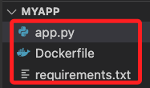
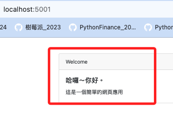
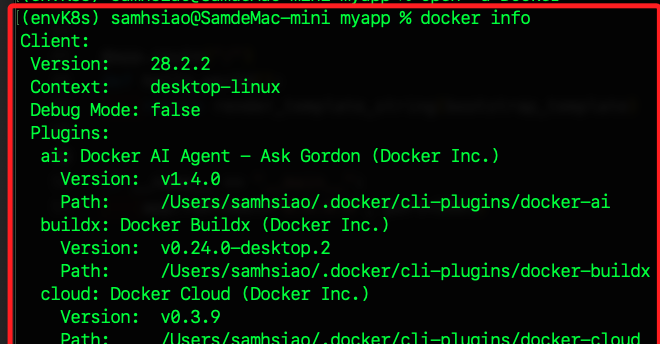
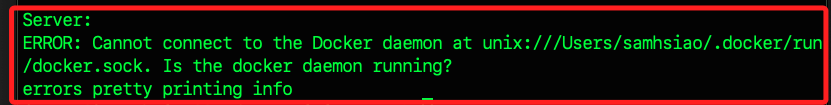
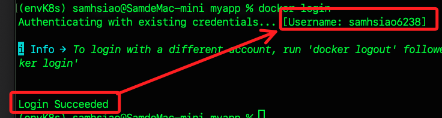
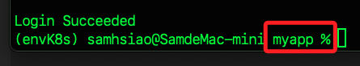
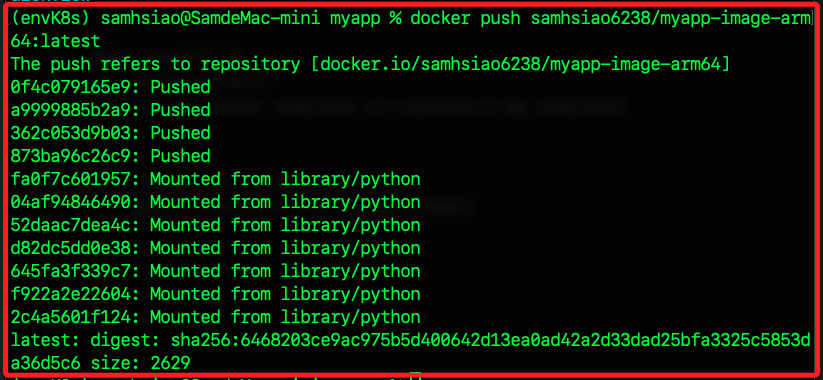
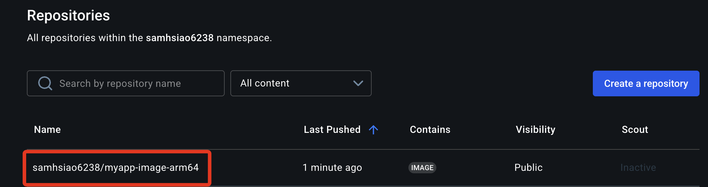
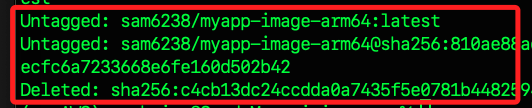

# 建立鏡像並推送到 Dockerhub

_以下示範在本機建立並推送適用於樹莓派架構的鏡像到 `Docker Hub`_

<br>

1. 在本地 `~/Documents` 建立建一個專案資料夾 `myapp`，將用於編輯 `Docker` 鏡像；完成後啟動 `VSCode`。

    ```bash
    mkdir -p ~/Documents/myapp
    cd ~/Documents/myapp
    touch app.py requirements.txt Dockerfile
    code .
    ```

<br>

2. 架構如下。

    

<br>

## 編寫腳本

1. 編輯應用程式的主腳本 `app.py`，這是一個簡單的 `Flask` 應用程式。

    ```python
    from flask import Flask, render_template_string

    app = Flask(__name__)

    bootstrap_template = """
    <!doctype html>
    <html lang="en">
    <head>
        <!-- Required meta tags -->
        <meta charset="utf-8">
        <meta name="viewport" content="width=device-width, initial-scale=1, shrink-to-fit=no">

        <!-- Bootstrap CSS -->
        <link href="https://stackpath.bootstrapcdn.com/bootstrap/4.5.2/css/bootstrap.min.css" rel="stylesheet">

        <title>My Kubernets App</title>
    </head>
    <body>
        <div class="container mt-5">
        <div class="row">
            <div class="col-md-12">
            <div class="card">
                <div class="card-header">
                Welcome
                </div>
                <div class="card-body">
                <h5 class="card-title">哈囉～你好。</h5>
                <p class="card-text">這是一個簡單的網頁應用</p>
                </div>
            </div>
            </div>
        </div>
        </div>

        <!-- Optional JavaScript -->
        <!-- jQuery first, then Popper.js, then Bootstrap JS -->
        <script src="https://code.jquery.com/jquery-3.5.1.slim.min.js"></script>
        <script src="https://cdn.jsdelivr.net/npm/@popperjs/core@2.5.4/dist/umd/popper.min.js"></script>
        <script src="https://stackpath.bootstrapcdn.com/bootstrap/4.5.2/js/bootstrap.min.js"></script>
    </body>
    </html>
    """


    @app.route("/")
    def hello_world():
        return render_template_string(bootstrap_template)


    if __name__ == "__main__":
        app.run(host="0.0.0.0", port=5001)
    ```

<br>

2. 在 `requirements.txt` 文件中，指定必要套件與版本。

    ```bash
    Flask==2.0.2
    werkzeug==2.0.3
    ```

<br>

3. 編輯容器文件 `Dockerfile` 以構建適用於 `ARM 架構` 的鏡像。

    ```dockerfile
    FROM python:3.9

    WORKDIR /usr/src/app

    COPY requirements.txt ./
    RUN pip install --no-cache-dir -r requirements.txt

    COPY . .

    CMD ["python", "./app.py"]
    ```

<br>

## 測試

_若要在本地測試腳本，需完成環境配置_

<br>

1. 建立並啟動虛擬環境。

    ```bash
    cd ~/Documents/PythonVenv
    python -m venv envK8s
    echo ". ~/Documents/PythonVenv/envK8s/bin/activate" >> ~/.zshrc
    . ~/.zshrc
    ```

2. 先安裝套件。

    ```bash
    pip install flask
    ```

<br>

3. 預設 `app.py` 中的 `port` 指定為 `5001`，如被佔用可指定為其他閒置的端口。

    ```python
    if __name__ == "__main__":
        app.run(host='0.0.0.0', port=5001)
    ```

<br>

4. 在專案資料夾中運行腳本。

    ```bash
    python app.py
    ```

<br>

5. 開啟瀏覽器訪問。

    ```bash
    http://127.0.0.1:5001
    ```

    

<br>

6. 關於測試模式中，若希望網頁在修改後可透過刷新同步，不需要重啟應用，可添加參數 `debug=True`；但不適用於生產環境，要特別注意。

    ```python
    if __name__ == "__main__":
        # app.run(host="0.0.0.0", port=5001)
        app.run(host="0.0.0.0", port=5001, debug=True)
    ```

<br>

## 進行推送

1. 啟動 `Docker Desktop`；這會在背景運行。

    ```bash
    open -a Docker
    ```

<br>

2. 顯示本機 `Docker` 環境的整體狀態。

    ```bash
    docker info
    ```

    

<br>

3. 假如未啟用，會出現錯誤訊息。

    

<br>

4. 登入 `Docker Hub`；記下自己的使用者名稱 `Username`，在後續步驟會使用到。

    ```bash
    docker login
    ```

    

<br>

## 建立 `Docker` 鏡像

1. 確認當前進入 `myapp` 目錄中。

    

<br>

2. 運行指令建立 `Docker` 鏡像；更改其中的 `<DockerHub-使用者名稱>`；另外，尾綴的點 `.` 不要遺漏。

    ```bash
    docker build -t <DockerHub-使用者名稱>/myapp-image-arm64:latest .
    ```

<br>

3. 補充說明，若需要刪除可運行以下指令；同樣地，更改其中的 `<DockerHub-使用者名稱>` 與原指令輸入相同。

    ```bash
    docker rmi <DockerHub-使用者名稱>/myapp-image-arm64:latest
    ```

<br>

4. 將構建好的鏡像推送到 `Docker Hub`。

    ```bash
    docker push <DockerHub-使用者名稱>/myapp-image-arm64:latest
    ```

    

<br>

5. 完成後可前往 [Docker Hub](https://hub.docker.com/) 進行查看。

    

<br>

## 修正鏡像

_若鏡像內容有修訂_

<br>

1. 修正後先進行重構。

    ```bash
    docker build -t <使用者名稱>/myapp-image-arm64 .
    ```

<br>

2. 重新推送。

    ```bash
    docker push <使用者名稱>/myapp-image-arm64
    ```

<br>

## 刪除本地鏡像

1. 刪除本地鏡像。

    ```bash
    docker rmi <使用者名稱>/myapp-image-arm64:latest
    ```

    

<br>

2. 使用 `sed` 移除虛擬環境的環境變數；特別注意，`macOS` 使用 `sed` 指令要加空字串參數。

    ```bash
    # 
    sed -i '' '\#\. ~/Documents/PythonVenv/envK8s/bin/activate#d' ~/.zshrc
    ```

<br>

3. 退出並刪除虛擬環境。

    ```bash
    deactivate
    rm -rf ~/Documents/PythonVenv/envK8s
    . ~/.zshrc
    ```

<br>

___

_END_