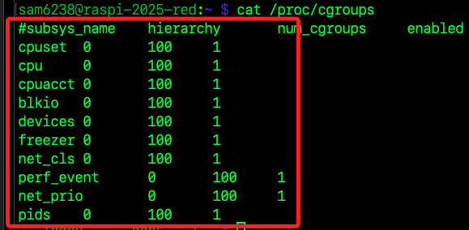

# 部署 K3s 主節點

_因為 `K8s` 需要耗用大量資源，不建議在邊緣設備如樹莓派上部署 K8s，以下將進行 K3s 部署。_ 

<br>

## 準備工作

1. 更新系統。

    ```bash
    sudo apt update
    sudo apt upgrade -y
    ```

<br>

2. 安裝依賴套件。

    ```bash
    sudo apt install -y iptables iptables-persistent
    ```

<br>

## 設置 cgroups

_在 `Linux` 系統中，`cgroup` 主要用於管理和限制系統資源的使用；在 `K8s / K3s` 中用來管理 `Pod` 和容器的資源配額；必須完成設置才能讓 `K3s` 正常安裝並啟動。_

<br>

1. 編輯 `/boot/firmware/cmdline.txt`。

    ```bash
    sudo nano /boot/firmware/cmdline.txt
    ```

<br>

2. 當前設置如下，除了 `root=PARTUUID=` 這段因為每張 SD 卡分割區 UUID 都不同以外，其他參數在不同裝置上都是一樣的；特別注意，這個設定是單行表示、不可換行的，參數以間隔表示。

    

<br>

3. 在最右邊空一格之後加入以下參數；若當前視窗寬度不足，可將游標移動到下一行，然後返回就可進入 `行末`。

    ```bash
    cgroup_memory=1 cgroup_enable=memory systemd.unified_cgroup_hierarchy=1
    ```

<br>

4. 查看完成設定的內容。

    ```bash
    cat /boot/firmware/cmdline.txt
    ```

    

<br>

5. 接續安裝步驟前，先重啟系統。

    ```bash
    sudo reboot now
    ```

<br>

## 查看 `cgroup` 狀態

_重新連線樹莓派_

<br>

1. 檢查當前系統使用的檔案系統類型；結果顯示系統已載入並使用 `cgroup v2` 統一階層，在 `/sys/fs/cgroup` 下管理所有容器與進程的資源控管。

    ```bash
    mount | grep cgroup
    ```

    

<br>

2. 查看 `v2` 下可用的 `controllers`，包含 `memory`、`cpu`、`pids`、`io` 等，這些就是目前 _啟用並可用_ 的控制器，而這些資源子系統都已由 `v2 統一階層` 接管並可用來為各個 `cgroup` 設定相應的配額或限制，`cgroup` 指的就是容器或 Pod。

    ```bash
    cat /sys/fs/cgroup/cgroup.controllers
    ```

    

<br>

3. 特別注意，若查看 `/proc/cgroups` 只會列出 `舊版 (v1)`  控制子系統；在 `v2` 下，控制器已整合到 `統一階層`，不再以獨立 `subsys` 的形式出現在 `/proc/cgroups` 裡。

    ```bash
    cat /proc/cgroups
    ```

    

<br>

## 安裝 K3s

1. 下載 `K3s` 安裝腳本並進行安裝，官方建議的參數是 `sfL`，這會完全靜默；以下改用 `-fL` 以利觀察安裝過程，完成時會顯示 `Starting k3s`。

    ```bash
    curl -fL https://get.k3s.io | sudo sh -
    ```

    

<br>

2. 安裝完成後檢查 `K3s` 狀態 `status`；務必確認狀態為 `active(running)`。

    ```bash
    sudo systemctl status k3s
    ```

    

<br>

## 解除安裝

_若要重新安裝，可以先進行解除安裝_

<br>

1. k3s 安裝腳本會自動安裝一個移除用的腳本。

    ```bash
    sudo /usr/local/bin/k3s-uninstall.sh
    ```

<br>

2. 若安裝的是 agent 節點，以 K3S_URL 和 K3S_TOKEN 執行，則要使用以下指令進行解除安裝。

    ```bash
    sudo /usr/local/bin/k3s-agent-uninstall.sh
    ```

<br>

3. 解除後查詢狀態。

    ```bash
    systemctl status k3s
    ```

<br>

## 查看資訊

1. 查看日誌；參數 `-n` 表示顯示的資料筆數，`-n 30` 就是顯示最後 `30` 筆；按下 `q` 可退出互動視窗。

    ```bash
    journalctl -xeu k3s.service -n 30
    ```

<br>

2. 查看節點狀態，`master` 表示這個節點是 `K3s` 的 `主節點`，將負責管理 `Kubernetes` 控制平面。

    ```bash
    sudo kubectl get nodes
    ```

    

<br>

3. 使用 `awk` 篩選節點名稱；`NR==2` 表示取 `第二行`，第一行是標題，`{print $1}` 取出該行的第一欄 `NAME`。

    ```bash
    NODE_NAME=$(sudo kubectl get nodes | awk 'NR==2 {print $1}')
    echo $NODE_NAME
    ```

    

<br>

4. 查看節點資源狀態；帶入前一個步驟取得的名稱變數 `NODE_NAME`。

    ```bash
    sudo kubectl describe node $NODE_NAME
    ```

    

<br>

5. 查看 `K8s` 叢集中 `kube-system` 命名空間下的系統元件 `Pod`；每行的 `READY/STATUS/RESTARTS/Age` 分別表示容器就緒情況、目前狀態、重啟次數及運行時間。

    ```bash
    sudo kubectl get pods -A
    ```

    

<br>

## 查詢結果說明

_延續前一個步驟_

<br>

1. `coredns-ccb96694c-jmh2n`，`CoreDNS` 是 `Kubernetes` 內建的 `DNS` 服務，用於解析 `Pod` 及 `Service` 名稱。

<br>

2. `helm-install-traefik-crd-hk6gg`，`Helm` 安裝 `Traefik CRD`，`Traefik` 是 `K3s` 預設的 `Ingress Controller`，這個 `Pod` 用於安裝 `Custom Resource Definitions (CRD)`。

<br>

3. `helm-install-traefik-hd6kh`，`Helm` 安裝 `Traefik`，負責部署 `Traefik Ingress Controller`。

<br>

4. `local-path-provisioner-5cf85fd84d-gmrxp`，本地存儲供應器，用於動態配置 `PVC（Persistent Volume Claims）`，允許 `Pod` 使用本機存儲。

<br>

5. `metrics-server-5985cbc9d7-bs25r`，`Metrics Server`，提供 `Kubernetes` 監控數據，如 `CPU` 和記憶體使用率，支援 `kubectl top` 指令。

<br>

6. `svclb-traefik-87972c75-jgpjc`，`Traefik` 服務負載均衡器，用來將外部請求轉發到 `Kubernetes` 內部的 `Traefik Ingress Controller`。

<br>

7. `traefik-5d45fc8cc9-wtg9c`，`Traefik Ingress Controller`，負責處理 `HTTP / HTTPS` 進入 `Kubernetes` 叢集的流量。

<br>

___

_END_